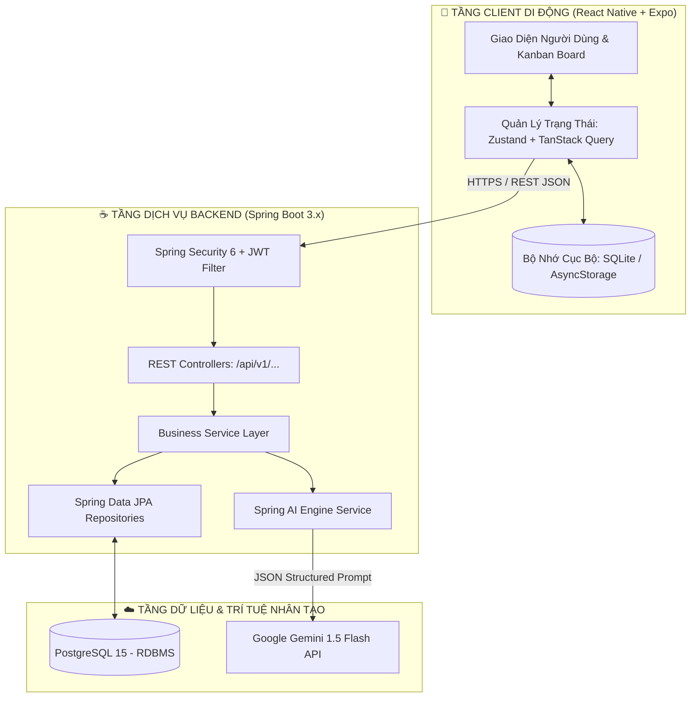
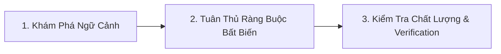

# 🌌 HỆ THỐNG AGENTIC WORKSPACE BLUEPRINT — DỰ ÁN ORBIT
## Intelligent Task Orchestrator for ADHD Minds

| Metadata | Chi Tiết |
| :--- | :--- |
| **Dự Án** | **Orbit** — Hệ thống điều phối nhiệm vụ thông minh cho người ADHD |
| **Vai Trò Tài Liệu** | System Meta-Instruction & Workspace Agent Blueprint |
| **Chuẩn Cấu Hình** | Google Antigravity / Gemini AI Workspace Customization (`.agents/`) |
| **Phân Công Trách Nhiệm** | **Người 1:** Lead Backend & AI Engineer \| **Người 2:** Lead Mobile & ADHD UX |
| **Trạng Thái** | Active Specification (Phiên bản đồng bộ Milestone 5) |

---

## 1. TỔNG QUAN DỰ ÁN & SỨ MỆNH NHẬN THỨC (COGNITIVE MISSION)

**Orbit** là hệ thống điều phối công việc được thiết kế chuyên biệt cho cá nhân mắc chứng **Rối loạn Giảm chú ý / Tăng động (ADHD)** và người gặp khiếm khuyết chức năng điều hành não bộ (*Executive Dysfunction: Tê liệt hành động, Mù thời gian, Quá tải phân tích*).

Không giống như các phần mềm quản lý công việc truyền thống (Jira, Trello, Asana) vốn tạo ra ma sát nhận thức khổng lồ do form nhập liệu phức tạp và cảnh báo quá hạn dồn dập, **Orbit** áp dụng triệt để các nguyên tắc công thái học nhận thức:
1. **Thu nhận tức thì (Instant Capture < 5s):** Ghi nhanh suy nghĩ vào Backlog với 0 form phụ.
2. **Bẻ nhỏ việc bằng AI (Human-in-the-loop Decomposition):** Chia nhỏ công việc lớn thành các vi bước $\le 20\text{ phút}$, bước đầu tiên $< 5\text{ phút}$.
3. **Đơn nhiệm tuyệt đối (Single-Task WIP = 1):** Cột *Doing* chỉ cho phép duy nhất 1 nhiệm vụ.
4. **Không kích động sợ hãi (No Panic Triggers):** Tuyệt đối cấm màu đỏ tươi báo động (`#FF0000`) và thông báo dồn dập gây phản ứng *Rejection Sensitive Dysphoria (RSD)*.
5. **Động lực bền vững (Gentle Gamification):** Tặng thưởng XP vi mô và cơ chế bảo toàn chuỗi (*Streak Freeze: 2 lượt*).

---

## 2. SƠ ĐỒ KIẾN TRÚC HỆ THỐNG (SYSTEM ARCHITECTURE)



---

## 3. PHÂN VAI TRÁCH NHIỆM & BẢN ĐỒ AGENTS WORKSPACE

Hệ thống thư mục `.agents/` được phân bổ minh bạch cho 2 thành viên phụ trách:

```text
.agents/
├── AGENTS.md                                # [Chung] Master Blueprint & Điều hướng Agent
├── rules/                                   # Quy chuẩn & Ràng buộc bắt buộc (Always-on / Scoped)
│   ├── backend_clean_architecture.md        # [Người 1] Clean Arch, Spring Boot 3, REST API & Security
│   └── adhd_cognitive_ux_rules.md           # [Người 2] ADHD UX, Calm Dark Palette, WIP=1, WCAG 2.1 AA
└── skills/                                  # Kỹ năng thực thi quy trình theo yêu cầu (On-Demand)
    ├── ai-task-decomposer/                  # [Người 1] Quy trình Spring AI + Gemini 1.5 Flash Decomposition
    │   ├── SKILL.md                         # Hướng dẫn chính, prompts, schema & heuristic fallback
    │   └── examples/
    │       ├── decomposition_schema.json    # JSON Schema chuẩn cho output subtasks
    │       └── sample_decomposition.json    # Dữ liệu mẫu kết quả bẻ việc
    └── adhd-ui-evaluator/                   # [Người 2] Quy trình kiểm thử & chấm điểm UI/UX WCAG 2.1 AA
        ├── SKILL.md                         # Hướng dẫn audit tương phản, haptics, spring physics
        └── examples/
            └── wcag_audit_checklist.json    # Bảng kiểm tra trợ năng định lượng
```

### Bảng Phân Quyền Chi Tiết

| Thành Viên | Vai Trò Chính | Trách Nhiệm Kỹ Thuật | Danh Mục Customization Quản Lý |
| :--- | :--- | :--- | :--- |
| **Người 1** *(Hiện tại)* | **Lead Backend & AI Engineer** | - Kiến trúc Clean Architecture Spring Boot 3<br>- REST API specs, validation, exception handling<br>- PostgreSQL ACID transactions & Spring AI integration<br>- Fallback heuristic khi AI timeout (Edge Case 01 & 12) | - `.agents/rules/backend_clean_architecture.md`<br>- `.agents/skills/ai-task-decomposer/` |
| **Người 2** *(Teammate)* | **Lead Mobile & ADHD UX** | - Thiết kế giao diện React Native / Expo<br>- Áp dụng Design Tokens & WCAG 2.1 Level AA<br>- Cấu hình Haptic Feedback Engine & Spring physics<br>- Đảm bảo giới hạn WIP = 1 và 4 UI Edge States | - `.agents/rules/adhd_cognitive_ux_rules.md`<br>- `.agents/skills/adhd-ui-evaluator/` |

---

## 4. QUY TRÌNH HOẠT ĐỘNG DÀNH CHO AI AGENT (AGENT ONBOARDING PROTOCOL)

Khi bất kỳ AI Agent nào tương tác trong kho mã nguồn Orbit, agent **bắt buộc** phải tuân thủ quy trình 3 giai đoạn:



1. **Giai đoạn 1: Nạp Ngữ Cảnh (Context Ingestion):**
   - Đọc kỹ `docs/prd/02_PRD.md` để nắm rõ 12 Edge Cases.
   - Kiểm tra xem tác vụ thuộc phạm vi Backend (Người 1) hay Mobile/UX (Người 2) để kích hoạt Rule và Skill tương ứng.
2. **Giai đoạn 2: Tuân Thủ Ràng Buộc Bất Biến (Invariants Enforcement):**
   - **Về Backend:** Mọi input phải qua `@Valid`, API trả về chuẩn `/api/v1/...`, tuyệt đối không viết logic nghiệp vụ trong Controller.
   - **Về AI Engine:** Mọi prompt bẻ nhỏ việc phải khống chế $\le 20\text{ phút/bước}$, bước 1 $< 5\text{ phút}$. Timeout 3s phải kích hoạt Fallback Heuristic ngay lập tức.
   - **Về Frontend:** Tuyệt đối không dùng màu đỏ tươi `#FF0000`, nút bấm tối thiểu $44 \times 44\text{ pt}$, cột Doing khóa cứng WIP = 1.
3. **Giai đoạn 3: Kiểm Tra Chất Lượng (Quality Gate & Verification):**
   - Backend: Kiểm tra syntax và build độc lập (`mvn compile` hoặc `javac`).
   - Mobile: Kiểm tra type check với `node ./node_modules/typescript/bin/tsc --noEmit` (bắt buộc 0 lỗi).

---

## 5. QUY ƯỚC ĐÓNG GÓP GIT (CONVENTIONAL COMMITS)

Mọi commit đẩy lên repository đều phải tuân thủ chuẩn Conventional Commits để duy trì lịch sử đóng góp chất lượng cao:

* `feat(...)`: Tính năng mới hoặc rule/skill mới (ví dụ: `feat(skills): implement ai-task-decomposer skill`).
* `docs(...)`: Cập nhật tài liệu kỹ thuật, PRD, README, Wireframes.
* `fix(...)`: Sửa lỗi logic, sửa bug giao diện hoặc cấu hình.
* `refactor(...)`: Tái cấu trúc mã nguồn không làm thay đổi hành vi nghiệp vụ.
* `chore(...)`: Cấu hình build tool, cập nhật dependencies, dọn dẹp môi trường.
