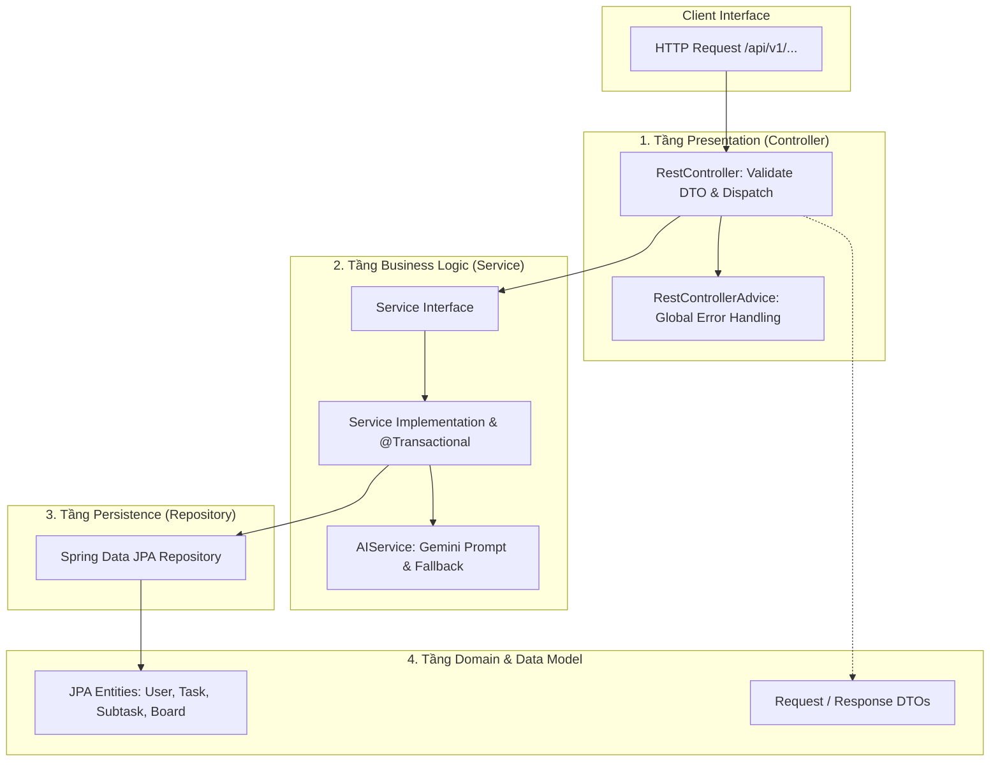

# 📜 QUY TẮC PHÁT TRIỂN BACKEND & CLEAN ARCHITECTURE — ORBIT
## Spring Boot 3, Spring Data JPA, PostgreSQL 15 & Spring AI

| Metadata | Chi Tiết |
| :--- | :--- |
| **Phạm Vi Áp Dụng** | Toàn bộ module Backend (`backend/src/main/java/com/orbit/...`) |
| **Thành Viên Phụ Trách** | **Người 1** (Lead Backend & AI Engineer) |
| **Mục Tiêu** | Đảm bảo tính mở rộng, an toàn dữ liệu, chuẩn hóa API và độ tin cậy của AI Engine |
| **Trạng Thái** | Always-On Rule for Backend Development |

---

## 1. NGUYÊN TẮC CLEAN ARCHITECTURE & PHÂN TÁCH TRÁCH NHIỆM (SOC)

Backend của Orbit được tổ chức theo 4 tầng ranh giới nghiêm ngặt. Dòng phụ thuộc chỉ được phép đi một chiều từ ngoài vào trong:
`Controller -> Service -> Repository -> Entity / Database`.



### 1.1. Tầng Presentation (Controller Layer)
* **Annotation bắt buộc:** `@RestController`, `@RequestMapping("/api/v1/{resource}")`, `@CrossOrigin(origins = "*")` (hoặc cấu hình WebMvcConfigurer tập trung).
* **Tuyệt đối cấm logic nghiệp vụ:** Controller chỉ nhận Request DTO, kích hoạt validate bằng `@Valid`, chuyển việc cho Service và đóng gói kết quả vào `ResponseEntity<ApiResponse<T>>`.
* **Không bao giờ nhận hoặc trả về JPA Entity trực tiếp:** Bắt buộc dùng `RequestDTO` và `ResponseDTO` để tránh over-fetching, circular references hoặc lộ cấu trúc database.

### 1.2. Tầng Business Logic (Service Layer)
* **Interface-Driven:** Luôn định nghĩa `TaskService` interface và triển khai trong `TaskServiceImpl`.
* **Giao dịch dữ liệu (`@Transactional`):**
  - Đặt `@Transactional(readOnly = true)` ở cấp độ Class để tối ưu hóa hiệu năng đọc của Hibernate (bỏ qua dirty-checking cache).
  - Đặt `@Transactional(rollbackFor = Exception.class)` rõ ràng trên từng method ghi/sửa/xóa để đảm bảo tính nguyên tử (Atomicity).

### 1.3. Tầng Persistence (Repository Layer)
* Kế thừa `JpaRepository<Entity, UUID>` hoặc `JpaRepository<Entity, Long>`.
* Sử dụng query method phái sinh hoặc `@Query` JPQL có tham số ràng buộc (`:param`), tuyệt đối không ghép chuỗi SQL thủ công để ngăn ngừa SQL Injection.

---

## 2. QUY CHUẨN THIẾT KẾ RESTFUL API & DTO VALIDATION

### 2.1. Định Danh Endpoint & Động Từ HTTP
Mọi endpoint đều có tiền tố `/api/v1/`:
* `GET /api/v1/boards/{boardId}/tasks`: Lấy danh sách nhiệm vụ theo board.
* `POST /api/v1/tasks`: Tạo nhiệm vụ mới (Instant Capture).
* `PATCH /api/v1/tasks/{id}/status`: Cập nhật trạng thái Kanban (`BACKLOG` -> `TODO` -> `DOING` -> `DONE`).
* `POST /api/v1/tasks/{id}/ai-decompose`: Gọi AI bẻ nhỏ nhiệm vụ thành subtasks.
* `POST /api/v1/tasks/{id}/subtasks/bulk`: Áp dụng danh sách subtasks đã duyệt.

### 2.2. Kiểm Tra Hợp Lệ Dữ Liệu Đầu Vào (Jakarta Validation)
Mọi DTO nhận vào đều phải được khai báo ràng buộc nghiêm ngặt:

```java
public record CreateTaskRequest(
    @NotBlank(message = "Tiêu đề nhiệm vụ không được để trống")
    @Size(min = 2, max = 255, message = "Tiêu đề phải từ 2 đến 255 ký tự")
    String title,

    @Size(max = 2000, message = "Mô tả không được vượt quá 2000 ký tự")
    String description,

    @NotNull(message = "Mức năng lượng nhận thức là bắt buộc")
    EnergyLevel energyRequired, // LOW, MEDIUM, HIGH

    @Min(value = 1, message = "Thời gian ước tính tối thiểu 1 phút")
    @Max(value = 480, message = "Thời gian ước tính tối đa 480 phút")
    Integer estimatedMinutes,

    @NotNull(message = "ID của bảng làm việc không được để trống")
    UUID boardId
) {}
```

---

## 3. XỬ LÝ NGOẠI LỆ TẬP TRUNG (GLOBAL EXCEPTION HANDLING)

Mọi lỗi phát sinh trong hệ thống phải được chặn và chuẩn hóa qua `@RestControllerAdvice`. Tuyệt đối không trả về Stacktrace mặc định của Tomcat / Spring Boot.

### 3.1. Cấu Trúc Payload Lỗi Chuẩn (`ApiResponse<T>` / `ErrorDetails`)
```json
{
  "success": false,
  "timestamp": "2026-10-03T10:30:00Z",
  "status": 400,
  "errorCode": "VALIDATION_FAILED",
  "message": "Dữ liệu đầu vào không hợp lệ",
  "path": "/api/v1/tasks",
  "errors": {
    "title": "Tiêu đề nhiệm vụ không được để trống",
    "energyRequired": "Mức năng lượng nhận thức là bắt buộc"
  }
}
```

### 3.2. Quy Tắc Xử Lý Lỗi Nghiệp Vụ Đặc Thù Cho ADHD
* **WIP Limit Violation (Edge Case 02):** Khi người dùng cố gắng chuyển một task thứ 2 vào cột `DOING` trong khi đã có task đang làm:
  - Ném `WipLimitExceededException`.
  - Trả về mã HTTP `409 Conflict`.
  - Thông điệp phản hồi nhẹ nhàng, khuyến khích: *"🎯 Giới hạn đơn nhiệm (WIP = 1) đang bảo vệ sự tập trung của bạn. Vui lòng hoàn thành hoặc chuyển task hiện tại về Todo trước nhé!"*.
* **AI Service Failure / Timeout (Edge Case 01 & 12):**
  - Không được ném lỗi `500 Internal Server Error` làm đơ ứng dụng.
  - Tự động kích hoạt Heuristic Fallback Provider để trả về 3 bước khởi động mặc định với cờ `"fallback": true`.

---

## 4. QUY TẮC TÍCH HỢP SPRING AI & GOOGLE GEMINI 1.5 FLASH

1. **Structured Outputs:** Bắt buộc sử dụng chế độ JSON Mode hoặc `BeanOutputConverter<T>` để nhận kết quả có cấu trúc từ Gemini.
2. **Khống Chế Timeout Nghiêm Ngặt:** Thời gian chờ tối đa cho request gọi AI là **3000ms (3 giây)**. Nếu quá thời gian, cơ chế `CompletableFuture.orTimeout` hoặc Circuit Breaker phải ngắt kết nối và chuyển hướng sang Fallback.
3. **Prompt Ràng Buộc Kỹ Thuật:** Prompt gửi đến Gemini phải chứa các điều kiện bất biến:
   - *"Mỗi bước con không được vượt quá 20 phút."*
   - *"Bước đầu tiên phải là bước mồi (starter step) thực hiện dưới 5 phút để kích hoạt động lực."*
   - *"Tổng số bước từ 3 đến 5 bước, không được vượt quá 5 bước."*

---

## 5. BẢO MẬT & XÁC THỰC (SPRING SECURITY 6 + JWT)

* Quản lý phiên hoàn toàn phi trạng thái: `SessionCreationPolicy.STATELESS`.
* Bộ lọc `JwtAuthenticationFilter` giải mã Token từ Header `Authorization: Bearer <token>`, trích xuất `userId` và thiết lập vào `SecurityContextHolder`.
* Mọi API (ngoại trừ whitelist `/api/v1/auth/**`, `/api/v1/health`) đều yêu cầu xác thực hợp lệ.
