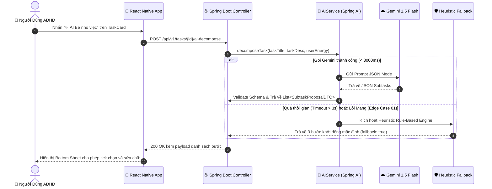

# 🧩 SKILL: AI TASK DECOMPOSER (BẺ NHỎ NHIỆM VỤ CHO TÂM TRÍ ADHD)
## Spring AI, Google Gemini 1.5 Flash & Cognitive Scaffolding

Tài liệu này hướng dẫn chi tiết quy trình cho AI Agent khi thực thi hoặc kiểm thử tính năng **AI Task Decomposition (Bẻ nhỏ công việc)** trong hệ sinh thái Orbit. Mục tiêu tối thượng là giúp người mắc chứng ADHD vượt qua hiện tượng **Tê liệt hành động (Task Paralysis)** bằng cách chia nhỏ công việc thành những vi bước hành động cụ thể, nhẹ nhàng và khả thi.

---

## 1. NGUYÊN TẮC CÔNG THÁI HỌC BẮT BUỘC (COGNITIVE INVARIANTS)

Mọi danh sách bước con do AI sinh ra phải tuân thủ nghiêm ngặt 4 quy tắc vàng:

1. **Quy tắc bước mồi khởi động (Starter Step $< 5\text{ phút}$):**
   - Bước số 1 **bắt buộc** phải là một hành động siêu dễ, tốn dưới 5 phút và gần như không đòi hỏi nỗ lực tư duy (Ví dụ: *"Mở file Word và lưu tên file"*, *"Uống một ngụm nước và dọn bàn học"*).
   - *Cơ chế thần kinh:* Giúp vượt qua lực cản quán tính ban đầu và kích hoạt dopamine tức thì (*Dopamine Action Ignition*).
2. **Trần thời gian vi bước ($\le 20\text{ phút/bước}$ - Edge Case 12 trong PRD):**
   - Tuyệt đối không sinh ra bất kỳ bước con nào có thời lượng ước tính $> 20\text{ phút}$. Nếu một bước phức tạp hơn, bắt buộc phải chẻ nhỏ tiếp.
3. **Số lượng bước tối ưu (3 đến 5 bước):**
   - Giới hạn danh sách gợi ý từ **3 đến 5 bước**. Tuyệt đối không sinh quá 5 bước một lần vì danh sách dài sẽ gây quá tải thị giác (*Cognitive Overload*) và kích hoạt lại sự hoảng loạn.
4. **Gắn thẻ năng lượng rõ ràng (`LOW`, `MEDIUM`, `HIGH`):**
   - Mỗi bước con phải có nhãn năng lượng để người dùng lựa chọn theo thể trạng não bộ tại thời điểm làm việc.

---

## 2. QUY TRÌNH THỰC THI (STEP-BY-STEP WORKFLOW)



---

## 3. PROMPT TEMPLATE CHUẨN HÓA CHO GEMINI 1.5 FLASH

Khi gọi Spring AI, template prompt hệ thống phải được định dạng chính xác như sau:

```text
[SYSTEM INSTRUCTION]
Bạn là một trợ lý tâm lý học nhận thức và chuyên gia chia nhỏ công việc dành cho người mắc chứng ADHD (Rối loạn Giảm chú ý / Tăng động).
Nhiệm vụ của bạn là nhận vào một công việc và phân rã thành từ 3 đến 5 bước hành động vi mô cực kỳ cụ thể.

RÀNG BUỘC TUYỆT ĐỐI:
1. Bước đầu tiên (Step 1) BẮT BUỘC phải là bước mồi (starter step) có estimatedMinutes <= 5, thao tác cực kỳ đơn giản để giúp người dùng bắt tay vào làm ngay.
2. Tất cả các bước tiếp theo BẮT BUỘC có estimatedMinutes <= 20. Tuyệt đối không vượt quá 20 phút.
3. Số lượng bước từ 3 đến 5 bước.
4. Ngôn ngữ: Tiếng Việt, câu từ ấm áp, khích lệ, rõ ràng, không dùng thuật ngữ trừu tượng.
5. Định dạng đầu ra: Bắt buộc trả về thuần JSON tuân thủ JSON Schema dưới đây, không kèm markdown giải thích.

[USER TASK INPUT]
- Tiêu đề: "{taskTitle}"
- Mô tả bổ sung: "{taskDescription}"
- Mức năng lượng hiện tại của người dùng: "{userEnergyLevel}"

[JSON OUTPUT SCHEMA]
Tham chiếu file: examples/decomposition_schema.json
```

---

## 4. CƠ CHẾ DỰ PHÒNG TỨC THÌ (HEURISTIC FALLBACK ENGINE - EDGE CASE 01 & 12)

Khi kết nối API AI bị timeout sau **3000ms** hoặc gặp sự cố mạng, hệ thống **không được phép báo lỗi đỏ** mà phải lập tức tự sinh ra 3 bước mồi heuristic dựa trên từ khóa phân tích ngữ nghĩa:

| Từ Khóa Trong Tiêu Đề | Bước 1 (Mồi $< 5\text{m}$) | Bước 2 (Hành động $< 15\text{m}$) | Bước 3 (Hoàn tất $< 15\text{m}$) |
| :--- | :--- | :--- | :--- |
| **Viết / Soạn / Báo cáo** | Mở ứng dụng soạn thảo và tạo file nháp mới (3p) | Gạch đầu dòng 3 ý chính cần thể hiện (10p) | Viết đoạn mở đầu ngắn gọn 5 câu (15p) |
| **Học / Ôn thi / Đọc** | Mở trang sách/tài liệu và đọc lướt mục lục (4p) | Đọc sâu 3-5 trang trọng tâm đầu tiên (15p) | Tóm tắt 2 ý quan trọng nhất vào giấy note (10p) |
| **Code / Lập trình / Bug** | Mở IDE và checkout một nhánh mới sạch sẽ (3p) | Tái hiện bug hoặc viết 1 test case mẫu (12p) | Sửa đoạn logic cốt lõi đầu tiên (15p) |
| **Dọn dẹp / Nhà cửa** | Uống một ngụm nước và bật bài nhạc yêu thích (2p) | Nhặt 5 món đồ bừa bộn nhất cất vào chỗ (10p) | Quét dọn nhanh khu vực sàn chính (15p) |
| **Mặc định (Tổng quát)** | Dành 3 phút ngồi tĩnh tâm và hình dung kết quả (3p) | Liệt kê hành động nhỏ nhất có thể làm lúc này (10p) | Thực hiện bước nhỏ đầu tiên vừa ghi ra (15p) |

*Mọi kết quả trả về từ Fallback Engine phải gắn cờ `"isFallback": true` để giao diện hiển thị thông báo dịu dàng: "Orbit đã chuẩn bị sẵn 3 bước khởi động vừa sức giúp bạn!".*

---

## 5. BẢNG KIỂM TRA CHẤT LƯỢNG OUTPUT (VERIFICATION CHECKLIST)

Trước khi chuyển giao danh sách bước cho tầng Client, AI Agent hoặc Backend Validator phải kiểm tra:
* [ ] Tổng số bước nằm trong khoảng $[3, 5]$.
* [ ] Bước 1 có `estimatedMinutes <= 5`.
* [ ] Không có bất kỳ bước nào có `estimatedMinutes > 20`.
* [ ] Các giá trị `energyLevel` hợp lệ: `LOW`, `MEDIUM`, hoặc `HIGH`.
* [ ] Tiêu đề bước bắt đầu bằng một động từ hành động trực quan (Mở, Gõ, Đọc, Chọn...).
