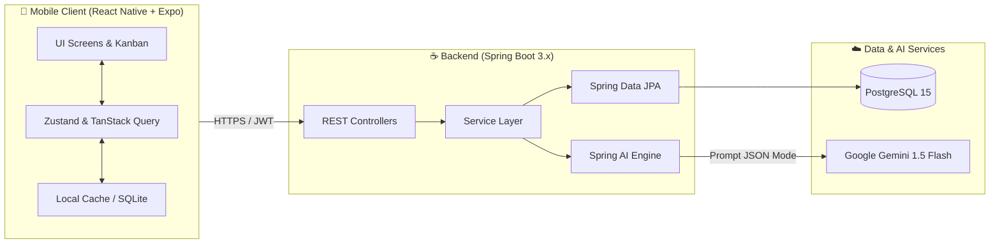

# 🌌 Orbit — Intelligent Task Orchestrator for ADHD Minds

<p align="center">
  
  
  
  
  
  
</p>

---

## 📌 Project Overview

**Orbit** is an intelligent task coordination and management system scientifically designed for individuals diagnosed with **ADHD (Attention Deficit Hyperactivity Disorder)** and those who experience severe executive dysfunction (*Time Blindness, Activation Paralysis, Analysis Overload*).

Unlike conventional project management tools (Jira, Trello) that impose multi-step manual data entry and visual clutter, **Orbit** reduces cognitive friction through:
* ⚡ **Instant Capture:** Log emerging tasks in under 5 seconds with zero required dropdowns.
* 🧩 **AI Task Decomposition:** Decompose overwhelming tasks into bite-sized micro-steps (< 20 minutes) with human-in-the-loop preview.
* 🧠 **Energy-Adaptive Prioritization:** Prioritize tasks matching the user's active cognitive energy (☕ Low / ⚡ Medium / 🔥 High).
* 🎯 **WIP Limits & Focus Mode:** Strict cap on in-progress tasks (max 1) and a dedicated distraction-free Pomodoro view.
* 🛡️ **Gentle Gamification:** Encouraging XP rewards and a *Streak Freeze* mechanism to protect motivation across off-days.

---

## 📚 Product Documentation (`docs/`)

All software engineering and product management artifacts are maintained in the [`docs/`](docs/) directory:

1. 📄 [**01. Project Brief**](docs/01_PROJECT_BRIEF.md): Core problem hypothesis, primary persona, MVP scope, explicit exclusions, and the decision log (D1–D13).
2. 📋 [**02. Product Requirements Document (PRD)**](docs/02_PRD.md): Comprehensive PRD covering ADHD psychological background, user personas, empathy mapping, customer journey, functional/non-functional requirements, and AI data contracts.
3. 🎯 [**03. User Stories & Acceptance Criteria**](docs/03_USER_STORIES_AC.md): MoSCoW-prioritized user stories accompanied by observable **Gherkin (`Given - When - Then`)** acceptance criteria.
4. 🏗️ [**04. System Architecture & Design**](docs/04_SYSTEM_ARCHITECTURE.md): 3-tier layered system design, Mermaid Database ERD, RESTful API endpoint specifications, and offline-first resilience strategy.

---

## 🏛️ System Architecture



---

## 📂 Repository Structure

```text
orbit_project/
├── .gitignore                      # Git exclusion rules (Node, Java, macOS, IDEs)
├── README.md                       # Project overview and development guidelines
├── docs/                           # Software Engineering & Product Documentation
│   ├── 01_PROJECT_BRIEF.md         # Initial project scope and decision log
│   ├── 02_PRD.md                   # Full Product Requirements Document (Chapter 3 aligned)
│   ├── 03_USER_STORIES_AC.md       # MoSCoW User Stories and Gherkin Acceptance Criteria
│   └── 04_SYSTEM_ARCHITECTURE.md   # Architectural design, ERD, and API contracts
├── mobile/                         # Mobile Client Scaffolding (React Native Expo)
│   ├── src/
│   │   ├── components/             # Reusable UI widgets
│   │   ├── screens/                # Application screens (BoardScreen, FocusScreen)
│   │   ├── services/               # Axios REST API Client
│   │   └── types/                  # TypeScript domain models
│   ├── app.json                    # Expo project configuration
│   ├── package.json                # Mobile dependencies
│   └── tsconfig.json               # Standalone TypeScript compiler options
└── backend/                        # Backend API Scaffolding (Spring Boot 3.x)
    ├── src/
    │   ├── main/
    │   │   ├── java/com/orbit/
    │   │   │   ├── controller/     # REST API Controllers (HealthController)
    │   │   │   ├── entity/         # JPA Entities (User, Task, Subtask)
    │   │   │   └── OrbitApplication.java
    │   │   └── resources/
    │   │       └── application.yml # Datasource, JWT, and AI configurations
    └── pom.xml                     # Maven build and dependency management
```

---

## 🛠️ Technology Stack

| Component | Technology | Rationale |
| :--- | :--- | :--- |
| **Mobile Client** | **React Native (Expo SDK) + TypeScript** | Unified iOS & Android codebase enabling instant task capture on mobile devices anytime. |
| **Mobile State** | **Zustand + TanStack Query** | Lightweight state management with optimistic UI updates and robust offline caching. |
| **Backend API** | **Spring Boot 3.x (Java 17/21)** | Enterprise-grade reliability, strict layered separation, and comprehensive security standards. |
| **Security** | **Spring Security + JWT + OAuth2** | Stateless authentication with one-tap Google Identity sign-in. |
| **Database** | **PostgreSQL 15+** | Robust ACID relational persistence ensuring data integrity and fast indexed queries. |
| **AI Engine** | **Spring AI + Google Gemini 1.5 Flash** | Sub-3s structured JSON task decomposition with human-in-the-loop validation. |

---

## 🚦 Git Commit Guidelines (Conventional Commits)

This repository strictly follows the Conventional Commits specification:
* `docs:` Documentation additions or modifications (`PRD`, `Architecture`, `README`).
* `feat:` Introduction of a new functional capability.
* `fix:` Bug fixes or UI remediation.
* `refactor:` Code refactoring without behavioral alterations.
* `chore:` Build scripts, dependency updates, and environment configuration.
