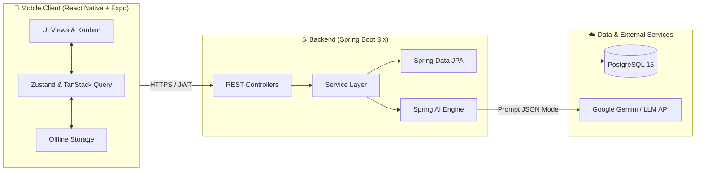

# 🌌 Orbit — Intelligent Task Orchestrator for ADHD Minds

<p align="center">
  
  
  
  
  
  
</p>

---

## 📌 Giới Thiệu Dự Án

**Orbit** là hệ thống điều phối và quản trị công việc thông minh, được nghiên cứu và thiết kế chuyên sâu dành cho người mắc hội chứng **ADHD (Rối loạn giảm chú ý tăng động)** và những người thường xuyên đối mặt với trở ngại nhận thức (*Executive Dysfunction, Time Blindness, Analysis Paralysis*).

Không giống như các công cụ quản lý dự án nặng nề (Trello, Jira), **Orbit** tối giản hóa trải nghiệm, ứng dụng Trí tuệ Nhân tạo (AI) để:
* ⚡ **Ghi nhận công việc tức thì (Instant Capture)** dưới 5 giây.
* 🧩 **Tự động chia nhỏ việc lớn (AI Task Decomposition)** thành các vi hành động (micro-steps) dưới 20 phút.
* 🧠 **Sắp xếp thứ tự ưu tiên theo mức năng lượng não bộ (Energy-based Prioritization)** thay vì chỉ dựa vào deadline.
* 🎯 **Triệt tiêu đa nhiệm với Chế độ Focus & Giới hạn WIP** (chỉ làm 1 việc duy nhất tại 1 thời điểm).
* 🛡️ **Bảo vệ động lực với Gamification nhẹ nhàng** (bảo lưu chuỗi ngày, không phán xét, không cảnh báo tiêu cực).

---

## 📚 Bộ Tài Liệu Đặc Tả Chi Tiết (Project Documentation)

Toàn bộ tài liệu phân tích nghiệp vụ, yêu cầu phần mềm và thiết kế hệ thống được tổ chức khoa học trong thư mục [`docs/`](docs/):

1. 📄 [**01. Project Brief**](docs/01_PROJECT_BRIEF.md): Bản tóm tắt dự án, định vị giá trị cốt lõi, phạm vi MVP và ranh giới loại trừ.
2. 📋 [**02. Product Requirements Document (PRD)**](docs/02_PRD.md): Tài liệu yêu cầu sản phẩm đầy đủ (Product Discovery, User Personas, Empathy Map, Functional & Non-Functional Requirements, Hợp đồng dữ liệu AI).
3. 🎯 [**03. User Stories & Acceptance Criteria**](docs/03_USER_STORIES_AC.md): Danh mục User Stories ưu tiên theo MoSCoW và tiêu chí nghiệm thu chuẩn **Gherkin (Given - When - Then)**.
4. 🏗️ [**04. System Architecture & Design**](docs/04_SYSTEM_ARCHITECTURE.md): Thiết kế kiến trúc 3 tầng, sơ đồ ERD Cơ sở dữ liệu, đặc tả RESTful API và chiến lược Offline-First.

---

## 🏛️ Kiến Trúc Hệ Thống (High-Level Overview)



---

## 📂 Cấu Trúc Thư Mục Dự Án (Repository Layout)

```text
orbit_project/
├── .gitignore                      # Cấu hình bỏ qua file rác (Node, Java, macOS, IDEs)
├── README.md                       # Tài liệu tổng quan và hướng dẫn dự án
├── docs/                           # Thư mục tài liệu đặc tả sản phẩm & kiến trúc
│   ├── 01_PROJECT_BRIEF.md         # Bản tóm tắt dự án định hướng ban đầu
│   ├── 02_PRD.md                   # PRD chi tiết chuẩn môn học (Chương 3)
│   ├── 03_USER_STORIES_AC.md       # Bảng User Stories & Tiêu chí nghiệm thu Gherkin
│   └── 04_SYSTEM_ARCHITECTURE.md   # Thiết kế kiến trúc hệ thống, ERD & API Contract
├── mobile/                         # Khung mã nguồn ứng dụng di động (React Native)
│   ├── src/
│   │   ├── components/             # Reusable UI Components (Cards, Buttons, Modals)
│   │   ├── screens/                # Màn hình chính (BoardScreen, FocusScreen, QuickCapture)
│   │   ├── navigation/             # Cấu hình điều hướng React Navigation
│   │   ├── services/               # API Client gọi về Spring Boot
│   │   └── types/                  # TypeScript Data Models
│   ├── app.json                    # Cấu hình Expo App Manifest
│   ├── package.json                # Danh sách thư viện phụ thuộc Mobile
│   └── tsconfig.json               # Cấu hình TypeScript cho Mobile
└── backend/                        # Khung mã nguồn máy chủ (Spring Boot 3.x)
    ├── src/
    │   ├── main/
    │   │   ├── java/com/orbit/
    │   │   │   ├── config/         # Cấu hình Security, CORS, Spring AI
    │   │   │   ├── controller/     # REST API Controllers
    │   │   │   ├── dto/            # Data Transfer Objects (Request/Response)
    │   │   │   ├── entity/         # JPA Entities (User, Board, Task, Subtask)
    │   │   │   ├── repository/     # Spring Data JPA Repositories
    │   │   │   ├── service/        # Business Logic & AI Orchestrator
    │   │   │   └── OrbitApplication.java
    │   │   └── resources/
    │   │       └── application.yml # Cấu hình môi trường, Database, AI API Keys
    └── pom.xml                     # Cấu hình quản lý thư viện Maven (Java 17/21)
```

---

## 🛠️ Ngăn Xếp Công Nghệ (Tech Stack)

| Thành Phần | Công Nghệ Lựa Chọn | Lý Do & Vai Trò |
| :--- | :--- | :--- |
| **Mobile Client** | **React Native (Expo SDK) + TypeScript** | Xây dựng ứng dụng đa nền tảng (iOS & Android) tiện lợi, cho phép người ADHD ghi việc nhanh mọi lúc mọi nơi. |
| **Mobile State** | **Zustand + TanStack Query** | Quản lý trạng thái nhẹ nhàng, hỗ trợ bộ đệm offline và cập nhật giao diện lạc quan (Optimistic Updates). |
| **Backend API** | **Spring Boot 3.x (Java 17/21)** | Nền tảng doanh nghiệp vững chắc, tuân thủ kiến trúc phân tầng chuẩn mực, bảo mật cao. |
| **Bảo Mật** | **Spring Security + JWT + OAuth2** | Xác thực phiên đăng nhập an toàn không trạng thái (Stateless), hỗ trợ đăng nhập 1 chạm qua Google. |
| **Cơ Sở Dữ Liệu** | **PostgreSQL 15+** | Hệ quản trị cơ sở dữ liệu quan hệ tin cậy, mạnh mẽ, toàn vẹn dữ liệu cao. |
| **Trí Tuệ Nhân Tạo**| **Spring AI + Google Gemini / OpenAI** | Phân rã tác vụ thông minh (Task Decomposition) và xếp thứ tự ưu tiên theo trạng thái nhận thức. |

---

## 🚦 Quy Chuẩn Commit Git (Conventional Commits)

Dự án tuân thủ nghiêm ngặt quy ước đặt tên commit:
* `docs:` Bổ sung hoặc cập nhật tài liệu (`PRD`, `Architecture`, `README`, v.v.).
* `feat:` Phát triển tính năng mới cho ứng dụng.
* `fix:` Sửa lỗi hệ thống hoặc giao diện.
* `refactor:` Tối ưu hóa cấu trúc code mà không thay đổi hành vi nghiệp vụ.
* `chore:` Cấu hình công cụ, phụ thuộc hoặc thiết lập môi trường.
