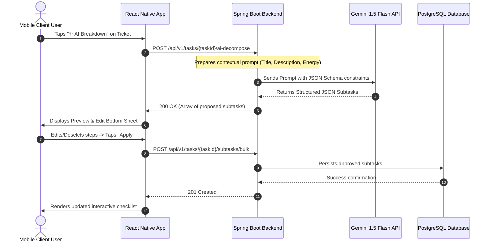

# Product Requirements Document (PRD) — ORBIT

| Document Metadata | Value |
| :--- | :--- |
| **Project Name** | **Orbit** – Intelligent Task Orchestrator for ADHD Minds |
| **Document Version** | 1.0.0 (MVP Specification) |
| **Author** | Orbit Engineering & Product Team |
| **Status** | Accepted — Ready for Engineering Baseline |
| **Target Platforms** | Mobile Client (React Native / Expo) & Backend Server (Spring Boot 3) |

---

## 1. Product Discovery

### 1.1. Psychological Background & ADHD Neurobiology
**Attention Deficit Hyperactivity Disorder (ADHD)** is not merely a lack of attention; it is a neurological condition characterized by dysregulation of dopamine transmission and executive function in the prefrontal cortex (*Executive Dysfunction*). Individuals with ADHD face four primary cognitive barriers in daily life:

1. **Activation Barrier (ADHD Paralysis):** When a task appears vague, complex, or unquantifiable, the brain triggers an avoidance response (*fight-or-flight / procrastination*) due to severe cognitive dread.
2. **Time Blindness:** Impaired perception of future time horizons; tasks are cognitively categorized as either *"Now"* or *"Not Now"*, leading to inaccurate task duration estimates and chronic last-minute panic.
3. **Visual Sensory Overload:** Traditional project management platforms (Jira, Trello) present an abundance of labels, custom dropdowns, and metrics, exhausting executive functioning before a task is even selected.
4. **Rejection Sensitive Dysphoria (RSD):** Intense emotional distress triggered by failure or perceived shortcoming (e.g., staring at a dashboard filled with bright red "Overdue" badges), frequently resulting in complete tool abandonment.

---

### 1.2. Target User Personas

#### Persona 1: Nhat Minh — Computer Science Student (Inattentive ADHD)
* **Age:** 21 | **Location:** Ho Chi Minh City
* **Profile:** Excels in creative problem-solving and hyperfocuses on novel subjects, but experiences complete paralysis when assigned semester-long projects with distant deadlines.
* **Pain Points:**
  * Understands the importance of coursework but cannot decide where to start.
  * Attempting to break tasks down manually on paper results in cluttered lists that amplify anxiety.
  * Abandoned Notion after three days due to the excessive overhead of workspace configuration.
* **Core Need from Orbit:** A single-action button that transforms a broad assignment into 3 concrete micro-steps (< 15 mins each), presented in a calm, focused UI.

#### Persona 2: Thuy Linh — Freelance Content Strategist (Combined ADHD)
* **Age:** 26 | **Location:** Hanoi
* **Profile:** Manages multiple concurrent client contracts; energy levels fluctuate dramatically between high-burst evening focus and daytime cognitive fatigue.
* **Pain Points:**
  * Misses minor client sub-deliverables due to fragmented tracking across messaging apps.
  * Attempting analytical, heavy tasks during cognitive fatigue causes burnout and guilt.
* **Core Need from Orbit:** Dynamic energy filtering: *"When you are exhausted, Orbit highlights low-energy micro-tasks (under 10 mins) so momentum is maintained without burnout."*

---

### 1.3. Empathy Map

```text
               [ THINKS & FEELS ]
    - "I genuinely want to start, but my mind feels completely locked."
    - "Why is structured planning effortless for others but exhausting for me?"
    - Lingering guilt when deadlines slip past without initial action.

 [ HEARS ]                                      [ SEES ]
 - Frequent reminders from peers and managers.   - 50+ unfinished browser tabs.
 - "Just sit down and concentrate!"             - A screen filled with red overdue tasks.
 - Generic productivity advice that fails.      - Cluttered apps with overwhelming settings.

                 [ SAYS & DOES ]
    - States: "Tomorrow morning I will tackle everything at once."
    - Downloads productivity apps, uses them for 48 hours, then uninstalls.
    - Engages in productive procrastination (cleaning desk instead of coding).

 [ PAINS ]                                      [ GAINS ]
 - Intimidating activation barriers.           - Immediate relief from small, obvious first steps.
 - Shame from breaking streaks.                - A non-judgmental, serene workspace.
 - Visual clutter and tool fatigue.            - Confidence rebuilt through continuous micro-wins.
```

---

### 1.4. Customer Journey Comparison

| Workflow Stage | Baseline (Conventional Tools) | Orbit Solution |
| :--- | :--- | :--- |
| **1. Capture** | Mandatory sprint selection, issue type, estimates, story points $\to$ Task discarded unrecorded. | **Instant Capture:** Single input field; type and press Enter. Processed in < 5 seconds. |
| **2. Decomposing** | Manual breakdown into epics and subtasks $\to$ Analysis paralysis and avoidance. | **AI Task Decomposition:** One tap transforms large tasks into 3–5 actionable micro-steps (< 20 mins). |
| **3. Prioritizing** | Sorting through 40+ unordered tickets $\to$ Cognitive overload. | **Energy-Adaptive Prioritization:** Filters tasks compatible with current energy state (☕ Low / ⚡ Med / 🔥 High). |
| **4. Execution** | 8 concurrent tickets in progress $\to$ Distracted context-switching. | **Focus Mode & WIP Limits:** Doing lane capped at 1 task; dedicated Pomodoro countdown screen. |
| **5. Retention** | Loud red overdue warnings $\to$ Triggers RSD; user uninstalls app. | **Gentle Gamification:** Encouraging micro-rewards; streak freeze preserves motivation across off-days. |

---

## 2. Product Goals & Success Metrics (OKRs)

### 2.1. Value Proposition
> **"Orbit does not force neurodivergent individuals to rewire their brains for a rigid tool; Orbit adapts its workflow to the natural rhythm of the ADHD mind."**

### 2.2. Objectives and Key Results (MVP Release)
* **Objective 1 (Frictionless Initiation):** Minimize the time elapsed between task conception and physical execution.
  * *KR 1.1:* Mean time to create a new ticket via Instant Capture reaches $\le$ 5 seconds.
  * *KR 1.2:* Over 70% of tasks with estimated duration $\ge$ 2 hours utilize the AI Decomposition engine.
* **Objective 2 (Sustainable Completion):** Boost completion rates while actively preventing cognitive burnout.
  * *KR 2.1:* Micro-subtask completion rate exceeds 65%.
  * *KR 2.2:* Day-14 user retention reaches at least 40%.

---

## 3. Requirements Analysis

### 3.1. Functional Requirements (FR)

| ID | Feature Area | Requirement Description |
| :--- | :--- | :--- |
| **FR-01** | **Authentication** | Users can register and log in via Email/Password or one-tap Google OAuth2. Unauthenticated access redirects immediately to Login. |
| **FR-02** | **Board Management** | Users can create, edit, archive, and delete personal boards (default limit: 3–5 active boards to prevent sprawl). |
| **FR-03** | **Kanban Workflow** | Each board enforces 4 peer lanes in fixed order: `Backlog`, `Todo`, `Doing`, and `Done`. Direct movement supported via drag-and-drop or modal status selector. |
| **FR-04** | **Ticket Management** | Users can create tickets with a title (required), optional description, deadline, and energy requirement level (☕ Low, ⚡ Med, 🔥 High). |
| **FR-05** | **AI Task Breakdown** | On-demand task decomposition generates 3–5 subtasks under 20 minutes each. Users inspect and approve suggestions in a preview sheet before persistence. |
| **FR-06** | **Energy Prioritization**| System calculates an adaptive priority score based on proximity to deadline and alignment with the user's active energy level. |
| **FR-07** | **WIP Limit & Focus** | The `Doing` lane enforces a strict Work-In-Progress limit (max 1 task). Focus Mode isolates the single active ticket with a distraction-free Pomodoro timer. |
| **FR-08** | **Gentle Gamification** | Awards experience points (XP) on task completion; tracks daily streaks with a non-punitive *Streak Freeze* buffer to mitigate emotional drop-off. |

---

### 3.2. Non-Functional Requirements (NFR)

| ID | Category | Specification |
| :--- | :--- | :--- |
| **NFR-01** | **Performance** | AI task decomposition latency $\le$ 3.0 seconds. Local UI state updates and task creation render in $\le$ 100ms. |
| **NFR-02** | **Cognitive Ergonomics** | Complies with **WCAG 2.1 AA** contrast standards. Replaces harsh red alerts with gentle amber/neutral tones. Strictly avoids jarring auditory alarms. |
| **NFR-03** | **Security & Privacy** | Passwords hashed using BCrypt (Spring Security). Stateless JWT architecture (15-minute access token, 7-day refresh token). No sensitive PII sent to AI LLM endpoints. |
| **NFR-04** | **Offline Resilience** | Client-side caching enables ticket creation and completion without an active network connection. Queued actions synchronize automatically upon reconnection. |
| **NFR-05** | **Failure Recovery** | A failed ticket mutation restores prior persisted state, preserves input drafts, and provides an explicit retry trigger without data loss. |

---

## 4. User Stories & Acceptance Criteria

### 4.1. US-01: Instant Capture
* **Story:** *As a user experiencing sudden thoughts,* I want *to capture a task title in under 5 seconds with a single tap,* so that *ideas are secured before memory decays.*
* **Acceptance Criteria (Gherkin):**
  ```gherkin
  Given The user is on any screen within the application
  When The user taps the bottom quick-capture input, types "Submit AI Milestone Report", and presses Enter
  Then A new ticket is immediately instantiated at the top of the "Backlog" column
  And A subtle haptic confirmation confirms creation within 100ms
  And The input field clears automatically for subsequent entries
  ```

### 4.2. US-02: AI Task Decomposition
* **Story:** *As a user paralyzed by an overwhelming project,* I want *AI to decompose the ticket into 3–5 micro-steps under 20 minutes,* so that *I can overcome activation inertia.*
* **Acceptance Criteria (Gherkin):**
  ```gherkin
  Given An existing ticket titled "Write Literature Review on Neural Networks"
  When The user presses "✨ AI Breakdown"
  Then A preview modal renders within 3 seconds displaying 3 to 5 actionable subtasks
  And Each subtask includes an estimated duration (<= 20 mins) and an energy tag
  When The user edits one step, unchecks another, and taps "Confirm & Apply"
  Then The approved subtasks are appended to the ticket's checklist in the database
  And If the user cancels or dismisses the modal, no data is modified
  ```

### 4.3. US-03: Work-In-Progress (WIP) Enforcement
* **Story:** *As a user prone to chronic multitasking,* I want *the Doing column to cap concurrent work to 1 item,* so that *I finish tasks sequentially.*
* **Acceptance Criteria (Gherkin):**
  ```gherkin
  Given The "Doing" column currently holds 1 active ticket
  When The user attempts to drag a second ticket from "Todo" into "Doing"
  Then The system rejects the transition and returns the ticket to "Todo"
  And Displays an encouraging notification: "Your mind operates best on one task at a time. Complete or pause your current work first!"
  ```

---

## 5. Technical Feature Specifications & AI Contracts

### 5.1. AI Interaction Sequence (Human-in-the-Loop)



---

### 5.2. AI Engine Data Contract

#### System Prompt Template (Spring Boot Service):
```text
You are an expert cognitive behavioral specialist assisting individuals with ADHD.
Decompose the specified task into 3 to 5 concrete, actionable micro-steps.
Mandatory constraints:
1. Every subtask MUST begin with an unambiguous action verb (e.g., "Open...", "Outline 3 bullets...", "Search...").
2. Estimated duration for each step MUST NOT exceed 20 minutes.
3. The first step MUST be extremely low-friction (< 5 minutes) to trigger dopamine and break initiation paralysis.
4. Output strictly valid JSON matching the requested schema without conversational filler.

Task Title: {taskTitle}
Context Description: {taskDescription}
Target Deadline: {deadline}
```

#### Structured JSON Output Schema:
```json
{
  "taskId": "7c9e6679-7425-40de-944b-e07fc1f90ae7",
  "originalTitle": "Prepare Software Architecture Final Slides",
  "estimatedTotalMinutes": 45,
  "subtasks": [
    {
      "stepOrder": 1,
      "title": "Open Google Slides and select a minimalist dark presentation template",
      "estimatedMinutes": 5,
      "energyLevel": "LOW"
    },
    {
      "stepOrder": 2,
      "title": "Write 4 section title cards matching the rubric criteria",
      "estimatedMinutes": 10,
      "energyLevel": "MEDIUM"
    },
    {
      "stepOrder": 3,
      "title": "Draft architectural diagram description for the backend services",
      "estimatedMinutes": 15,
      "energyLevel": "HIGH"
    },
    {
      "stepOrder": 4,
      "title": "Review slide progression and attach 2 system workflow screenshots",
      "estimatedMinutes": 15,
      "energyLevel": "MEDIUM"
    }
  ]
}
```

---

## 6. Risk Matrix & Mitigations

| Identified Risk | Likelihood / Impact | Mitigation Strategy |
| :--- | :--- | :--- |
| **AI Hallucination / Impractical Steps** | Low / Medium | **Human-in-the-Loop Gate:** Users review, edit, or reject all AI suggestions prior to database persistence. |
| **Upstream AI Latency or Outages** | Medium / High | In-memory caching for recurring standard tasks; graceful fallback to manual checklist entry on network failure. |
| **Rejection Sensitive Dysphoria (RSD)** | High / Critical | Zero punitive notifications; elimination of high-stress red overdue badges; non-judgmental tone throughout copy. |
| **Offline Disconnection on Mobile** | Medium / High | Offline-first optimistic architecture: mutations persist to local storage and sync idempotently when connectivity restores. |

---

## 7. Product Release Roadmap

* **Milestone 1 (Week 1–2): Foundation & Architecture**
  * Repository initialization, PRD baseline, and system architecture sign-off.
  * Base scaffolding for Spring Boot 3 microservice and React Native Expo client.
* **Milestone 2 (Week 3–4): Core Kanban & AI Engine**
  * Authentication (JWT + Google OAuth2), 4-lane Kanban with WIP limits.
  * Integration with Gemini API for on-demand task decomposition with preview modal.
* **Milestone 3 (Week 5–6): ADHD Ergonomics & Gamification**
  * Energy-adaptive prioritization algorithm.
  * Single-task Focus Mode with Pomodoro timer.
  * Gentle streak mechanics with Streak Freeze credit system.
