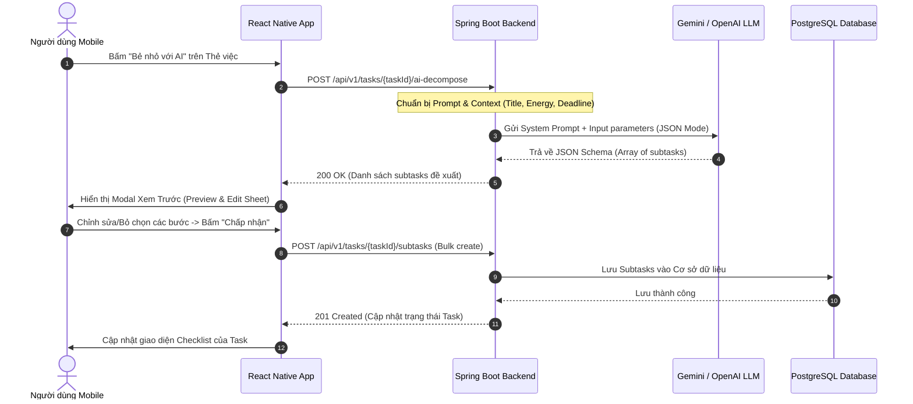

# Tài Liệu Yêu Cầu Sản Phẩm (PRD) — ORBIT

| Thông Tin Tài Liệu | Giá Trị |
| :--- | :--- |
| **Dự Án** | **Orbit** – Hệ Thống Điều Phối Công Việc Thông Minh Cho Người ADHD |
| **Phiên Bản** | 1.0.0 (MVP Release Specification) |
| **Tác Giả** | Đội ngũ phát triển dự án Orbit |
| **Trạng Thái** | Sẵn sàng triển khai (Ready for Development) |
| **Nền Tảng** | Mobile (React Native / Expo) & Backend API (Spring Boot 3) |

---

## 1. Khám Phá Sản Phẩm (Product Discovery)

### 1.1. Bối Cảnh Tâm Lý Học Người Dùng ADHD
Hội chứng **ADHD (Attention Deficit Hyperactivity Disorder)** không đơn thuần là "mất tập trung", mà là sự khiếm khuyết trong mạng lưới dẫn truyền Dopamine và chức năng điều hành của não bộ (*Executive Dysfunction*). Người mắc ADHD phải đối mặt với 4 rào cản nhận thức lớn:

1. **Rào Cản Khởi Động (Activation Barrier / ADHD Paralysis):** Khi một công việc có độ phức tạp cao hoặc chưa rõ cách làm, não bộ người ADHD kích hoạt phản ứng né tránh (Fight-or-Flight / Procrastination) vì cảm thấy ngột ngạt.
2. **Hội Chứng Mù Thời Gian (Time Blindness):** Chỉ nhận thức được hai mốc thời gian: *"Bây Giờ" (Now)* và *"Không Phải Bây Giờ" (Not Now)*. Điều này dẫn đến việc đánh giá sai lệch thời gian hoàn thành công việc và thường xuyên sát hạn mới bắt đầu làm.
3. **Quá Tải Nhận Thức Thị Giác (Visual Sensory Overload):** Khi mở một ứng dụng có quá nhiều bảng biểu, nhiều tag màu sắc lộn xộn (như Jira/Trello), họ sẽ kiệt sức trước khi kịp chọn ra công việc cần làm.
4. **Nhạy Cảm Với Thất Bại (Rejection Sensitive Dysphoria - RSD):** Cảm giác tội lỗi cực độ khi nhìn thấy danh sách công việc trễ hạn màu đỏ (*Overdue tasks*), từ đó có xu hướng xóa app hoặc bỏ mặc hệ thống.

---

### 1.2. Chân Dung Người Dùng Điển Hình (User Personas)

#### Persona 1: Nguyễn Nhật Minh — Sinh viên Công nghệ Thông tin (Inattentive ADHD)
* **Độ tuổi:** 21 | **Địa điểm:** TP. Hồ Chí Minh
* **Đặc điểm:** Thường xuyên chìm đắm trong suy nghĩ riêng (*Hyperfocus* khi có hứng, nhưng tê liệt hoàn toàn khi phải làm bài tập lớn có hạn chót 3 tuần).
* **Pain Points:** 
  * Biết bài tập lớn rất quan trọng nhưng không biết bắt đầu từ đâu.
  * Càng cố chia nhỏ bằng cách viết giấy thì càng thấy nhiều đầu việc và hoảng loạn.
  * Sử dụng Notion được 2 ngày thì chán vì tốn quá nhiều thời gian tùy biến giao diện.
* **Mục tiêu mong đợi ở Orbit:** Một nút bấm duy nhất biến bài tập lớn thành 3 bước nhỏ dưới 15 phút, giao diện sạch sẽ, chỉ nhìn thấy việc cần làm ngay lúc này.

#### Persona 2: Trần Thùy Linh — Freelance Content Creator (Combined ADHD)
* **Độ tuổi:** 26 | **Địa điểm:** Hà Nội
* **Đặc điểm:** Trực giác sáng tạo cao, giàu năng lượng vào ban đêm nhưng ban ngày năng lượng bấp bênh.
* **Pain Points:**
  * Nhận nhiều hợp đồng cùng lúc, dễ quên deadline các bài viết phụ.
  * Khi mệt mỏi (*Low Energy*), cố gắng làm việc nặng dẫn đến kiệt sức (*Burnout*).
* **Mục tiêu mong đợi ở Orbit:** Hệ thống tự động gợi ý: *"Nếu bạn đang mệt, hãy làm việc này trước (chỉ mất 10 phút và không tốn nhiều năng lượng não)"*.

---

### 1.3. Bản Đồ Thấu Cảm (Empathy Map)

```text
               [ THINKS & FEELS ]
    - "Mình muốn hoàn thành mọi thứ nhưng đầu óc cứ trống rỗng"
    - "Sao người khác làm việc có kế hoạch dễ dàng thế còn mình thì không?"
    - Cảm giác tội lỗi khi deadline trôi qua mà chưa động vào task.

 [ HEARS ]                                      [ SEES ]
 - Lời phàn nàn từ bạn bè, gia đình.           - Hàng tá tab trình duyệt mở dở.
 - "Chỉ cần tập trung vào là làm được mà!"    - To-do list đỏ rực việc quá hạn.
 - Mẹo năng suất chung chung trên mạng.        - App quản lý việc quá nhiều nút.

                 [ SAYS & DOES ]
    - Nói: "Mai mình sẽ bắt đầu làm nghiêm túc!"
    - Tải nhiều app quản lý việc rồi bỏ sau 3 ngày.
    - Làm việc lặt vặt để né tránh việc lớn (Productive Procrastination).

 [ PAINS ]                                      [ GAINS ]
 - Tê liệt nhận thức trước việc lớn.          - Cảm giác giải tỏa khi bước đầu tiên dễ dàng.
 - Xấu hổ vì bỏ dở kế hoạch.                  - Giao diện yên bình, không phán xét.
 - Quá tải vì giao diện phức tạp.              - Tự tin từng bước hoàn thành công việc.
```

---

### 1.4. Hành Trình Trải Nghiệm Khách Hàng (Customer Journey Map)

| Giai Đoạn | Hiện Tại (Công Cụ Truyền Thống) | Giải Pháp Của Orbit |
| :--- | :--- | :--- |
| **1. Ghi nhận việc** | Phải chọn Project, chọn Sprint, gán Tag, nhập Estimate phức tạp → Bỏ cuộc, không ghi nữa. | **Ghi nhận 1 chạm (Quick Capture):** Nhập 1 dòng tiêu đề rồi lưu ngay, không bắt buộc điền thuộc tính. |
| **2. Tiếp cận việc lớn** | Đối mặt với task khổng lồ → Tê liệt (*ADHD Paralysis*), lướt mạng xã hội né tránh. | **AI Task Decomposition:** Bấm "Chia nhỏ với AI", AI bẻ nhỏ thành 3-4 micro-task (<20 phút). |
| **3. Chọn việc để làm** | Nhìn vào ma trận 30 việc trên Trello → Quá tải nhận thức, không biết chọn gì. | **AI Prioritize by Energy:** Lọc công việc phù hợp với mức năng lượng hiện tại (Cao / Vừa / Thấp). |
| **4. Thực hiện** | Mở bảng Kanban thấy 10 việc đang làm dở → Mất tập trung nhảy việc. | **Focus Mode + WIP Limit:** Chỉ hiển thị 1 thẻ việc duy nhất trên màn hình cùng Pomodoro nhẹ nhàng. |
| **5. Kết thúc & Duy trì** | Trễ hạn bị bôi đỏ cảnh báo → Xấu hổ, bỏ app. | **Gentle Gamification:** Động viên bằng micro-reward, cho phép bảo vệ chuỗi (*Streak Freeze*). |

---

## 2. Mục Tiêu Sản Phẩm & Chỉ Số Đo Lường (Product Goals & OKRs)

### 2.1. Tuyên Ngôn Giá Trị (Value Proposition)
> **"Orbit không bắt người ADHD phải thay đổi bộ não để thích nghi với công cụ, mà Orbit là công cụ thích nghi với cơ chế hoạt động của não bộ người ADHD."**

### 2.2. Mục Tiêu & Kết Quả Then Chốt (OKRs - MVP Phase)
* **Mục tiêu 1 (Khởi động dễ dàng):** Giảm thiểu tối đa thời gian từ lúc nảy sinh ý nghĩ đến khi bắt tay vào làm việc.
  * *KR 1.1:* Thời gian trung bình để người dùng tạo một task mới đạt dưới 5 giây.
  * *KR 1.2:* Hơn 70% người dùng sử dụng tính năng chia nhỏ công việc bằng AI cho các task có thời lượng > 2 giờ.
* **Mục tiêu 2 (Hoàn thành bền vững):** Tăng tỷ lệ hoàn thành công việc mà không gây kiệt sức tâm lý.
  * *KR 2.1:* Tỷ lệ hoàn thành các micro-task (công việc con) đạt trên 65%.
  * *KR 2.2:* Tỷ lệ duy trì sử dụng ứng dụng sau 14 ngày (Day-14 Retention) đạt tối thiểu 40%.

---

## 3. Phân Tích Yêu Cầu (Requirements Analysis)

### 3.1. Yêu Cầu Chức Năng (Functional Requirements - FR)

| Mã FR | Tên Chức Năng | Mô Tả Nghiệp Vụ |
| :--- | :--- | :--- |
| **FR-01** | **Xác Thực & Quản Lý Hồ Sơ** | Đăng ký/đăng nhập bằng Email/Password và Google OAuth2. Thiết lập hồ sơ nhịp sinh học năng lượng cơ bản. |
| **FR-02** | **Quản Lý Bảng (Board Management)** | Tạo, sửa, lưu trữ Board theo từng ngữ cảnh cuộc sống (ví dụ: Học tập, Công việc, Cá nhân). Mặc định tối đa 3-5 boards hoạt động. |
| **FR-03** | **Quy Trình Kanban Tinh Gọn** | Bảng Kanban với 4 cột cố định: `Backlog`, `Todo`, `Doing`, `Done`. Hỗ trợ kéo thả hoặc nút chuyển trạng thái một chạm. |
| **FR-04** | **Quản Lý Thẻ Việc (Ticket Management)** | Tạo task nhanh với tiêu đề, hạn chót (Deadline), và mức năng lượng ước tính (Thấp: ☕, Vừa: ⚡, Cao: 🔥). |
| **FR-05** | **AI Task Decomposition (Cốt Lõi)** | Gửi yêu cầu phân rã công việc đến AI. AI trả về danh sách các bước hành động cụ thể kèm thời gian dự tính. Người dùng duyệt trước khi tạo. |
| **FR-06** | **AI Smart Prioritization (Cốt Lõi)** | Tính toán và xếp thứ tự ưu tiên các thẻ việc trong cột Todo dựa trên: Deadline + Độ quan trọng + Mức năng lượng hiện tại của người dùng. |
| **FR-07** | **Chế Độ Tập Trung (Focus Mode)** | Ẩn toàn bộ giao diện bảng, toàn màn hình chỉ hiện 1 thẻ việc đang làm kèm đồng hồ đếm ngược Pomodoro tối giản (25 phút). |
| **FR-08** | **Gamification Nhẹ Nhàng (Gentle Rewards)** | Cộng điểm kinh nghiệm (XP) khi hoàn thành task, hiển thị lời chúc khích lệ tích cực, bảo lưu chuỗi ngày (*Streak Freeze*) nếu có ngày nghỉ. |

---

### 3.2. Yêu Cầu Phi Chức Năng (Non-Functional Requirements - NFR)

| Mã NFR | Tiêu Chí | Đặc Tả Kỹ Thuật |
| :--- | :--- | :--- |
| **NFR-01** | **Hiệu Năng & Độ Trễ (Performance)** | Thời gian gọi API AI trả về kết quả preview chia nhỏ task ≤ 3.0 giây. Thao tác tạo task offline-ready và phản hồi giao diện ≤ 100ms. |
| **NFR-02** | **Thiết Kế Thân Thiện Nhận Thức (Cognitive Ergonomics)** | Đạt chuẩn tương phản **WCAG 2.1 AA**. Tuyệt đối không dùng màu đỏ gay gắt cho cảnh báo quá hạn (dùng tone cam/nâu ấm áp). Không phát âm thanh báo động chói tai. |
| **NFR-03** | **Bảo Mật & Riêng Tư (Security & Privacy)** | Toàn bộ mật khẩu băm bằng BCrypt (Spring Security). Sử dụng JWT ngắn hạn (Access Token 15 phút) kết hợp Refresh Token an toàn. Không gửi dữ liệu cá nhân nhạy cảm lên AI. |
| **NFR-04** | **Độ Tin Cậy & Hoạt Động Offline (Reliability)** | Lưu trữ bộ đệm trên thiết bị di động (Local Storage / SQLite / WatermelonDB). Khi mất kết nối mạng, người dùng vẫn xem và tick hoàn thành task được, tự động đồng bộ khi có mạng. |
| **NFR-05** | **Khả Năng Mở Rộng (Scalability)** | Backend Spring Boot thiết kế theo mô hình Stateless RESTful Service, hỗ trợ mở rộng ngang (Horizontal Scaling) và kết nối Connection Pool (HikariCP) tối ưu. |

---

## 4. User Stories & Tiêu Chí Chấp Nhận (Acceptance Criteria)

Tất cả các tiêu chí nghiệm thu được viết theo chuẩn **Gherkin (Given - When - Then)**:

### 4.1. US-01: Ghi nhận công việc tức thời (Instant Capture)
* **Story:** *Là một người dùng ADHD hay quên việc,* tôi muốn *có thể mở app và gõ ngay tiêu đề công việc chỉ với 1 thao tác,* để *tôi lưu lại ý tưởng trước khi nó biến mất khỏi đầu mà không bị phân tâm bởi form nhập liệu dài dòng.*
* **Acceptance Criteria:**
  ```gherkin
  Given Người dùng đang ở màn hình chính hoặc bất kỳ tab nào trong app
  When Người dùng nhấn vào thanh nhập nhanh ở đáy màn hình và gõ "Nộp báo cáo môn AI" rồi bấm Enter
  Then Hệ thống tạo ngay một thẻ việc mới trong cột "Backlog" của Board mặc định
  And Hiển thị thông báo nhẹ (Toast) xác nhận thành công trong vòng 100ms
  And Không bắt buộc người dùng phải nhập deadline hay mô tả
  ```

---

### 4.2. US-02: Chia nhỏ việc lớn bằng AI (AI Task Decomposition)
* **Story:** *Là một người dùng đang hoảng loạn trước một deadline lớn,* tôi muốn *AI tự động phân tích và bẻ nhỏ công việc thành 3-5 bước dưới 20 phút,* để *tôi có thể dễ dàng bắt tay vào làm bước đầu tiên mà không cảm thấy sợ hãi.*
* **Acceptance Criteria:**
  ```gherkin
  Given Một thẻ việc có tiêu đề "Làm slide thuyết trình đồ án tốt nghiệp" nằm trong cột Backlog hoặc Todo
  When Người dùng nhấn nút "Bẻ nhỏ với AI" (AI Breakdown)
  Then Hệ thống gửi yêu cầu đến Backend Spring Boot và gọi AI Engine
  And Hệ thống hiển thị Modal xem trước chứa danh sách 3 đến 5 bước gợi ý (ví dụ: "Bước 1: Viết dàn ý 5 slide chính - 15 phút")
  And Mỗi bước có ô chọn (checkbox) và ô chỉnh sửa nội dung văn bản
  When Người dùng bỏ chọn 1 bước, chỉnh sửa tên 1 bước khác và bấm "Xác nhận & Thêm vào thẻ"
  Then Thẻ việc được bổ sung danh sách Checklist công việc con tương ứng
  And Tuyệt đối không tự động tạo công việc nếu người dùng bấm "Hủy bỏ"
  ```

---

### 4.3. US-03: Sắp xếp theo mức năng lượng não bộ (Energy-based Prioritization)
* **Story:** *Là một người dùng đang trong trạng thái kiệt sức (Low Energy),* tôi muốn *hệ thống gợi ý các việc nhẹ nhàng, tốn ít năng lượng trước,* để *tôi vẫn duy trì được tiến độ mà không bị kiệt sức (burnout).*
* **Acceptance Criteria:**
  ```gherkin
  Given Người dùng mở danh sách công việc cần làm hôm nay
  When Người dùng chọn mức năng lượng hiện tại là "Năng lượng thấp (☕ Low)"
  Then Hệ thống tự động đẩy các công việc có nhãn "Năng lượng thấp" (thời lượng ngắn, việc thủ tục/soát lỗi) lên đầu danh sách
  And Các công việc đòi hỏi tư duy phân tích phức tạp ("Năng lượng cao") được ẩn vào mục "Làm sau khi hồi phục"
  ```

---

### 4.4. US-04: Giới hạn việc đang làm & Chế độ Tập trung (WIP Limit & Focus Mode)
* **Story:** *Là một người hay bị xao nhãng và nhảy việc giữa chừng,* tôi muốn *ứng dụng giới hạn chỉ cho phép tối đa 1 việc trong cột Doing,* để *tôi tập trung hoàn thành dứt điểm từng việc một.*
* **Acceptance Criteria:**
  ```gherkin
  Given Cột "Doing" đã có sẵn 1 thẻ việc đang được thực hiện
  When Người dùng cố gắng kéo thêm 1 thẻ việc thứ hai từ cột "Todo" sang cột "Doing"
  Then Hệ thống chặn hành động di chuyển và rung phản hồi nhẹ (Haptic Feedback)
  And Hiển thị thông báo dịu dàng: "Bộ não của bạn làm việc tốt nhất khi xử lý từng việc một. Hãy hoàn thành hoặc đưa việc hiện tại về Todo trước nhé!"
  ```

---

## 5. Đặc Tả Tính Năng Kỹ Thuật (Feature Specifications)

### 5.1. Luồng Tương Tác AI Task Breakdown (Human-in-the-Loop Flow)



---

### 5.2. Hợp Đồng Dữ Liệu AI (AI Engine Data Contract)

#### Input Prompt Template (Spring AI / Backend Service):
```text
Bạn là chuyên gia tâm lý học hành vi và hỗ trợ nhận thức cho người có hội chứng ADHD.
Nhiệm vụ của bạn là bẻ nhỏ một nhiệm vụ lớn thành 3 đến 5 hành động vi mô (micro-steps).
Quy tắc bắt buộc:
1. Mỗi bước phải bắt đầu bằng một động từ hành động cụ thể, rõ ràng (ví dụ: "Mở file...", "Viết 3 câu...", "Tìm kiếm...").
2. Thời lượng ước tính cho mỗi bước KHÔNG ĐƯỢC vượt quá 20 phút.
3. Bước đầu tiên phải cực kỳ dễ dàng (dưới 5 phút) để kích hoạt dopamine và vượt qua rào cản khởi động.
4. Trả về đúng định dạng JSON được yêu cầu, không kèm bất kỳ lời dẫn nào khác.

Nhiệm vụ: {taskTitle}
Mô tả bổ sung: {taskDescription}
Hạn chót: {deadline}
```

#### Output JSON Schema (AI trả về cho Backend):
```json
{
  "taskId": "a1b2c3d4-e5f6-7890-abcd-ef1234567890",
  "originalTitle": "Hoàn thành bài thuyết trình môn Trí tuệ Nhân tạo",
  "estimatedTotalMinutes": 45,
  "subtasks": [
    {
      "stepOrder": 1,
      "title": "Mở Google Slides và chọn một mẫu template màu tối giản",
      "estimatedMinutes": 5,
      "energyLevel": "LOW"
    },
    {
      "stepOrder": 2,
      "title": "Viết tiêu đề 4 phần chính vào 4 slide trống",
      "estimatedMinutes": 10,
      "energyLevel": "MEDIUM"
    },
    {
      "stepOrder": 3,
      "title": "Soạn nội dung chi tiết cho phần Định nghĩa & Vấn đề",
      "estimatedMinutes": 15,
      "energyLevel": "HIGH"
    },
    {
      "stepOrder": 4,
      "title": "Xem lại toàn bộ slide và thêm 2 hình ảnh minh họa",
      "estimatedMinutes": 15,
      "energyLevel": "MEDIUM"
    }
  ]
}
```

---

### 5.3. Thuật Toán Xếp Thứ Tự Ưu Tiên Thích Ứng (Adaptive Prioritization Score)

Hệ thống tính toán chỉ số ưu tiên $P$ (Priority Score) cho từng công việc trong hàng đợi theo công thức:

$$P = (w_1 \cdot \text{Urgency}) + (w_2 \cdot \text{Importance}) + (w_3 \cdot \text{EnergyFit})$$

Trong đó:
* **Urgency (1 - 5):** Tăng dần khi thời gian đến Deadline càng ngắn (nguy cấp = 5).
* **Importance (1 - 5):** Người dùng gắn nhãn tác động của công việc.
* **EnergyFit (0 - 5):** Độ tương thích giữa mức năng lượng hiện tại của người dùng ($E_{current}$) và năng lượng yêu cầu của task ($E_{task}$):
  * Nếu $E_{current} = E_{task} \implies \text{EnergyFit} = 5$
  * Nếu người dùng đang mệt ($E_{current} = \text{LOW}$) nhưng task yêu cầu $\text{HIGH} \implies \text{EnergyFit} = 0$ (tránh gây kiệt sức).

---

## 6. Ma Trận Quản Trị Rủi Ro (Risk Management)

| Rủi Ro Nhận Diện | Khả Năng & Tác Động | Biện Pháp Kiểm Soát & Giảm Thiểu |
| :--- | :--- | :--- |
| **AI Ảo giác / Gợi ý vô lý (Hallucination)** | Thấp / Trung bình | Áp dụng cơ chế **Human-in-the-loop**: Người dùng luôn phải xác nhận và có quyền sửa từng từ trước khi lưu vào database. |
| **Giới hạn tốc độ gọi AI (API Rate Limit)** | Trung bình / Cao | Caching kết quả phân rã các tác vụ phổ biến trên Redis; áp dụng hàng đợi bất đồng bộ (Async Queue) trong Spring Boot. |
| **Người dùng cảm thấy tội lỗi khi bỏ dở (RSD)** | Cao / Nghiêm trọng | Tính năng "Chuỗi an toàn" (*Streak Freeze*), hệ thống không dùng màu đỏ cảnh báo, không gửi thông báo tiêu cực dạng "Bạn đã quên...". |
| **Mất kết nối mạng khi đang làm việc** | Trung bình / Cao | Thiết kế Mobile Client Offline-First, lưu dữ liệu tạm trên thiết bị và đồng bộ ngầm khi có Internet trở lại. |

---

## 7. Lộ Trình Phát Triển (Product Roadmap)

* **Giai đoạn 1 (Tuần 1 - Tuần 3): Foundation & Core MVP**
  * Thiết lập Source Base: Mobile (Expo React Native) & Backend (Spring Boot 3 + PostgreSQL).
  * Hoàn thiện Auth JWT, Quản lý Board và Kanban 4 cột.
  * Tích hợp AI Task Breakdown (Spring AI + Gemini API) có Modal duyệt trước.
* **Giai đoạn 2 (Tuần 4 - Tuần 6): ADHD Polish & Prioritization**
  * Thuật toán AI Prioritization theo mức năng lượng.
  * Focus Mode kèm Pomodoro tối giản.
  * Hệ thống Vi tích phân (XP, Streak Freeze nhẹ nhàng).
* **Giai đoạn 3 (Sau MVP): Tích hợp Nâng cao**
  * Đồng bộ Google Calendar 2 chiều.
  * Widget ghi chú nhanh trên màn hình chính của iOS / Android.
