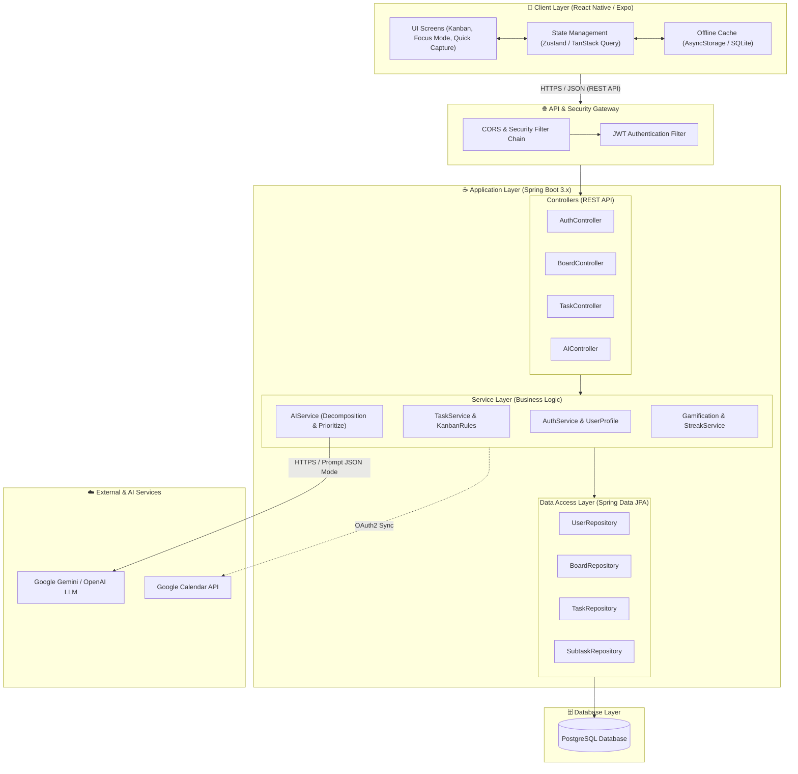
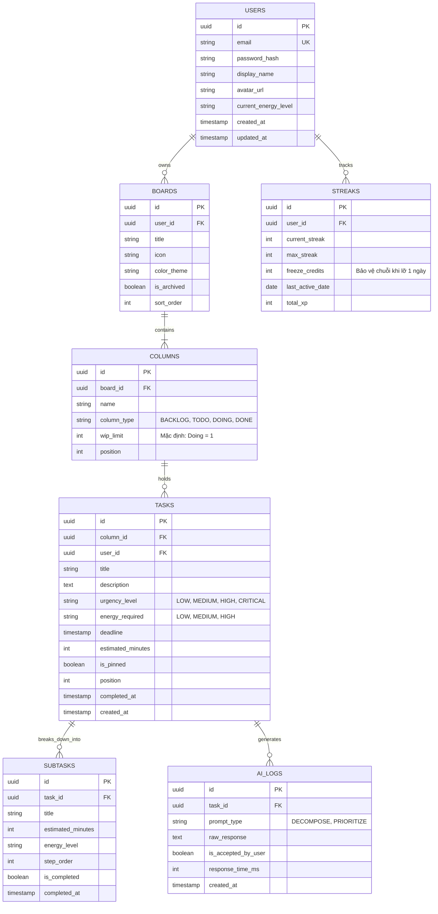

# Kiến Trúc Hệ Thống (System Architecture & Design) — ORBIT

| Thông Tin Kiến Trúc | Chi Tiết |
| :--- | :--- |
| **Dự Án** | **Orbit** – Hệ Thống Điều Phối Công Việc Thông Minh Cho Người ADHD |
| **Mô Hình Kiến Trúc** | 3-Tier Layered Architecture + Stateless RESTful Service + AI Integration |
| **Nền Tảng Client** | Mobile Cross-Platform: **React Native (Expo)** with TypeScript |
| **Nền Tảng Server** | Backend API: **Java 17/21 & Spring Boot 3.x** |
| **Cơ Sở Dữ Liệu** | **PostgreSQL 15+** (Relational DB) & Local Storage (Offline Cache) |
| **Dịch Vụ AI** | Google Gemini API / OpenAI API via Spring AI |

---

## 1. Sơ Đồ Tổng Quan Kiến Trúc (High-Level Architecture)



---

## 2. Ngăn Xếp Công Nghệ (Technology Stack)

### 2.1. Mobile Client (Ứng dụng Di Động)
* **Framework:** **React Native** (sử dụng **Expo SDK**) — Giúp phát triển nhanh chóng cho cả iOS và Android với mã nguồn dùng chung (codebase thống nhất).
* **Ngôn ngữ:** **TypeScript** — Đảm bảo tính chặt chẽ về mặt kiểu dữ liệu và giảm thiểu lỗi runtime.
* **Quản lý State:** **Zustand** (cho Client State nhẹ nhàng) kết hợp **TanStack Query (React Query)** để caching và quản lý dữ liệu bất đồng bộ từ Server.
* **Giao diện & Chuyển động:** **React Native Reanimated** — Cung cấp hiệu ứng kéo thả thẻ Kanban và chuyển cảnh sang Chế độ Focus mượt mà 60fps, không giật lag gây xao nhãng.
* **Lưu trữ cục bộ:** **AsyncStorage** hoặc **WatermelonDB / SQLite** phục vụ cơ chế xem và tick việc ngoại tuyến (Offline-First).

### 2.2. Backend Server (Máy Chủ Xử Lý)
* **Framework:** **Spring Boot 3.x** (nền tảng **Java 17/21 LTS**).
* **Bảo mật:** **Spring Security 6** với xác thực Stateless dựa trên **JSON Web Token (JWT)** và hỗ trợ **Google OAuth2 Login**.
* **Tương tác Cơ sở dữ liệu:** **Spring Data JPA (Hibernate)** kết hợp Connection Pool **HikariCP** cho hiệu năng truy vấn cao.
* **Tích hợp AI:** **Spring AI** — Hỗ trợ gọi các mô hình sinh (Generative AI) với cơ chế bọc tham số an toàn (Prompt Templates) và ép kiểu cấu trúc JSON đầu ra (Structured Outputs).
* **Quản lý Migration:** **Flyway** hoặc **Liquibase** để theo dõi và quản lý các phiên bản cấu trúc bảng database.

---

## 3. Thiết Kế Cơ Sở Dữ Liệu (Database Schema / ERD)



---

## 4. Đặc Tả RESTful API Contracts (Các Endpoint Cốt Lõi)

Mọi yêu cầu đến API (ngoại trừ Auth) đều yêu cầu Header: `Authorization: Bearer <JWT_TOKEN>`.

### 4.1. Phân Hệ Xác Thực (Authentication API)
* `POST /api/v1/auth/register` — Đăng ký tài khoản bằng Email/Mật khẩu.
* `POST /api/v1/auth/login` — Đăng nhập và nhận cặp Access/Refresh Token.
* `POST /api/v1/auth/google` — Đăng nhập qua Google ID Token.
* `POST /api/v1/auth/refresh` — Làm mới Access Token.

### 4.2. Phân Hệ Bảng & Kanban (Board & Kanban API)
* `GET /api/v1/boards` — Lấy danh sách các Board của người dùng hiện tại.
* `POST /api/v1/boards` — Tạo một Board mới (tự động khởi tạo 4 cột mặc định: Backlog, Todo, Doing, Done).
* `GET /api/v1/boards/{boardId}/kanban` — Lấy đầy đủ dữ liệu cây Kanban (Cột và các Thẻ việc) để render bảng.

### 4.3. Phân Hệ Thẻ Việc (Task API)
* `POST /api/v1/tasks/quick-capture` — Tạo nhanh thẻ việc chỉ với tiêu đề (`title`) và tùy chọn board.
* `PATCH /api/v1/tasks/{taskId}/move` — Di chuyển thẻ sang cột khác hoặc thay đổi thứ tự `position`.
  * *Request Body:* `{"targetColumnId": "...", "newPosition": 0}`
  * *Validation:* Nếu chuyển sang cột có `wip_limit` và đã đầy, Server trả về lỗi `400 Bad Request` kèm thông báo thân thiện.
* `PUT /api/v1/tasks/{taskId}` — Chỉnh sửa chi tiết thẻ việc.
* `DELETE /api/v1/tasks/{taskId}` — Xóa thẻ việc.

### 4.4. Phân Hệ Trợ Lý AI (AI Assistant API)
* `POST /api/v1/tasks/{taskId}/ai-decompose` — Gọi AI phân rã tác vụ thành các bước con.
  * *Response (200 OK):*
    ```json
    {
      "taskId": "...",
      "estimatedTotalMinutes": 40,
      "suggestedSubtasks": [
        { "stepOrder": 1, "title": "Bước 1...", "estimatedMinutes": 5, "energyLevel": "LOW" },
        { "stepOrder": 2, "title": "Bước 2...", "estimatedMinutes": 15, "energyLevel": "MEDIUM" }
      ]
    }
    ```
* `POST /api/v1/tasks/{taskId}/subtasks/bulk` — Áp dụng danh sách subtasks sau khi người dùng đã duyệt/sửa.
* `POST /api/v1/boards/{boardId}/ai-prioritize` — Tính toán lại thứ tự ưu tiên các việc trong cột Todo theo mức năng lượng hiện tại của người dùng.

---

## 5. Chiến Lược Đồng Bộ Ngoại Tuyến (Offline-First Strategy)

Đối với người dùng ADHD, việc ứng dụng bị xoay vòng loading khi mất mạng sẽ ngay lập tức làm gián đoạn dòng tập trung (*Focus Flow*). Do đó hệ thống áp dụng cơ chế:
1. **Optimistic UI Updates (Cập nhật giao diện lạc quan):** Khi người dùng kéo thẻ, tích hoàn thành task hoặc thêm task nhanh, UI trên Mobile cập nhật ngay lập tức mà không chờ Server phản hồi.
2. **Action Queue (Hàng đợi thao tác ngoại tuyến):** Các hành động được lưu vào hàng đợi cục bộ trên máy. Khi có kết nối Internet trở lại, Client tự động gửi các yêu cầu đồng bộ tuần tự lên Spring Boot.
3. **Xung đột phiên bản:** Sử dụng cơ chế `updated_at` timestamp để giải quyết xung đột (quy tắc: thao tác gần nhất được ưu tiên).
