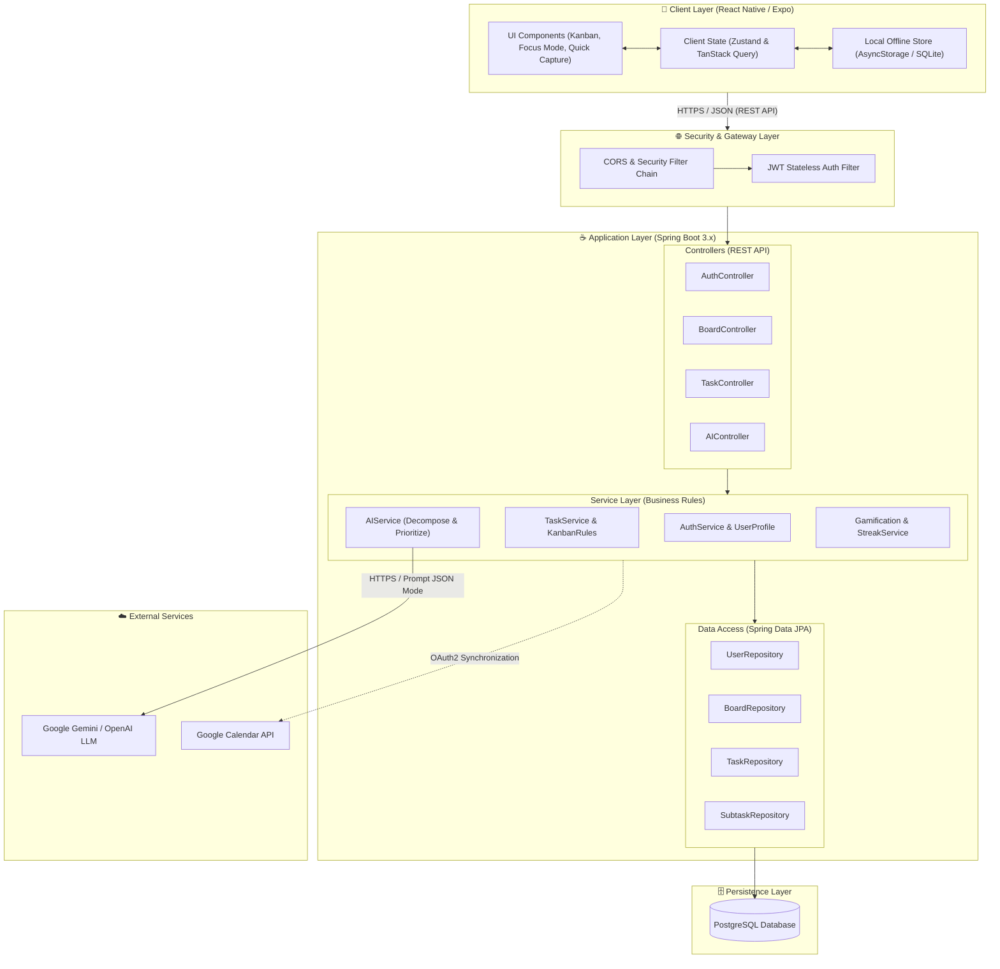
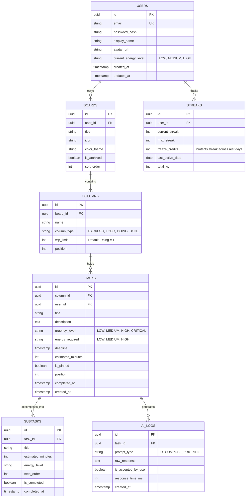

# System Architecture & Technical Design — ORBIT

| Architectural Specification | Value |
| :--- | :--- |
| **Project** | **Orbit** – Intelligent Task Orchestrator for ADHD Minds |
| **Architecture Paradigm** | 3-Tier Layered Architecture + Stateless RESTful Microservice + Human-in-the-Loop AI |
| **Mobile Client** | Cross-Platform: **React Native (Expo SDK)** with TypeScript |
| **Backend Server** | Enterprise API: **Java 17/21 LTS & Spring Boot 3.x** |
| **Database** | Relational: **PostgreSQL 15+** & Local Persistent Cache (AsyncStorage / SQLite) |
| **AI Orchestration** | Google Gemini 1.5 Flash / OpenAI GPT-4o-mini via Spring AI |

---

## 1. High-Level System Architecture

---

## 2. Technology Stack & Architectural Justification

### 2.1. Mobile Client Layer
* **Framework:** **React Native (Expo SDK 51+)** — Single TypeScript codebase providing native 60fps mobile experiences across iOS and Android. Essential for ADHD individuals who require an always-accessible mobile device to capture emerging thoughts instantly.
* **State Management:** **Zustand** (lightweight client state) combined with **TanStack Query (React Query)** for declarative server-state management, automated background synchronization, and optimistic UI updates.
* **Animation Engine:** **React Native Reanimated** — Delivers fluid, stutter-free drag-and-drop animations between Kanban lanes and gentle transitions to Focus Mode, avoiding jarring visual jolts.
* **Local Persistence:** **AsyncStorage** or embedded **SQLite** — Enables offline-first functionality so that network disconnections never block task capture.

### 2.2. Backend Application Layer
* **Platform:** **Java 17/21 LTS** running **Spring Boot 3.x**.
* **Security Architecture:** **Spring Security 6** with stateless **JSON Web Tokens (JWT)** and **Google OAuth2** integration. Token refresh cycles isolate session lifecycles without database-bound session storage.
* **Data Persistence:** **Spring Data JPA (Hibernate 6)** with **HikariCP** connection pooling, ensuring transaction atomicity and low-latency database queries.
* **AI Orchestration:** **Spring AI** — Provides resilient client wrappers, prompt templating, and structured JSON output mapping with schema validation.

---

## 3. Database Schema & Entity Relationship Diagram (ERD)

---

## 4. RESTful API Endpoints Specification

All protected endpoints require the header: `Authorization: Bearer <JWT_TOKEN>`.

### 4.1. Authentication Endpoints
* `POST /api/v1/auth/register` — Create account with Email, Password, and Display Name.
* `POST /api/v1/auth/login` — Authenticate credentials; returns access & refresh tokens.
* `POST /api/v1/auth/google` — Authenticate via Google OAuth2 ID Token.
* `POST /api/v1/auth/refresh` — Issue a new short-lived Access Token.

### 4.2. Board & Kanban Endpoints
* `GET /api/v1/boards` — Retrieve all active boards owned by the authenticated user.
* `POST /api/v1/boards` — Create a board; automatically initializes the 4 canonical columns (`Backlog`, `Todo`, `Doing`, `Done`).
* `GET /api/v1/boards/{boardId}/kanban` — Fetch hierarchical board structure (columns and tasks) for board rendering.

### 4.3. Task Lifecycle Endpoints
* `POST /api/v1/tasks/quick-capture` — Instant task creation requiring only a `title`.
* `PATCH /api/v1/tasks/{taskId}/move` — Move ticket between columns or update ordering position.
  * *Request Body:* `{"targetColumnId": "...", "newPosition": 0}`
  * *WIP Validation:* If moving into a column whose `wip_limit` is exceeded, the server returns `400 Bad Request` with an encouraging client message.
* `PUT /api/v1/tasks/{taskId}` — Update task properties (title, deadline, description).
* `DELETE /api/v1/tasks/{taskId}` — Remove a task and cascade deletion to its subtasks.

### 4.4. AI Assistant Endpoints
* `POST /api/v1/tasks/{taskId}/ai-decompose` — Request AI decomposition. Returns a JSON array of suggested micro-steps (< 20 mins) for client-side preview.
* `POST /api/v1/tasks/{taskId}/subtasks/bulk` — Persist the user-approved subtasks checklist.
* `POST /api/v1/boards/{boardId}/ai-prioritize` — Reorder the Todo lane based on current energy and deadlines.

---

## 5. Offline-First Resilience & Failure Recovery

For individuals with ADHD, loading spinners and lost input cause immediate cognitive drop-off. Orbit enforces three recovery guarantees:
1. **Optimistic UI Updates:** Dragging a ticket or creating an item reflects on the mobile interface instantly (< 100ms) before network confirmation.
2. **Failure Reversion:** If an API call fails, the client rolls back the ticket to its prior lane, displays an unobtrusive toast, preserves user input drafts, and provides an explicit "Retry" action.
3. **Resource Isolation:** All database queries enforce strict user scoping (`where user_id = :authenticatedUserId`), preventing unauthorized cross-board access.
