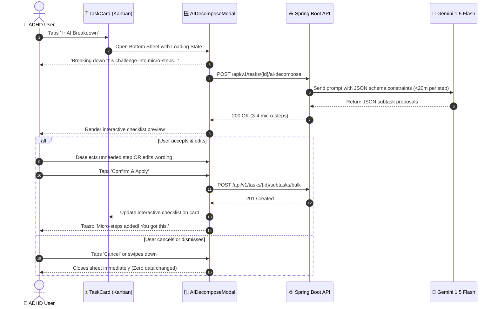
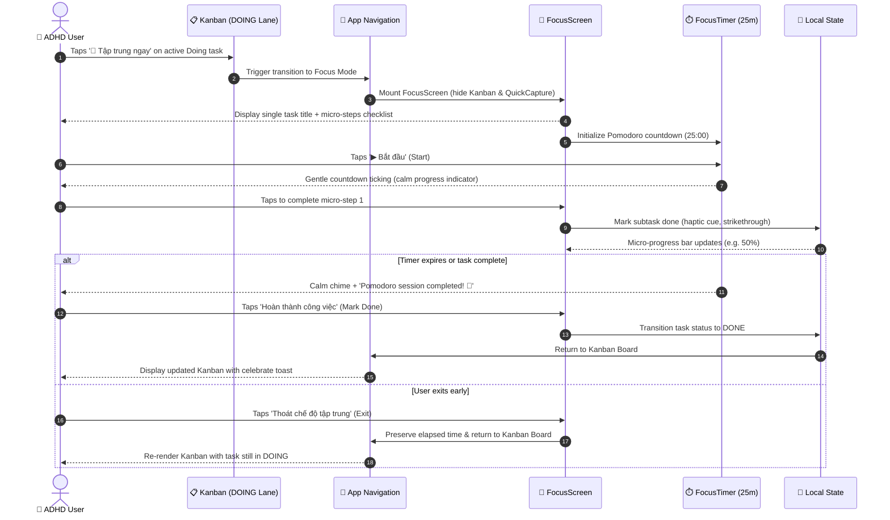
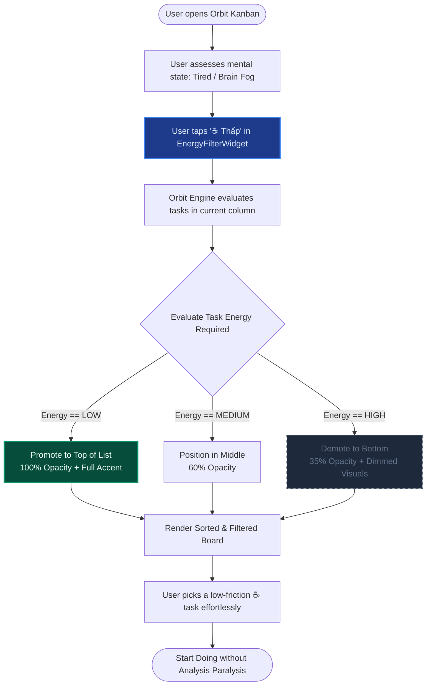

# Chapter 4: User Flows Specification — ORBIT

| Metadata | Details |
| :--- | :--- |
| **Project** | **Orbit** – Intelligent Task Orchestrator for ADHD Minds |
| **Document Stage** | 4.1 Luồng Người dùng (User Flow) |
| **Target Audience** | UI/UX Designers & Frontend Mobile Engineers |
| **Author** | Orbit Engineering & Product Team |

---

## 1. Overview & Cognitive Flow Principles

Individuals with **ADHD** experience cognitive friction when user flows contain excessive steps, mandatory secondary inputs, or irreversible AI decisions. Orbit enforces three foundational flow principles:

1. **Sub-5-Second Capture:** Zero barrier between thought conception and system persistence.
2. **Human-in-the-Loop AI Collaboration:** AI acts as a cognitive scaffold, never an autonomous decision-maker. Users inspect, adjust, and approve AI breakdown steps before committing.
3. **Single-Task Focus & Frictionless Recovery:** Flow paths prioritize linear focus and provide immediate visual clarity.

---

## 2. Core User Flows (Part 1)

### 2.1. User Flow 1: Instant Task Capture (Ghi Nhận Việc Tức Thời)

This flow enables an ADHD user experiencing working memory decay to register a task immediately without confronting overwhelming forms.

#### Flow Attributes & Edge Cases:
* **Time to Complete:** $\le 5$ seconds.
* **Mandatory Fields:** `Title` only. Descriptions, deadlines, and tags are strictly optional.
* **Offline Handling:** If disconnected, the ticket is cached locally in SQLite/AsyncStorage with zero error modals.

---

### 2.2. User Flow 2: Human-in-the-Loop AI Task Breakdown (Chia Nhỏ Task Bằng AI)

When a task is large, ambiguous, or triggering *ADHD Task Paralysis*, the user activates the AI breakdown engine.

#### Cognitive Guarantees:
* **Micro-Step Limit:** Every generated step is strictly capped at $\le 20$ minutes.
* **Non-Destructive:** The parent task is never modified until the user taps **Confirm & Apply**.

---

## 3. Supplementary User Flows (Part 2 — Focus Mode & Energy Filtering)

### 3.1. User Flow 3: Focus Mode Activation & Single-Task Pomodoro (Kích Hoạt Chế Độ Tập Trung)

When working on a critical task, individuals with ADHD frequently fall victim to visual distraction and peripheral task anxiety. Focus Mode strips away all surrounding Kanban columns and UI noise, locking the cognitive spotlight onto the single task currently in the `DOING` column with an integrated 25-minute Pomodoro timer and interactive micro-step checklist.

#### Flow Attributes & Cognitive Guarantees:
* **Zero Cognitive Bleed:** All other columns (`BACKLOG`, `TODO`, `DONE`) and the Quick Capture bar are completely hidden from viewport.
* **Micro-Step Scaffolding:** Instead of confronting an intimidating macro-task, the user only interacts with bite-sized checkboxes ($\le 20$ min each).
* **Calm Timer Visuals:** Time display uses soothing cyan/emerald palettes rather than alarming bright red counters to prevent adrenaline-spike anxiety.

---

### 3.2. User Flow 4: Energy-Based Filtering & Dynamic Reranking (Lọc Năng Lượng Nhận Thức)

ADHD productivity heavily depends on fluctuating neurochemical energy (dopamine/norepinephrine levels). When users experience low cognitive energy (burnout, fatigue, brain fog), Orbit dynamically rearranges the task queue to surface gentle, low-friction tasks while dimming demanding tasks.

#### Cognitive Guarantees:
* **Eliminates Analysis Paralysis:** Eliminates the guilt of seeing high-effort tasks when mentally drained by visually demoting and fading them out.
* **Momentum Builder:** Encourages quick-win dopamine loops by highlighting 5-15 minute low-energy micro-tasks.
* **Streak Shield Visibility:** The accompanying streak widget constantly assures the user that their momentum is protected with a Freeze Shield (`🛡️ 1 Streak Freeze sẵn sàng`).

