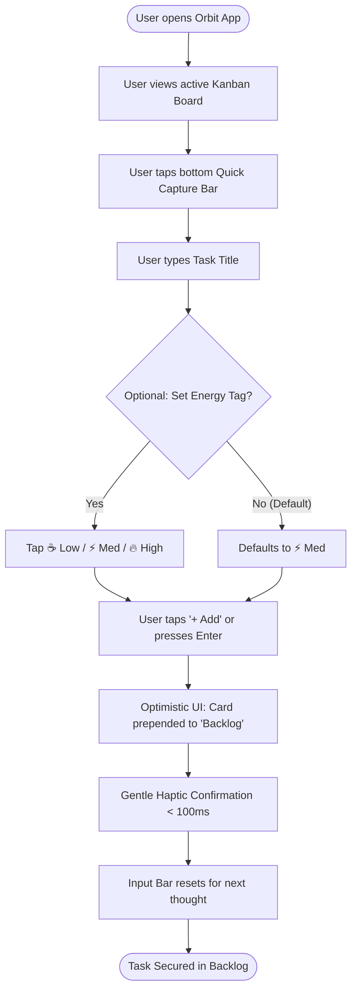
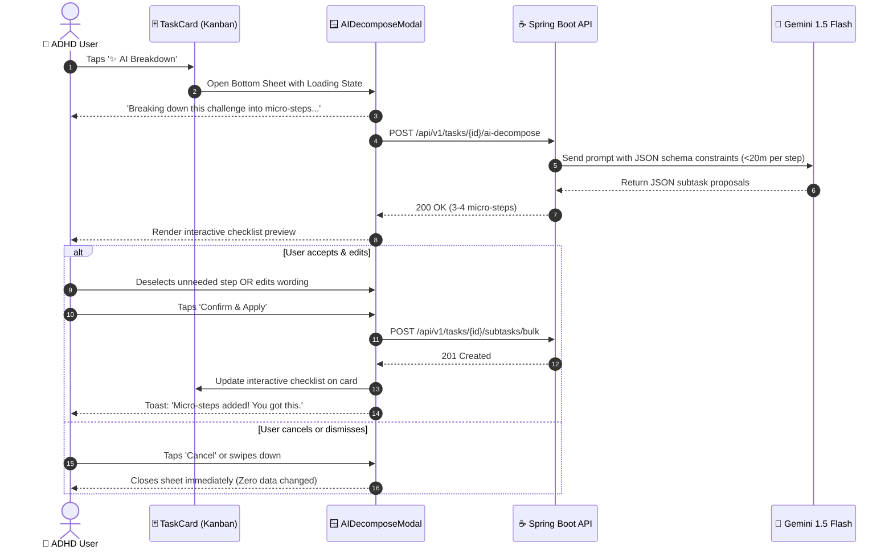

# Chapter 4: User Flows Specification — ORBIT

| Metadata | Details |
| :--- | :--- |
| **Project** | **Orbit** – Intelligent Task Orchestrator for ADHD Minds |
| **Document Stage** | 4.1 Luồng Người dùng (User Flow) |
| **Target Audience** | UI/UX Designers & Frontend Mobile Engineers |
| **Author** | Orbit Engineering & Product Team |

---

## 1. Overview & Cognitive Flow Principles

Individuals with **ADHD** experience cognitive friction when user flows contain excessive steps, mandatory secondary inputs, or irreversible AI decisions. Orbit enforces three foundational flow principles:

1. **Sub-5-Second Capture:** Zero barrier between thought conception and system persistence.
2. **Human-in-the-Loop AI Collaboration:** AI acts as a cognitive scaffold, never an autonomous decision-maker. Users inspect, adjust, and approve AI breakdown steps before committing.
3. **Single-Task Focus & Frictionless Recovery:** Flow paths prioritize linear focus and provide immediate visual clarity.

---

## 2. Core User Flows (Part 1)

### 2.1. User Flow 1: Instant Task Capture (Ghi Nhận Việc Tức Thời)

This flow enables an ADHD user experiencing working memory decay to register a task immediately without confronting overwhelming forms.

#### Flow Attributes & Edge Cases:
* **Time to Complete:** $\le 5$ seconds.
* **Mandatory Fields:** `Title` only. Descriptions, deadlines, and tags are strictly optional.
* **Offline Handling:** If disconnected, the ticket is cached locally in SQLite/AsyncStorage with zero error modals.

---

### 2.2. User Flow 2: Human-in-the-Loop AI Task Breakdown (Chia Nhỏ Task Bằng AI)

When a task is large, ambiguous, or triggering *ADHD Task Paralysis*, the user activates the AI breakdown engine.

#### Cognitive Guarantees:
* **Micro-Step Limit:** Every generated step is strictly capped at $\le 20$ minutes.
* **Non-Destructive:** The parent task is never modified until the user taps **Confirm & Apply**.

---

## 3. Supplementary User Flows (Part 2 — Teammate Extension)

> [!NOTE]
> The following user flows are allocated to **Teammate (Part 2)** and will be expanded in the next implementation milestone:
> - **User Flow 3: Single-Task Focus Mode & Pomodoro Integration** (Doing Lane $\to$ Focus View $\to$ Timer Start $\to$ Step Checkoff $\to$ Completion).
> - **User Flow 4: Cognitive Energy-Based Task Filtering** (Energy Selector $\to$ Re-rank Todo Queue $\to$ Dim high-energy tasks during fatigue).
