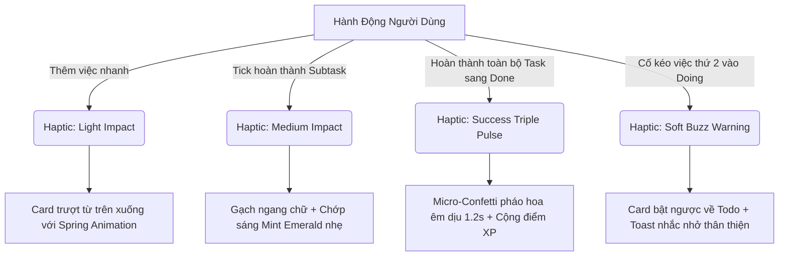

# HỒ SƠ ĐẶC TẢ THIẾT KẾ UI/UX & HỆ THỐNG WIREFRAME TOÀN DIỆN — ORBIT
## Intelligent Task Orchestrator for ADHD Minds

| Metadata | Chi Tiết |
| :--- | :--- |
| **Dự Án** | **Orbit** — Hệ thống điều phối công việc thông minh cho người ADHD |
| **Giai Đoạn** | Tài liệu Thiết kế Chi tiết (Detailed UI/UX & Wireframe Specification) |
| **Tiêu Chuẩn Áp Dụng** | **WCAG 2.1 Level AA**, Thuyết Tải Nhận Thức (Cognitive Load Theory), ADHD Ergonomics |
| **Nền Tảng Đích** | Mobile iOS & Android (React Native / Expo) — Figma Design Token Ready |
| **Trạng Thái** | Approved Specification (Phần việc Người 2 - UI/UX Designer) |

---

## 1. TRIẾT LÝ THIẾT KẾ CHO NHẬN THỨC THẦN KINH ĐA DẠNG (NEURODIVERGENT & ADHD UX)

Người mắc hội chứng **ADHD (Attention Deficit Hyperactivity Disorder)** có cơ chế vận hành não bộ khác biệt ở hệ dẫn truyền thần kinh Dopamine và thùy trán trước (*Prefrontal Cortex*). Giao diện của Orbit được thiết kế dựa trên 5 nguyên lý công thái học nhận thức bắt buộc:

1. **Calm Dark Canvas (Triệt tiêu mỏi mắt & quá tải giác quan):** Sử dụng nền tối trầm Slate `#0F172A` kết hợp bề mặt thẻ `#1E293B`. Tuyệt đối không dùng nền đen tuyền OLED `#000000` (dễ gây hiện tượng nhòe quầng Halation khi đọc chữ trắng) và không dùng nền trắng tinh (gây chói lóa, tăng mức độ kích thích thần kinh tiêu cực).
2. **Loại bỏ hoàn toàn yếu tố hoảng loạn (No Panic Triggers):** Tuyệt đối cấm sử dụng màu đỏ rực `#FF0000` và các huy hiệu báo động dồn dập dạng *"OVERDUE / TRỄ HẠN!"*. Trực quan này kích hoạt phản ứng sợ hãi từ chối (*Rejection Sensitive Dysphoria - RSD*), khiến người ADHD xóa ứng dụng. Thời hạn được biểu thị bằng sắc cam hổ phách ấm hoặc xám trung tính dịu dàng.
3. **Quy chuẩn vùng chạm lớn (Touch Target $\ge 44 \times 44\text{ pt}$):** Phục vụ hành vi chạm nhanh, ngón tay bồn chồn vận động (*motor restlessness*) hoặc run tay nhẹ khi căng thẳng. Mọi nút bấm, checkbox, chip lọc đều có padding an toàn $\ge 10\text{px}$.
4. **Quy tắc Đơn nhiệm Tuyệt đối (Single-Task Prominence & WIP = 1):** Cột *Doing* chỉ cho phép tối đa 1 task duy nhất. Chế độ *Focus Mode* ẩn hoàn toàn mọi thành phần xung quanh để chống nhảy việc (*Context-Switching*).
5. **Kích hoạt Dopamine Lành mạnh (Gentle Dopamine Loops):** Phản hồi xúc giác (Haptic) tức thì $< 100\text{ms}$ khi ghi việc nhanh, hiệu ứng pháo giấy vi mô nhẹ nhàng (*Micro-Confetti*) khi hoàn thành từng bước nhỏ, bảo lưu chuỗi ngày (*Streak Freeze*) không trừng phạt khi có ngày nghỉ.

---

## 2. DESIGN SYSTEM & COMPONENT TOKENS (REACT NATIVE & FIGMA READY)

### 2.1. Bảng Màu Hệ Thống (Color Tokens & WCAG 2.1 AA Contrast Mapping)

Toàn bộ các cặp màu văn bản và bề mặt của Orbit đều vượt qua ngưỡng kiểm định tương phản tối thiểu **4.5:1** (chuẩn AA) và hầu hết đạt trên **7:1** (chuẩn AAA).

| Token Name | Hex Code | Độ Tương Phản | Đạt Chuẩn WCAG | Vai Trò & Ứng Xử Tâm Lý Thần Kinh Học |
| :--- | :--- | :--- | :---: | :--- |
| `color.canvas.base` | `#0F172A` | N/A | Base Canvas | Nền Slate-900: Giảm chói mắt, tạo cảm giác tĩnh tại, không gây quầng sáng nhòe (anti-halation). |
| `color.surface.card` | `#1E293B` | N/A | Card Surface | Bề mặt Slate-800: Nổi khối nhẹ $1\text{px}$, phân tách các vùng thông tin độc lập rõ ràng. |
| `color.surface.subtle`| `#334155` | N/A | Border/Divider| Đường viền Slate-700: Phân định ranh giới thẻ và ô nhập mà không tạo "lưới mắt cáo" rối mắt. |
| `color.text.primary` | `#F8FAFC` | **15.8:1** (Canvas)<br>**13.4:1** (Card) | ✅ **AAA** | Slate-50: Tiêu đề task, chữ quan trọng nhất, độ sắc nét cao tuyệt đối. |
| `color.text.secondary`| `#94A3B8` | **5.8:1** (Canvas)<br>**4.9:1** (Card) | ✅ **AA** | Slate-400: Mô tả phụ, thời lượng ước tính, nhãn phụ không tranh chấp thị giác. |
| `color.text.muted` | `#64748B` | **3.8:1** (Placeholder) | ✅ **UI Target**| Slate-500: Placeholder nhập liệu gợi ý, icon ở trạng thái vô hiệu hóa. |
| `color.accent.primary`| `#38BDF8` | **8.4:1** (Canvas)<br>**7.1:1** (Card) | ✅ **AAA** | Sky Blue: Kích hoạt tỉnh táo, tăng Dopamine tích cực, nút CTA chính, chữ số Pomodoro. |
| `color.status.done` | `#34D399` | **7.5:1** (Canvas)<br>**6.3:1** (Card) | ✅ **AAA** | Mint Emerald: Màu hoàn thành nhiệm vụ nhẹ nhõm, không kích động. |
| `color.energy.low` | `#94A3B8` | **4.9:1** (Card) | ✅ **AA** | ☕ Xám Slate dịu: Việc thủ tục, đọc lướt, việc nhẹ tốn ít nơ-ron não bộ. |
| `color.energy.medium` | `#FBBF24` | **9.2:1** (Card) | ✅ **AAA** | ⚡ Vàng Amber ấm áp: Công việc tiêu chuẩn trong ngày. |
| `color.energy.high` | `#F87171` | **5.4:1** (Card) | ✅ **AA** | 🔥 San hô mềm (Soft Coral): Việc tư duy sâu; **tuyệt đối cấm đỏ tươi `#FF0000`**. |
| `color.badge.freeze` | `#818CF8` | **6.1:1** (Card) | ✅ **AAA** | 🛡️ Tím Indigo: Huy hiệu Streak Freeze bảo vệ chuỗi ngày an toàn. |

---

### 2.2. Hệ Thống Typography (Font Hierarchy & Spacing Tokens)

Sử dụng font không chân hình học hiện đại (**Inter** hoặc **SF Pro / Roboto**) với line-height rộng rãi, giúp mắt người ADHD định vị dòng đọc ổn định, không bị nhảy dòng hay hoa mắt.

| Typography Token | Size | Weight | Line-Height | Tracking | Áp Dụng Cụ Thể Trong Giao Diện |
| :--- | :--- | :--- | :--- | :--- | :--- |
| `typography.display.lg` | 32 pt | Bold (700) | 40 pt | -0.5 pt | Đồng hồ đếm lùi Pomodoro (25:00) trên màn hình Focus. |
| `typography.heading.xl` | 24 pt | Bold (700) | 32 pt | -0.3 pt | Tiêu đề màn hình chính, Tên Board công việc. |
| `typography.heading.md` | 18 pt | SemiBold (600) | 26 pt | 0 pt | Tiêu đề Task trong Modal chi tiết, Tên cột Kanban. |
| `typography.body.lg` | 16 pt | SemiBold (600) | 24 pt | 0 pt | Tiêu đề thẻ công việc trên bảng (`TaskCard`). |
| `typography.body.md` | 14 pt | Regular (400) | 22 pt | +0.1 pt | Nội dung mô tả, văn bản nhập liệu Quick Capture. |
| `typography.caption.sm`| 12 pt | Medium (500) | 16 pt | +0.2 pt | Metadata thời gian (⏱️ 15m), nhãn chip năng lượng. |
| `typography.micro.xs` | 10 pt | Bold (700) | 14 pt | +0.5 pt | Huy hiệu số lượng task trên tab (`CountBadge: 3`). |

---

### 2.3. Quy Chuẩn Không Gian & Vùng Chạm (Touch-Target Architecture)

```text
Spacing Scale:
4px (xxs) | 8px (xs) | 12px (sm) | 16px (md) | 20px (lg) | 24px (xl) | 32px (xxl)

Bo Góc (Radii):
- Button / Input: 10px - 12px (Mềm mại, không nhọn sắc)
- Task Card: 14px - 16px
- Modal Bottom Sheet: 24px (Bo đỉnh trên tạo cảm giác tự nhiên, thân thiện)
- Tag / Badge Pill: 9999px (Fully rounded)

Touch-Target Rule:
- Minimum Bounding Box: 44 x 44 pt (iOS) / 48 x 48 dp (Android)
- Minimum Distance Between Targets: 8px (Chống bấm nhầm khi tay di chuyển nhanh)
```

---

### 2.4. Thư Viện Components Cốt Lõi (Core Component Library & Tokens)

Hệ thống thành phần UI của Orbit được chuẩn hóa thành các Token có thể map 1-1 sang React Native StyleSheet hoặc Figma Component Set:

| Component | Vị Trí & Vai Trò | Quy Chuẩn Visual & Kích Thước | Touch-Target | Token Áp Dụng |
| :--- | :--- | :--- | :---: | :--- |
| **`QuickCaptureBar`** | Đáy màn hình Kanban cố định; thu nhận ý nghĩ tức thì <5s. | Height 88 pt (gồm safe area). Nền Slate-800 (`#1E293B`), viền Slate-700 (`#334155`), bo góc 12px. Input chữ 14 pt Slate-100, nút `+Thêm` Sky Blue `#38BDF8`. | $\ge 48 \times 48\text{ pt}$ (Nút Thêm) | `color.surface.card`<br>`color.accent.primary` |
| **`TaskCard`** | Thẻ nhiệm vụ trên các cột Kanban; hiển thị thông tin trực quan. | Width 100%, Min-height 96 pt, Margin bottom 12px, Radius 14px. Thẻ ở cột `Doing` có viền trái `#38BDF8` dày 3.5px và bóng đổ dịu. | $\ge 44 \times 44\text{ pt}$ (Các nút con) | `color.surface.card`<br>`typography.body.lg` |
| **`EnergyBadge`** | Huy hiệu nhận diện mức năng lượng nhận thức (☕/⚡/🔥). | Pill hình viên thuốc bo tròn 9999px, Height 28 pt, Padding 4px 10px. Nền mờ 15% tương ứng tông màu icon. **Tuyệt đối cấm đỏ tươi `#FF0000`**. | N/A (Display Tag) | `color.energy.low`<br>`color.energy.medium`<br>`color.energy.high` |
| **`SubtaskItem`** | Hàng checklist hành động vi mô ($\le 20\text{m}$) bên trong thẻ và Modal. | Min-height 48 pt. Checkbox 24x24 pt (vùng chạm $44\times 44\text{ pt}$). Trạng thái Done: chữ gạch ngang, icon tick Mint Emerald `#34D399`. | $\ge 44 \times 44\text{ pt}$ (Checkbox) | `color.status.done`<br>`typography.body.md` |
| **`PomodoroCountdown`** | Đồng hồ đếm lùi thời gian phiên tập trung tại màn hình Focus. | Chữ số hiển thị 32 pt Bold (`#38BDF8`), thanh tiến độ dạng vạch/vòng tròn màu Sky Blue chạy êm dịu theo giây. Nút Pause và +5m kích thước 48x48 pt. | $\ge 48 \times 48\text{ pt}$ (Nút điều khiển) | `typography.display.lg`<br>`color.accent.primary` |
| **`StreakBadge`** | Huy hiệu bảo vệ chuỗi động lực nhẹ nhàng, không trừng phạt. | Nền Slate-800 bo tròn 16px, icon ngọn lửa hổ phách kết hợp khiên bảo vệ tím Indigo `🛡️` (2 lượt Streak Freeze sẵn sàng). | $\ge 44 \times 44\text{ pt}$ | `color.badge.freeze`<br>`color.energy.medium` |
| **`NotificationToast`** | Thông báo nổi trên đỉnh màn hình (WIP Limit, Đồng bộ Offline). | Floating Card cách đỉnh 54 pt, bo góc 12px, Nền Slate-800 viền Sky Blue/Amber. Tự động trượt lên sau 3.5s. Câu chữ đồng cảm, không đổ lỗi. | N/A (Auto-dismiss) | `color.surface.card`<br>`typography.body.md` |

---

## 3. BẢN VẼ WIREFRAME ASCII CHO TOÀN BỘ 8 MÀN HÌNH CHÍNH

Dưới đây là bản vẽ khung dây chi tiết mô phỏng màn hình thiết bị di động (Tỷ lệ khung 390x844 pt tiêu chuẩn), có đầy đủ kích thước touch-target, phân bổ visual hierarchy và component naming ready cho Figma.

---

### 📱 Screen 1: Splash & Onboarding Flow (`Frame_01_Onboarding`)
> **Mục tiêu:** Giảm lo âu ngay từ giây đầu tiên; hướng dẫn 3 bước cốt lõi không quá tải chữ; cho người dùng chọn mức năng lượng khởi đầu.

```text
+-------------------------------------------------------------+ [390 pt]
|  [Status Bar: 09:41  •  Wifi  •  Battery 100%]              | (h: 44pt)
|                                                             |
|                          🌌 ORBIT                           |
|          "Quỹ đạo bình yên cho tâm trí ADHD"                |
|                                                             |
|         +-----------------------------------------+         |
|         |          [ Minh Họa Tối Giản ]          |         |
|         |                                         |         |
|         |     🧩 Bẻ nhỏ việc lớn thành bước <20p  |         |
|         |     ⚡ Chọn việc vừa với mức năng lượng |         |
|         |     🎯 Tập trung 1 việc - 0 áp lực trễ  |         |
|         +-----------------------------------------+         |
|                                                             |
|                        ( • )  ( )  ( )                      | (Pagination)
|                                                             |
|   Hiện tại bạn đang cảm thấy năng lượng thế nào?             |
|   +-----------------------------------------------------+   |
|   | [ ☕ Thấp (Mệt mỏi) ]  [ ⚡ Vừa (Ổn) ]  [ 🔥 Rực cháy ]|   | (h: 48pt)
|   +-----------------------------------------------------+   | Touch: 48pt
|                                                             |
|   +-----------------------------------------------------+   |
|   |         BẮT ĐẦU HÀNH TRÌNH TẬP TRUNG  ->            |   | (h: 52pt)
|   +-----------------------------------------------------+   | Touch: 52pt
|                                                             |
|             Đã có tài khoản? [ Đăng nhập ngay ]             | Touch: 44pt
|                                                             |
+-------------------------------------------------------------+
```

---

### 📱 Screen 2: Authentication Screen (`Frame_02_Auth`)
> **Mục tiêu:** Giảm tối đa rào cản đăng nhập; form ngắn gọn; đăng nhập 1-chạm Google; thông báo lỗi an toàn cấp form (form-level) không gây mặc cảm tội lỗi.

```text
+-------------------------------------------------------------+
|  [ < Quay lại ]                                             | Touch: 44pt
|                                                             |
|  Đăng Nhập Vào Orbit                                        |
|  Không cần vội vã. Hãy vào không gian làm việc của bạn.     |
|                                                             |
|  Email                                                      |
|  +-------------------------------------------------------+  |
|  | user@example.com                                      |  | (h: 48pt)
|  +-------------------------------------------------------+  | Touch: 48pt
|                                                             |
|  Mật khẩu                                                   |
|  +-------------------------------------------------------+  |
|  | ••••••••••••••••••                              [ 👁️ ] |  | (h: 48pt)
|  +-------------------------------------------------------+  | Touch: 48pt
|                                                             |
|  +-------------------------------------------------------+  |
|  |                     ĐĂNG NHẬP                         |  | (h: 50pt)
|  +-------------------------------------------------------+  | Touch: 50pt
|                                                             |
|  ------------------------- hoặc -------------------------  |
|                                                             |
|  +-------------------------------------------------------+  |
|  |     [ G ]  Tiếp tục với tài khoản Google              |  | (h: 50pt)
|  +-------------------------------------------------------+  | Touch: 50pt
|                                                             |
|            Chưa có tài khoản? [ Đăng ký tài khoản ]         | Touch: 44pt
|                                                             |
+-------------------------------------------------------------+
```

---

### 📱 Screen 3: Board Switcher & Board Management Modal (`Frame_03_BoardSwitcher`)
> **Mục tiêu:** Phân chia ngữ cảnh cuộc sống nhưng **khóa trần tối đa 3-5 boards** để chống bẫy thiết kế rườm rà (*Tool Procrastination / Edge Case 07 trong PRD*).

```text
+-------------------------------------------------------------+
| ==================== [ GẠT XUỐNG ĐÓNG ] =================== |
|                                                             |
| Danh Sách Bảng Công Việc (3/5 Bảng đang dùng)               |
| Chọn ngữ cảnh bạn muốn tập trung lúc này:                   |
|                                                             |
| +---------------------------------------------------------+ |
| | 🎓  Học Tập & Nghiên Cứu                   [ Đang xem ] | | (h: 56pt)
| |     4 việc cần làm  •  1 việc đang tập trung            | | Touch: 56pt
| +---------------------------------------------------------+ |
|                                                             |
| +---------------------------------------------------------+ |
| | 💼  Dự Án Khởi Nghiệp & Freelance                       | | (h: 56pt)
| |     2 việc cần làm  •  0 việc đang làm                  | | Touch: 56pt
| +---------------------------------------------------------+ |
|                                                             |
| +---------------------------------------------------------+ |
| | 🏠  Đời Sống & Việc Nhà                                 | | (h: 56pt)
| |     1 việc nhẹ nhàng                                    | | Touch: 56pt
| +---------------------------------------------------------+ |
|                                                             |
| +---------------------------------------------------------+ |
| |        +  Tạo Bảng Mới (Còn lại 2 slot)                 | | (h: 48pt)
| +---------------------------------------------------------+ | Touch: 48pt
|                                                             |
+-------------------------------------------------------------+
```

---

### 📱 Screen 4: Main Kanban Screen (`Frame_04_KanbanBoard`)
> **Mục tiêu:** Màn hình trung tâm của Orbit. Bảng 4 cột cố định; **khóa cứng giới hạn Doing = 1 task (WIP = 1 / Edge Case 02 trong PRD)**; thanh Quick Capture thường trực ở đáy.

```text
+-------------------------------------------------------------+
| 🎓 Học Tập & Nghiên Cứu [▼]          [ ⚡ Năng lượng: Vừa ] | (h: 56pt)
| Orbit • Hệ thống điều phối           [ 🎯 Focus (1) ]       | Touch: 44pt
+-------------------------------------------------------------+
| [ Backlog (3) ]  [ Todo (2) ]  [ Doing (1/1) 🔥 ] [ Done (4)]| Tab Bar
+-------------------------------------------------------------+
|                                                             |
|  +-------------------------------------------------------+  |
|  | 🃏 Soạn thảo slide đồ án Trí tuệ Nhân tạo             |  | (TaskCard)
|  |                                                       |  |
|  | ⏱️ 35 phút    ⚡ Vừa sức     📋 1/3 bước đã xong       |  |
|  |                                                       |  |
|  | [ ✨ AI Bẻ nhỏ việc ]               [ Bắt đầu (Doing) ]| | Touch: 44pt
|  +-------------------------------------------------------+  |
|                                                             |
|  +-------------------------------------------------------+  |
|  | 🃏 Đọc 5 trang tài liệu WCAG 2.1 cho ADHD             |  |
|  |                                                       |  |
|  | ⏱️ 15 phút    ☕ Nhẹ nhàng   📋 0/0 bước               |  |
|  |                                                       |  |
|  | [ ✨ AI Bẻ nhỏ việc ]               [ Bắt đầu (Doing) ]| | Touch: 44pt
|  +-------------------------------------------------------+  |
|                                                             |
+-------------------------------------------------------------+
| Năng lượng: ( ☕ Thấp )  ( ⚡ Vừa )*  ( 🔥 Cao )            | Quick
| [ Thêm nhanh việc mới vào Backlog...              ] [ +Thêm]| Capture
+-------------------------------------------------------------+ (h: 88pt)
```

---

### 📱 Screen 5: AI Task Decomposition Bottom Sheet (`Frame_05_AIDecompose`)
> **Mục tiêu:** Giao diện bẻ nhỏ việc theo chuẩn **Human-in-the-loop**. AI chỉ đóng vai trò thư ký gợi ý; người dùng toàn quyền bật/tắt và gõ sửa từng từ trực tiếp.

```text
+-------------------------------------------------------------+
| ==================== [ GẠT ĐỂ ĐÓNG ] ====================== |
|                                                             |
| ✨ AI TASK BREAKDOWN (BẺ NHỎ NHIỆM VỤ)                      |
| "Soạn thảo slide đồ án Trí tuệ Nhân tạo"                    |
| AI đã chia nhỏ thành các bước dưới 20p. Bạn có thể sửa chữ: |
|                                                             |
| +---------------------------------------------------------+ |
| | [✓] 1. [ Mở Canva/Slides và chọn mẫu màu tối giản    ]  | | Touch: 48pt
| |        ⏱️ 5 phút   ☕ Nhẹ nhàng                          | |
| +---------------------------------------------------------+ |
|                                                             |
| +---------------------------------------------------------+ |
| | [✓] 2. [ Viết tiêu đề cho 4 phần mục tiêu cốt lõi    ]  | | Touch: 48pt
| |        ⏱️ 10 phút  ⚡ Vừa sức                            | |
| +---------------------------------------------------------+ |
|                                                             |
| +---------------------------------------------------------+ |
| | [✓] 3. [ Soạn nội dung 2 slide phần Kiến trúc hệ thống] | | Touch: 48pt
| |        ⏱️ 20 phút  🔥 Sâu                                | |
| +---------------------------------------------------------+ |
|                                                             |
| +---------------------------------------------------------+ |
| | [ ] 4. [ Đọc diễn tập thử 5 phút                     ]  | | Touch: 48pt
| |        ⏱️ 10 phút  ⚡ Vừa sức (Đã bỏ chọn)               | |
| +---------------------------------------------------------+ |
|                                                             |
| Tổng thời gian dự tính: 35 phút (3 bước được chọn)          |
|                                                             |
| +-------------------------+ +-----------------------------+ |
| |        HỦY BỎ           | |    ÁP DỤNG VÀO THẺ (3)      | | (h: 50pt)
| +-------------------------+ +-----------------------------+ | Touch: 50pt
+-------------------------------------------------------------+
```

---

### 📱 Screen 6: Task Detail & Subtasks Checklist Modal (`Frame_06_TaskDetail`)
> **Mục tiêu:** Trung tâm quản lý thẻ việc: đọc ghi chú, tích chọn checklist micro-actions, hoặc phóng thẳng vào Chế độ Tập trung.

```text
+-------------------------------------------------------------+
| [ Đóng X ]                       Trạng thái: [ ĐANG LÀM 🔥 ]| Touch: 44pt
|                                                             |
| Tiêu Đề Nhiệm Vụ                                            |
| Soạn thảo slide đồ án Trí tuệ Nhân tạo                      |
|                                                             |
| Ghi chú bổ sung:                                            |
| Thầy yêu cầu tập trung vào sơ đồ Sequence Diagram & API.    |
|                                                             |
| Danh Sách Bước Nhỏ (Tiến độ: 1/3 hoàn thành):               |
| +---------------------------------------------------------+ |
| | [✓] 1. Mở Canva/Slides và chọn mẫu màu tối giản (5p)    | | Touch: 48pt
| +---------------------------------------------------------+ |
| | [ ] 2. Viết tiêu đề cho 4 phần mục tiêu cốt lõi (10p)   | | Touch: 48pt
| +---------------------------------------------------------+ |
| | [ ] 3. Soạn nội dung 2 slide phần Kiến trúc hệ thống    | | Touch: 48pt
| +---------------------------------------------------------+ |
|                                                             |
| [ + Thêm bước nhỏ thủ công... ]          [ ✨ AI Bẻ tiếp ]  | Touch: 44pt
|                                                             |
| ⏱️ Tổng ước tính: 35 phút        ⚡ Năng lượng: Vừa         |
| 📅 Hạn chót: Thứ Sáu, 17:00 (Còn 2 ngày)                    |
|                                                             |
| +---------------------------------------------------------+ |
| |              🎯 BẮT ĐẦU CHẾ ĐỘ FOCUS NGAY               | | (h: 52pt)
| +---------------------------------------------------------+ | Touch: 52pt
|                                                             |
| [ Di chuyển sang Cột khác ▼ ]              [ Lưu trữ thẻ ]  | Touch: 44pt
+-------------------------------------------------------------+
```

---

### 📱 Screen 7: Focus Mode & Pomodoro Timer Screen (`Frame_07_FocusMode`)
> **Mục tiêu:** Màn hình cô lập distraction-free tuyệt đối. Ẩn toàn bộ thanh điều hướng; hiển thị duy nhất 1 task đang làm kèm đồng hồ Pomodoro êm dịu và 1 bước hành động tiếp theo.

```text
+-------------------------------------------------------------+
| [ X Thoát Focus ]                       Đang Tập Trung (1/1)| Touch: 44pt
|                                                             |
|             🎯 NHIỆM VỤ HIỆN TẠI DUY NHẤT:                  |
|       "Soạn thảo slide đồ án Trí tuệ Nhân tạo"              |
|                                                             |
|                 +-----------------------+                   |
|                 |                       |                   |
|                 |       2 4 : 1 8       |                   | (Size: 32pt)
|                 |                       |                   |
|                 +-----------------------+                   |
|                   [=====>               ]                   | (Sky-Blue)
|                                                             |
|   HÀNH ĐỘNG TIẾP THEO BẠN CẦN LÀM NGAY:                     |
|   +-----------------------------------------------------+   |
|   | [ ] Bước 2: Viết tiêu đề cho 4 phần mục tiêu (10p)  |   | (h: 56pt)
|   +-----------------------------------------------------+   | Touch: 56pt
|                                                             |
|   +-------------------------+   +-----------------------+   |
|   |       [ ⏸️ TẠM DỪNG ]    |   |     [ +5 PHÚT ]       |   | (h: 48pt)
|   +-------------------------+   +-----------------------+   | Touch: 48pt
|                                                             |
|   +-----------------------------------------------------+   |
|   |         ✓  HOÀN THÀNH BƯỚC NÀY (+15 XP)             |   | (h: 52pt)
|   +-----------------------------------------------------+   | Touch: 52pt
|                                                             |
|      "Hít thở sâu một hơi. Bạn đang làm rất tốt đấy!"       | (Affirmation)
+-------------------------------------------------------------+
```

---

### 📱 Screen 8: Profile, Streak & Energy Settings (`Frame_08_ProfileSettings`)
> **Mục tiêu:** Quản trị hồ sơ nhận thức; theo dõi chuỗi streak dịu dàng kèm đúng 2 lượt đóng băng chuỗi (`Streak Freeze: 2 / Edge Case 03 trong PRD`) chống cảm giác tội lỗi.

```text
+-------------------------------------------------------------+
| [ < Quay lại ]                      Cài Đặt Hồ Sơ & Năng Lượng| Touch: 44pt
|                                                             |
|      [ Avatar 👨‍💻 ]  Nguyễn Nhật Minh (Inattentive ADHD)     |
|      minh.nn@orbit.app  •  Cấp độ: Người Du Hành Cấp 4      |
|                                                             |
|  CHUỖI ĐỘNG LỰC DỊU DÀNG (GENTLE STREAK):                   |
|  +-------------------------------------------------------+  |
|  |  🔥 7 Ngày Liên Tiếp       🛡️ 2 Lượt Đóng Băng Sẵn Sàng|  | (Card: 72pt)
|  |  "Bạn đã duy trì rất cừ! Nếu mai bạn mệt, Orbit sẽ tự |  |
|  |   động kích hoạt lượt đóng băng để bảo toàn chuỗi."   |  |
|  +-------------------------------------------------------+  |
|                                                             |
|  CẤU HÌNH NHỊP SINH HỌC & TẬP TRUNG:                        |
|  - Mức năng lượng mặc định khi mở app:                      |
|    [ ☕ Thấp ]    [ ⚡ Vừa ]*    [ 🔥 Cao ]                 | Touch: 44pt
|                                                             |
|  - Thời lượng Pomodoro phù hợp với bạn:                     |
|    ( ) 15 phút (Khuyên dùng khi não mệt)                    |
|    (•) 25 phút (Tiêu chuẩn)                                 |
|    ( ) 45 phút (Dành cho phiên Hyperfocus sâu)              |
|                                                             |
|  THÔNG BÁO VÀ TIẾP CẬN:                                     |
|  - Rung phản hồi haptic khi hoàn thành task:         [ BẬT ]|
|  - Nhắc nhở dịu dàng (Không dùng chuông chói tai):   [ BẬT ]|
|  - Ẩn toàn bộ cảnh báo quá hạn màu đỏ:               [ BẬT ]|
|                                                             |
|  [ Đăng Xuất An Toàn ]                                      | Touch: 44pt
+-------------------------------------------------------------+
```

---

## 4. ĐẶC TẢ CÁC TRẠNG THÁI GIAO DIỆN ĐẶC BIỆT (UI EDGE STATES)

### 4.1. Màn Hình Trống (Empty State Architecture)
Người ADHD khi nhìn thấy một màn hình trống trơn màu đen sẽ dễ bị rơi vào trạng thái bơ vơ, tê liệt hành động (*Void Paralysis*). Orbit thiết kế Empty State cho từng cột:
* **Cột Backlog trống:** Icon `☕` màu Slate-400 dịu nhẹ, tiêu đề *"Đầu óc bạn đang thảnh thơi!"*, thông điệp *"Nếu có ý nghĩ nào nảy ra, hãy gõ 1 dòng ở thanh dưới đáy. Orbit sẽ giữ hộ bạn."*
* **Cột Doing trống:** Icon `🎯` màu Sky Blue, tiêu đề *"Chưa có việc nào đang làm"*, thông điệp *"Hãy chọn 1 việc vừa sức nhất trong cột 'Cần làm' để bắt đầu nhẹ nhàng nhé!"*

---

### 4.2. Trạng Thái Đang Tải AI (AI Loading & Shimmer State / Edge Case 01 & 12)
* Tuyệt đối không dùng vòng quay tròn (Spinner) giật cục gây sốt ruột.
* Sử dụng **Skeleton Shimmer êm ái màu Slate-800 chuyển màu mềm mại**, kết hợp lời trấn an ngẫu nhiên:
  * *"AI đang nghiên cứu các bước nhỏ vừa sức cho bạn..."*
  * *"Đang gọt giũa thử thách này thành từng miếng nhỏ dưới 20 phút..."*
  * *"Hít một hơi thật sâu, kế hoạch sắp sẵn sàng rồi!"*
* **Cơ chế Fallback khi AI timeout:** Tự động hiển thị 3 bước khởi động mặc định mà không hiện hộp thoại lỗi đỏ.

---

### 4.3. Can Thiệp Khi Vi Phạm Giới Hạn Đơn Nhiệm (WIP Limit Violation / Edge Case 02)
Khi cột `Doing` đã có 1 việc mà người dùng cố tình kéo thêm việc thứ 2 từ cột `Todo` sang:
1. Thẻ việc tự động trượt ngược trở lại vị trí cũ ở cột `Todo` bằng hiệu ứng lò xo nhẹ (*Spring Physics*).
2. Rung nhẹ máy 1 nhịp trầm (`Haptics.notificationAsync(WARNING)`).
3. Hiển thị thông báo dịu dàng dạng Toast ở đầu màn hình trong 3 giây:
   > *"🎯 ĐƠN NHIỆM LÀ SIÊU NĂNG LỰC CỦA BẠN! Bạn đang làm việc 'Soạn slide AI'. Hãy hoàn thành dứt điểm hoặc đưa việc này về Todo trước khi nhận thêm việc mới nhé!"*  
   *(Không dùng từ "LỖI", không dùng màu đỏ, không khóa đơ màn hình)*.

---

### 4.4. Trạng Thái Ngoại Tuyến (Offline & Synchronization State)
* Khi mất mạng, không bao giờ hiện modal lỗi chặn người dùng.
* Góc trên hiển thị badge đám mây mờ: `[ ☁️ Đang lưu trên máy ]`.
* Mọi hành động thêm việc, tick subtask đều được ghi ngay vào bộ nhớ cục bộ (*Local Cache SQLite/WatermelonDB*) và tự động đồng bộ ngầm khi có mạng.

---

## 5. HỆ THỐNG VI TƯƠNG TÁC, HOẠT ẢNH & PHẢN HỒI XÚC GIÁC (HAPTICS)



### 5.1. Bảng Quy Chuẩn Rung Phản Hồi Xúc Giác (Haptic Feedback Engine Specs)

| Thao Tác Người Dùng | Mã API Expo Haptics | Độ Trễ | Ý Nghĩa Nhận Thức & Thần Kinh Học |
| :--- | :--- | :---: | :--- |
| **Ghi việc nhanh** | `Haptics.impactAsync(Light)` | $< 50\text{ms}$ | Cảm giác như tiếng "tách" bút bi nhẹ, xác nhận đã lưu. |
| **Tick Subtask** | `Haptics.impactAsync(Medium)`| $< 50\text{ms}$ | Thành tựu vi mô, kích hoạt dopamine lành mạnh tức thì. |
| **Hoàn tất Task** | `Haptics.notificationAsync(Success)`| $< 80\text{ms}$ | Chuỗi rung 3 nhịp êm, cảm giác hoàn thành nhẹ nhõm. |
| **Chạm WIP Limit**| `Haptics.notificationAsync(Warning)`| $< 50\text{ms}$ | Rung trầm cảnh báo dịu dàng, không gây giật mình hoảng loạn. |

---

### 5.2. Thông Số Hoạt Ảnh (Spring Animation Parameters)
* **Chuyển động thẻ Kanban:** `{ damping: 15, stiffness: 120, mass: 1 }` mang lại cảm giác đầm tay, chắc chắn, không trôi lướt quá đà.
* **Chuyển cảnh Focus Mode:** $300\text{ms}$ mờ dần (*Fade-in / Crossfade*), các thành phần thừa lùi vào bóng tối, mở ra không gian tĩnh lặng tuyệt đối.
