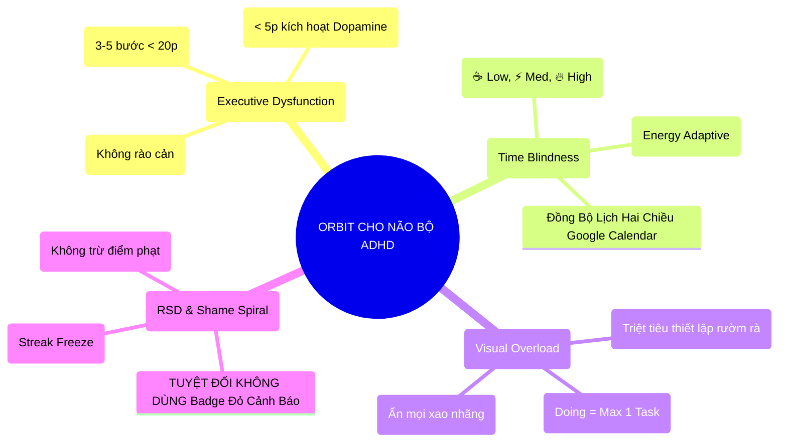
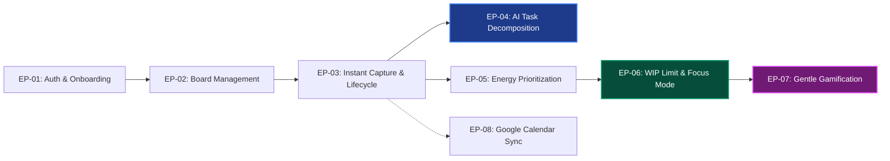
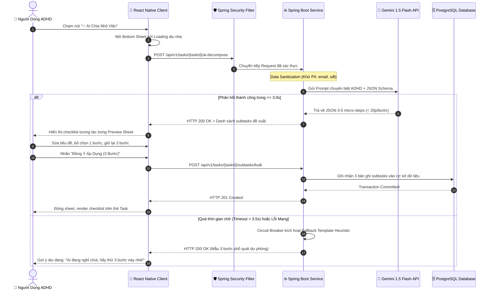
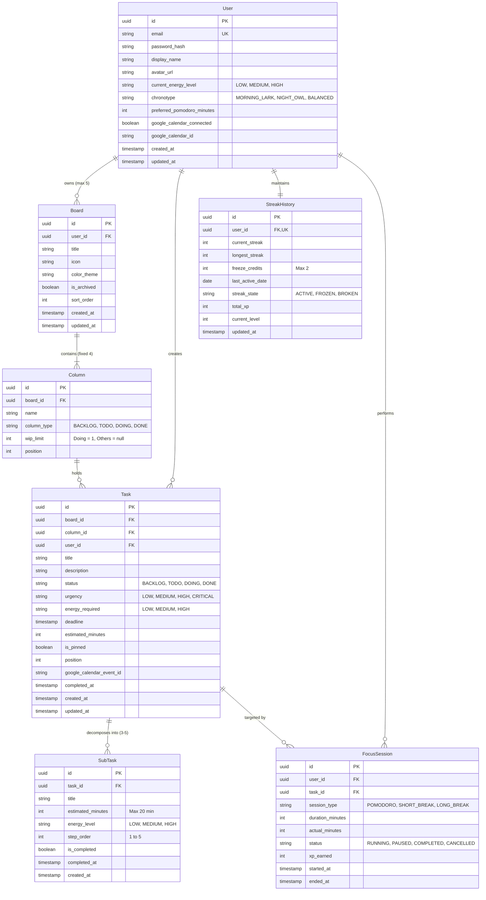
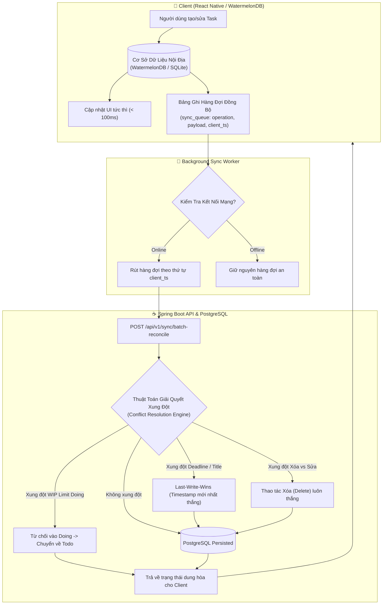
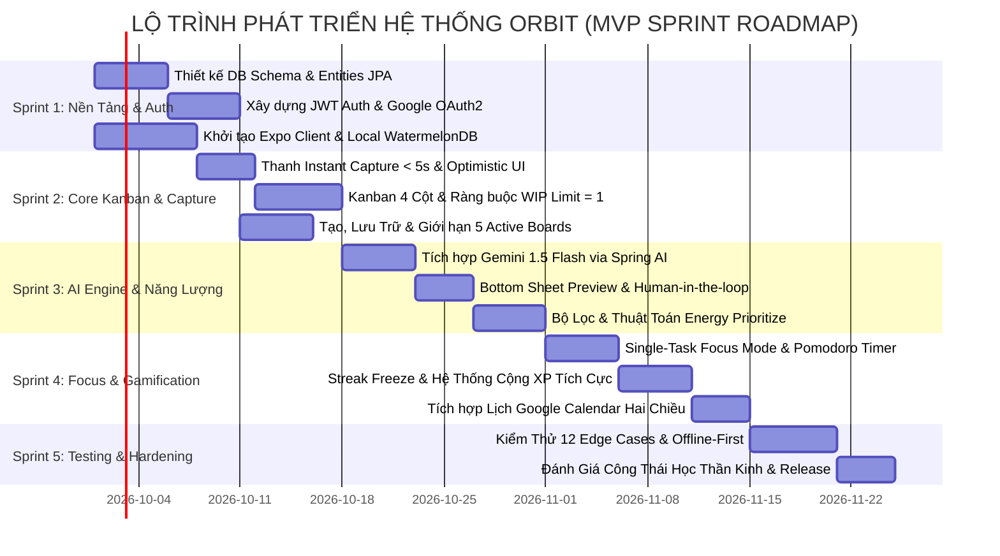

# Product Requirements Document (PRD) — ORBIT
## Intelligent Task Orchestrator for ADHD Minds

| Metadata Quản Trị Dự Án | Giá Trị Chi Tiết |
| :--- | :--- |
| **Tên Sản Phẩm** | **Orbit** — Intelligent Task Orchestrator for ADHD Minds |
| **Mã Dự Án** | `ORBIT-CORE-2026` |
| **Phiên Bản Tài Liệu** | `2.0.0` (Master Specification for Engineering & QA Baseline) |
| **Tác Giả & Vai Trò** | Senior Product Owner (PO) & Lead Business Analyst (BA) |
| **Trạng Thái Phê Duyệt** | **ACCEPTED — READY FOR SPRINT PLANNING & IMPLEMENTATION** |
| **Nền Tảng Đích** | **Mobile Client:** React Native (Expo SDK 51+, TypeScript) **Backend Server:** Java 17/21 LTS, Spring Boot 3.x, Spring AI **Database:** PostgreSQL 15+ (Production) & Reactive SQLite / WatermelonDB (Mobile Offline) **Trí Tuệ Nhân Tạo (AI):** Google Gemini 1.5 Flash via Spring AI Integration |

---

## MỤC LỤC CHI TIẾT

1. [Tổng Quan Sản Phẩm & Triết Lý Thiết Kế Thần Kinh Học](#1-tổng-quan-sản-phẩm--triết-lý-thiết-kế-thần-kinh-học)
   * 1.1. Bối cảnh thần kinh học & 4 rào cản nhận thức của ADHD
   * 1.2. Chân dung người dùng (Personas) & Bản đồ thấu cảm (Empathy Map)
   * 1.3. Mục tiêu sản phẩm & Khung đo lường OKRs
2. [Đặc Tả Chi Tiết 8 Epics Chức Năng (Functional Specifications)](#2-đặc-tả-chi-tiết-8-epics-chức-năng-functional-specifications)
   * Epic 1: Authentication & Onboarding
   * Epic 2: Board Management (Chống Configuration Paralysis)
   * Epic 3: Instant Capture & Ticket Life-cycle (< 5s)
   * Epic 4: AI Task Decomposition (Human-in-the-Loop & Schema < 20 min)
   * Epic 5: Energy-Adaptive Prioritization (Công thức xếp hạng thích ứng)
   * Epic 6: WIP Limit & Focus Mode Pomodoro (Single-Tasking)
   * Epic 7: Gentle Gamification & Retention (Chống RSD & Streak Freeze)
   * Epic 8: Google Calendar Two-Way Sync
3. [Từ Điển Dữ Liệu & Ràng Buộc Nghiệp Vụ (Data Dictionary & Validation Rules)](#3-từ-điển-dữ-liệu--ràng-buộc-nghiệp-vụ-data-dictionary--validation-rules)
   * Thực thể User, Board, Task, SubTask, EnergyLevel, FocusSession, StreakHistory
4. [Đặc Tả Phi Chức Năng (NFR) & Kiến Trúc Offline-First](#4-đặc-tả-phi-chức-năng-nfr--kiến-trúc-offline-first)
   * 4.1. Chiến lược lưu trữ Mobile & Thuật toán giải quyết xung đột (Conflict Resolution)
   * 4.2. SLA hiệu năng, Circuit Breaker & Heuristic Fallback
   * 4.3. Chính sách bảo mật dữ liệu PII & Data Sanitization Pipeline
5. [Ma Trận Phân Quyền, Xử Lý Sự Cố & Giới Hạn Biên (Edge Cases)](#5-ma-trận-phân-quyền-xử-lý-sự-cố--giới-hạn-biên-edge-cases)
   * 5.1. Ma trận phân quyền kiểm soát truy cập (Access Control Matrix)
   * 5.2. Danh mục 12 trường hợp biên (Edge Cases) & Ứng xử nhân văn

---

## 1. Tổng Quan Sản Phẩm & Triết Lý Thiết Kế Thần Kinh Học

### 1.1. Bối cảnh thần kinh học & 4 rào cản nhận thức của ADHD
**Rối loạn Tăng động Giảm chú ý (ADHD)** là một tình trạng thần kinh xuất phát từ sự rối loạn dẫn truyền chất dẫn truyền thần kinh **Dopamine** và **Norepinephrine** tại thùy trán trước (*Prefrontal Cortex*). Đây là trung tâm chỉ huy của các **chức năng điều hành (Executive Functions)** bao gồm: khởi xướng hành động, ước lượng thời gian, ức chế xung động và ghi nhớ làm việc (*Working Memory*).

Orbit được xây dựng dựa trên 4 trụ cột giải phẫu thần kinh học nhằm triệt tiêu 4 rào cản cốt tử:

1. **Rào Cản Khởi Động (Task Paralysis / Executive Dysfunction):**
   * *Bản chất:* Khi đứng trước một đầu việc mơ hồ hoặc quá lớn, hạch hạnh nhân (*Amygdala*) của người ADHD kích hoạt phản ứng né tránh (Fight-or-Flight / Procrastination) vì xem đó là mối đe dọa nhận thức.
   * *Giải pháp Orbit:* Cung cấp thanh **Instant Capture < 5s** và tính năng **✨ AI Task Decomposition** dùng Gemini 1.5 Flash tự động bẻ gãy công việc thành 3–5 micro-steps dưới 20 phút. Bước đầu tiên luôn < 5 phút để tạo mồi nhử Dopamine.
2. **Hiện Tượng "Mù Thời Gian" (Time Blindness):**
   * *Bản chất:* Não bộ ADHD không cảm nhận được dòng thời gian tuyến tính; khái niệm thời gian chỉ tồn tại dưới hai trạng thái: *"Bây Giờ (Now)"* hoặc *"Không Phải Bây Giờ (Not Now)"*.
   * *Giải pháp Orbit:* Thay vì xếp hàng công việc đơn thuần theo Deadline cứng (vốn gây hoảng sợ phút chót), Orbit phân loại theo **Mức Năng Lượng Nhận Thức (Cognitive Energy)**: ☕ Thấp, ⚡ Vừa, 🔥 Cao. Giúp người dùng chọn việc phù hợp với lượng "pin sinh học" hiện có.
3. **Quá Tải Thị Giác & Tê Liệt Lựa Chọn (Visual Sensory Overload & Analysis Paralysis):**
   * *Bản chất:* Các công cụ quản lý dự án truyền thống (Jira, Notion, Trello) có quá nhiều nhãn màu, trường nhập, thanh lọc và cột tùy biến khiến năng lượng não bộ cạn kiệt trước khi bắt tay vào làm việc.
   * *Giải pháp Orbit:* Cố định **Kanban 4 cột duy nhất (Backlog → Todo → Doing → Done)**; áp dụng **WIP Limit = 1** ở cột Doing (chặn đa nhiệm phân mảnh) và tích hợp **Focus Mode Pomodoro** cô lập tầm nhìn.
4. **Hội Chứng Nhạy Cảm Bị Từ Chối / Thất Bại (Rejection Sensitive Dysphoria - RSD):**
   * *Bản chất:* Người ADHD dễ rơi vào vòng xoáy xấu hổ (*Shame Spiral*) và từ bỏ vĩnh viễn ứng dụng khi nhìn thấy chuỗi ngày bị đứt về số 0, hoặc màn hình tràn ngập các huy hiệu đỏ "Quá Hạn (Overdue)" gắt gỏng.
   * *Giải pháp Orbit:* **Gamification Dịu Dàng (Gentle Gamification)**: Tự động tiêu thụ **Khiên Đóng Băng (Streak Freeze)** khi nghỉ ngày; tuyệt đối không trừ điểm; không dùng màu đỏ đe dọa; đón chào người dùng trở lại bằng ngôn từ ấm áp, thấu cảm.

---

### 1.2. Chân Dung Người Dùng (Personas) & Bản Đồ Thấu Cảm

#### Persona 1: Nhật Minh — Sinh Viên Công Nghệ Thông Tin (Inattentive ADHD)
* **Độ tuổi:** 21 | **Địa bàn:** TP. Hồ Chí Minh.
* **Đặc điểm:** Sáng tạo, có khả năng Hyperfocus (siêu tập trung) vào những chủ đề mới lạ, nhưng bị tê liệt hoàn toàn khi đối mặt với đồ án học kỳ dài 3 tháng. Đã bỏ Notion sau 3 ngày vì ngợp khâu thiết lập.
* **Nhu cầu cốt lõi:** Một nút bấm duy nhất biến đề bài đồ án 15 trang thành các bước làm bài tập < 15 phút, hiển thị trong giao diện tĩnh lặng không quảng cáo.

#### Persona 2: Thùy Linh — Chuyên Viên Truyền Thông Tự Do (Combined ADHD)
* **Độ tuổi:** 26 | **Địa bàn:** Hà Nội.
* **Đặc điểm:** Quản lý cùng lúc 4 hợp đồng khách hàng. Mức năng lượng dao động dữ dội: bùng nổ ý tưởng vào lúc nửa đêm nhưng kiệt quệ não bộ vào chiều muộn.
* **Nhu cầu cốt lõi:** Bộ lọc năng lượng thông minh: *"Khi não bộ cạn pin, Orbit lập tức đưa các việc nhỏ ☕ (< 10 phút) lên đầu để Linh tích lũy chiến thắng nhỏ (micro-wins) mà không bị kiệt sức."*

---

### 1.3. Mục Tiêu Sản Phẩm & Khung Đo Lường OKRs (MVP Release)

* **Objective 1 (Khởi Động Liền Mạch — Frictionless Initiation):** Giảm thiểu tối đa khoảng cách thời gian giữa ý nghĩ nảy sinh và hành động thể chất đầu tiên.
  * *KR 1.1:* Thời gian trung bình để ghi nhận 1 task mới qua Instant Capture $\le 5.0$ giây.
  * *KR 1.2:* Tỷ lệ nhiệm vụ lớn ($\ge 60$ phút) sử dụng tính năng AI Task Decomposition đạt $\ge 65\%$.
  * *KR 1.3:* Tỷ lệ chấp thuận micro-step của AI (Human-in-the-loop acceptance rate) đạt $\ge 80\%$.
* **Objective 2 (Duy Trì Động Lực Bền Vững — Sustainable Dopamine Loop):** Giúp người dùng hoàn thành công việc mà không kích hoạt khủng hoảng tâm lý RSD.
  * *KR 2.1:* Tỷ lệ hoàn thành micro-subtasks đạt $\ge 60\%$.
  * *KR 2.2:* Tỷ lệ giữ chân người dùng sau 14 ngày (Day-14 Retention Rate) đạt $\ge 40\%$.
  * *KR 2.3:* Tỷ lệ kích hoạt bảo lưu chuỗi Streak Freeze thành công (cứu người dùng khỏi bỏ app) đạt $\ge 75\%$.

---

## 2. Đặc Tả Chi Tiết 8 Epics Chức Năng (Functional Specifications)

### Epic 1: Authentication & Onboarding (Xác Thực & Nhập Khởi)
* **Mục tiêu nghiệp vụ:** Cho phép người dùng đăng ký, đăng nhập an toàn với ma sát tối thiểu; thu thập nhịp sinh học ban đầu để cá nhân hóa gợi ý năng lượng.
* **Quy tắc nghiệp vụ (Business Rules):**
  1. Hỗ trợ 2 phương thức xác thực: Email/Mật khẩu truyền thống và Google OAuth2 (1 chạm).
  2. Mật khẩu phải có độ dài tối thiểu 8 ký tự, bao gồm ít nhất 1 chữ hoa, 1 chữ thường, 1 số và 1 ký tự đặc biệt.
  3. Mã hóa mật khẩu bằng thuật toán **BCrypt** với độ phức tạp `cost = 12`.
  4. Cơ chế phiên: Stateless JWT với Access Token (15 phút) và Refresh Token (7 ngày, lưu trữ an toàn trong SecureStore/KeyChain trên mobile, cookie HTTP-Only SameSite=Strict trên web nếu có).
  5. Bảo vệ chống tấn công dò quét người dùng (*User Enumeration Attack*): Khi đăng nhập sai mật khẩu hoặc sai email, hệ thống chỉ trả về duy nhất thông báo chung: *"Email hoặc mật khẩu chưa chính xác. Hãy thử lại nhẹ nhàng nhé!"*
  6. Luồng Onboarding ngắn gọn (2 bước): Khảo sát khung giờ tỉnh táo nhất (Sáng sớm, Ban ngày, hay Cú đêm) và thời lượng tập trung ưa thích (15, 25 hay 45 phút). Tự động khởi tạo 1 Board mặc định và cấu hình baseline năng lượng.

---

### Epic 2: Board Management (Quản Lý Không Gian Làm Việc)
* **Mục tiêu nghiệp vụ:** Phân tách các khía cạnh cuộc sống (Học tập, Sự nghiệp, Cá nhân) nhưng chặn đứng nguy cơ sa đà vào việc tạo quá nhiều bảng.
* **Quy tắc nghiệp vụ (Business Rules):**
  1. **Giới Hạn Nghiêm Ngặt (Strict Cap):** Mỗi người dùng được sở hữu tối đa **từ 3 đến 5 Active Boards** cùng lúc. Mặc định hệ thống giới hạn ở **5 Boards**.
  2. Khi người dùng cố gắng bấm "+ Thêm Board mới" ở mốc 5 boards, hệ thống hiển thị Modal chặn có tính giáo dục thấu cảm: nhắc nhở người dùng lưu trữ (Archive) bớt 1 board cũ để giữ tâm trí gọn gàng.
  3. Mỗi Board được tạo ra sẽ tự động chứa đúng 4 cột Kanban cố định bất biến: `BACKLOG` (Hộp nháp), `TODO` (Sẵn sàng), `DOING` (Đang làm - WIP Limit = 1), `DONE` (Hoàn thành). Người dùng không được phép thêm, xóa, hoặc đổi tên loại cột này nhằm triệt tiêu thói quen trì hoãn do tùy biến công cụ (*Tool Customization Procrastination*).
  4. Người dùng có quyền đổi tên bảng (tối đa 40 ký tự), đổi icon đại diện (Emoji), màu sắc nhận diện (8 màu pastel dịu nhẹ), và chức năng Lưu trữ (Archive) / Khôi phục (Unarchive).
  5. Xóa vĩnh viễn (Hard Delete) Board yêu cầu gõ xác nhận từ `"XÓA"` nếu board đang chứa $\ge 1$ task để tránh hành vi bốc đồng (*Impulsivity*).

---

### Epic 3: Instant Capture & Ticket Life-cycle (Ghi Nhận Nhanh & Vòng Đời Task)
* **Mục tiêu nghiệp vụ:** Cung cấp trải nghiệm ghi việc < 5 giây từ bất kỳ đâu trong app, triệt tiêu suy giảm trí nhớ ngắn hạn.
* **Quy tắc nghiệp vụ (Business Rules):**
  1. **Thanh Nhập Liệu Thường Trực (Persistent Quick Capture Bar):** Luôn ghim cố định ở đáy màn hình chính. Chỉ yêu cầu duy nhất 1 trường `title`.
  2. Bấm phím Enter / Gửi: Thẻ task lập tức xuất hiện trên đỉnh cột `BACKLOG` với cơ chế **Optimistic UI Update < 100ms** kèm rung Haptic dịu dàng.
  3. Giá trị mặc định khi tạo nhanh: Năng lượng = `MEDIUM` (⚡), Urgency = `MEDIUM`, Deadline = `null`.
  4. Khi mở chi tiết Task: Người dùng có thể gắn Deadline, chỉnh sửa Mô tả, chọn Mức năng lượng (☕ Low / ⚡ Med / 🔥 High), ước lượng thời gian (phút), ghim lên đầu (Pinned).
  5. Di chuyển trạng thái: Hỗ trợ kéo thả (Drag-and-Drop 60fps) hoặc mở menu chuyển cột nhanh. Khi chuyển sang `DONE`, ghi nhận `completed_at = now()`, bắn pháo hoa nhẹ (Confetti) và cộng +20 XP.

---

### Epic 4: AI Task Decomposition (Chia Nhỏ Việc Bằng AI & Human-in-the-Loop)
* **Mục tiêu nghiệp vụ:** Giải cứu người dùng khỏi cơn tê liệt hành động (*Task Paralysis*) khi đối diện một công việc phức tạp.
* **Quy trình tương tác AI (Human-in-the-Loop Workflow):**

* **Ràng buộc kỹ thuật với AI (Gemini Prompt & Schema Constraints):**
  1. Số lượng bước: Bắt buộc từ **3 đến 5 micro-steps**.
  2. Giới hạn thời gian: Mọi bước đều có `estimatedMinutes <= 20`.
  3. **Nguyên Tắc Mồi Nhử Dopamine (Dopamine Trigger):** Bước số 1 (`stepOrder = 1`) bắt buộc phải là hành động cực nhẹ có thời lượng $\le 5$ phút (ví dụ: *"Mở file Word và gõ 3 chữ tiêu đề"* hoặc *"Dọn 3 quyển sách trên bàn"*).
  4. Động từ hành động: Tiêu đề mỗi bước phải bắt đầu bằng động từ cụ thể, cấm dùng các từ ngữ mơ hồ ("Nghiên cứu", "Tư duy", "Làm đồ án").
  5. Nguyên tắc **Human-in-the-Loop**: Tuyệt đối không tự động ghi dữ liệu vào Database. Người dùng bắt buộc phải duyệt, chỉnh sửa hoặc hủy trên Bottom Sheet Preview trước khi lưu.

---

### Epic 5: Energy-Adaptive Prioritization (Ưu Tiên Thích Ứng Mức Năng Lượng)
* **Mục tiêu nghiệp vụ:** Tái định tuyến hàng đợi công việc dựa trên dung lượng năng lượng nhận thức thực tế của người dùng, giải quyết vấn đề Mù Thời Gian (*Time Blindness*).
* **Công thức toán học tính Điểm Ưu Tiên Thích Ứng (Priority Score Formula):**

Hệ thống tính toán Điểm Ưu Tiên Thích Ứng $P(T) \in [0, 100]$ cho mỗi công việc $T$ trong cột `TODO` theo công thức:

$$P(T) = w_U \cdot U(T) + w_E \cdot E(T, \text{UserEnergy}) + w_C \cdot C(T)$$

Trong đó, các trọng số được tối ưu hóa cho tâm lý học nhận thức ADHD:
* $w_U = 0.40$ (Trọng số mức độ khẩn cấp theo Deadline)
* $w_E = 0.45$ (Trọng số mức độ tương thích năng lượng — Yếu tố chi phối chính để chống Burnout)
* $w_C = 0.15$ (Trọng số chiến thắng nhanh / Độ phức tạp — Quick-Win Factor)

**Chi tiết các hàm thành phần:**
1. **Hàm Điểm Khẩn Cấp $U(T) \in [0, 100]$:**
   * Nếu task không có deadline: $U(T) = 20.0$ (Điểm cơ sở).
   * Nếu task đã quá hạn ($\Delta t < 0$): $U(T) = 90.0$ *(Lưu ý: Không đặt 100 để tránh gây hoảng loạn tâm lý cho người dùng)*.
   * Nếu còn thời hạn ($\Delta t = \text{deadline} - \text{now} > 0$, tính theo giờ):
     $$U(T) = 100 \cdot \exp\left(-\frac{\Delta t}{48}\right)$$
     *(Công việc có deadline trong vòng 24 giờ sẽ có điểm khẩn cấp cao vượt bậc).*
2. **Hàm Tương Thích Năng Lượng $E(T, \text{UserEnergy}) \in [0, 100]$:**
   * Quy ước mức năng lượng: $\text{LOW} = 1$, $\text{MEDIUM} = 2$, $\text{HIGH} = 3$.
   * Ma trận tương thích:
     | Năng lượng User hiện tại | Yêu cầu của Task: LOW (1) | Yêu cầu của Task: MEDIUM (2) | Yêu cầu của Task: HIGH (3) |
     | :--- | :---: | :---: | :---: |
     | **User LOW (☕ Kiệt sức)** | **100** *(Khuyên làm)* | **30** *(Cân nhắc)* | **0** *(Làm mờ, ẩn đi)* |
     | **User MEDIUM (⚡ Bình thường)** | **80** *(Dễ xơi)* | **100** *(Tối ưu)* | **40** *(Hơi nặng)* |
     | **User HIGH (🔥 Hưng phấn)** | **70** *(Giải quyết nhanh)* | **85** *(Rất tốt)* | **100** *(Tối ưu Hyperfocus)* |
3. **Hàm Chiến Thắng Nhanh $C(T) \in [0, 100]$:**
   * Khuyến khích các task ngắn để tích lũy Dopamine:
     $$C(T) = \max\left(10, 100 - \frac{\text{estimatedMinutes}}{2}\right)$$
     *(Ví dụ: Task 10 phút đạt $C = 95$; Task 120 phút đạt $C = 40$).*

* **Hiệu ứng công thái học thị giác (Visual Dimming):**
  * Khi User chọn `☕ LOW`: Các task `HIGH` sẽ tự động giảm độ mờ hiển thị xuống **Opacity = 35%**, chuyển về cuối danh sách cột `TODO`, gắn biểu tượng chiếc lá thư thái. Người dùng không còn bị cảm giác tội lỗi bủa vây.

---

### Epic 6: WIP Limit & Focus Mode Pomodoro (Giới Hạn Việc & Chế Độ Tập Trung)
* **Mục tiêu nghiệp vụ:** Bảo vệ não bộ khỏi sự phân mảnh đa nhiệm (*Multitasking*), cung cấp một môi trường làm việc đơn nhiệm (*Single-Tasking*) tuyệt đối an toàn.
* **Quy tắc nghiệp vụ WIP Limit:**
  1. Cột `DOING` có giới hạn nghiêm ngặt **WIP Limit = 1**.
  2. Khi cột `DOING` đã có 1 task, mọi thao tác kéo task thứ 2 vào sẽ bị chặn ngay lập tức. Thẻ task trượt ngược về cột cũ với thông báo dịu dàng: *"Tâm trí bạn tỏa sáng nhất khi chỉ tập trung vào một việc duy nhất! Hãy hoàn thành hoặc tạm dừng việc hiện tại trước nhé."*
* **Chế độ Focus Mode Pomodoro:**
  1. Kích hoạt bằng nút "🎯 Tập Trung Ngay" trên task đang nằm ở cột `DOING`.
  2. Màn hình FocusScreen phóng to toàn màn hình, che giấu toàn bộ: Thanh điều hướng, 3 cột Kanban còn lại, và Thanh Quick Capture.
  3. Chỉ hiển thị: Tiêu đề Task, Checklist micro-steps tương tác, và Đồng hồ đếm ngược Pomodoro (mặc định 25 phút, hỗ trợ tùy chỉnh 15/25/45 phút).
  4. Màu sắc hiển thị: Gam màu Xanh Ngọc (Emerald) hoặc Xanh Lam Dịu (Cyan) êm dịu, **TUYỆT ĐỐI KHÔNG dùng màu đỏ đếm ngược** gây kích thích căng thẳng vỏ não.
  5. Các trạng thái timer: `RUNNING`, `PAUSED`, `BREAK (5 phút)`, `COMPLETED`.
  6. Khi kết thúc: Chuông gió du dương (Wind Chime) vang lên, thưởng +15 XP tập trung, gợi ý nghỉ ngơi 5 phút trước khi làm tiếp.

---

### Epic 7: Gentle Gamification & Retention (Gamification Dịu Dàng & Chống RSD)
* **Mục tiêu nghiệp vụ:** Duy trì thói quen bền bỉ thông qua vòng lặp phản hồi Dopamine tích cực, loại bỏ hoàn toàn các hình phạt tâm lý.
* **Hệ thống Điểm Kinh Nghiệm (XP Architecture):**
  * Hoàn thành 1 Micro-subtask: `+5 XP`.
  * Hoàn thành 1 Task chính (chuyển sang Done): `+20 XP`.
  * Hoàn thành 1 phiên Focus Pomodoro (25 phút): `+15 XP`.
  * Nhiệm vụ đầu tiên hoàn thành trong ngày (First-win bonus): `+10 XP`.
  * **Quy tắc vàng:** **KHÔNG BAO GIỜ TRỪ ĐIỂM (Zero Penalty Policy).** Không phạt khi trễ hạn, không phạt khi hủy phiên Pomodoro.
* **Cơ chế Bảo Lưu Chuỗi (Streak Freeze Shield Mechanism):**
  1. Mỗi ngày hoàn thành ít nhất 1 micro-step hoặc 1 task $\to$ Tích lũy Streak ngày liên tiếp ($+1$).
  2. Cứ mỗi **3 ngày duy trì Streak liên tiếp**, người dùng được tặng **1 Khiên Đóng Băng (1 Streak Freeze Credit)**. Tối đa sở hữu cùng lúc: **2 Khiên**.
  3. Nếu người dùng không mở app hoặc không hoàn thành việc nào trong 24h:
     * Hệ thống tự động kích hoạt 1 Streak Freeze Credit để đóng băng ngày đó.
     * Chuỗi ngày được bảo toàn nguyên vẹn (ví dụ: đang 14 ngày vẫn giữ 14 ngày).
     * Khi người dùng quay lại: Hiển thị banner cảm ơn dịu dàng: *"Khiên đóng băng đã bảo vệ chuỗi ngày của bạn hôm qua. Hãy làm 1 việc nhỏ hôm nay để tiếp tục nhé! 🛡️"*
  4. Nếu vắng mặt kéo dài và hết lượt Freeze:
     * Streak reset về 1 ngày mới khi quay lại, nhưng hệ thống vẫn lưu trữ kỷ lục `max_streak` và tổng XP.
     * Xuất hiện màn hình Chào Đón Nhân Văn: *"Mừng bạn trở lại! Cuộc sống luôn cần những quãng nghỉ. Mọi nỗ lực cũ của bạn vẫn luôn ở đây."* — Tuyệt đối không dùng chữ số đỏ hay cảnh báo mất chuỗi!

---

### Epic 8: Google Calendar Two-Way Sync (Đồng Bộ Lịch Hai Chiều)
* **Mục tiêu nghiệp vụ:** Cầu nối nhận thức thời gian giữa Orbit và hệ thống lịch số hàng ngày của người dùng.
* **Quy tắc nghiệp vụ (Business Rules):**
  1. Người dùng kết nối Google Calendar qua OAuth2 scope `calendar.events`.
  2. Orbit tự động tạo một Secondary Calendar riêng biệt mang tên **"Orbit Tasks"** trên Google Calendar (màu Cyan nhận diện) để không làm rối lịch cá nhân chính của người dùng.
  3. **Đồng bộ xuôi (Orbit $\to$ Google Calendar):** Khi một task có `deadline` và `estimatedMinutes`, Orbit tự động tạo hoặc cập nhật Event tương ứng trên lịch "Orbit Tasks" với nhắc nhở mặc định trước 30 phút.
  4. **Đồng bộ ngược (Google Calendar $\to$ Orbit):** Khi người dùng kéo dời giờ sự kiện trên Google Calendar, Google đẩy Webhook về Orbit. Orbit cập nhật lại trường `deadline` của task tương ứng và bắn WebSocket thông báo về Mobile client.
  5. **Nguyên tắc giải quyết tranh chấp:** Orbit luôn là nguồn chân lý (*Source of Truth*) về trạng thái công việc (`status`), trong khi thời gian hạn chót (`deadline`) tuân theo nguyên tắc bản ghi có mốc thời gian sửa đổi mới nhất (*Latest Timestamp Wins*).

---

## 3. Từ Điển Dữ Liệu & Ràng Buộc Nghiệp Vụ (Data Dictionary & Validation Rules)

### 3.1. Sơ Đồ Thực Thể Quan Hệ (Entity Relationship Diagram - ERD)

---

### 3.2. Đặc Tả Chi Tiết Từng Thực Thể (Entity Data Specifications)

#### 1. Thực thể `User` (Bảng `users`)
| Tên trường | Kiểu dữ liệu (SQL / Java) | Bắt buộc (Null?) | Ràng buộc nghiệp vụ & Validation Rules |
| :--- | :--- | :---: | :--- |
| `id` | `UUID` / `UUID` | NOT NULL (PK) | Khởi tạo ngẫu nhiên UUIDv4; định danh duy nhất của tài khoản. |
| `email` | `VARCHAR(255)` / `String` | NOT NULL (UK) | Định dạng email hợp lệ theo RFC 5322 regex; viết thường toàn bộ; duy nhất trong toàn hệ thống. |
| `password_hash` | `VARCHAR(255)` / `String` | NULLABLE | Bắt buộc nếu đăng ký qua form mật khẩu. Băm BCrypt cost 12. Null nếu người dùng đăng ký thuần bằng Google OAuth2. |
| `display_name` | `VARCHAR(50)` / `String` | NOT NULL | Độ dài từ 2 đến 50 ký tự; không chứa ký tự điều khiển HTML/script; hiển thị tên gọi cá nhân. |
| `avatar_url` | `VARCHAR(512)` / `String` | NULLABLE | URL hình ảnh hợp lệ (HTTPS); tối đa 512 ký tự; trỏ tới Google CDN hoặc máy chủ S3 lưu trữ avatar. |
| `current_energy_level`| `VARCHAR(20)` / `Enum` | NOT NULL | Giá trị Enum: `LOW`, `MEDIUM`, `HIGH`. Mặc định: `MEDIUM`. Thể hiện trạng thái pin não bộ hiện tại. |
| `chronotype` | `VARCHAR(30)` / `Enum` | NOT NULL | Giá trị Enum: `MORNING_LARK`, `NIGHT_OWL`, `BALANCED`. Mặc định: `BALANCED`. |
| `preferred_pomodoro_minutes`| `INTEGER` / `Integer`| NOT NULL | Giá trị hợp lệ: `15`, `25`, `45`. Mặc định: `25`. Thời lượng phiên tập trung ưa thích. |
| `google_calendar_connected`| `BOOLEAN` / `Boolean`| NOT NULL | Mặc định: `false`. Cờ đánh dấu tài khoản đã kết nối lịch Google hay chưa. |
| `google_calendar_id` | `VARCHAR(255)` / `String` | NULLABLE | ID của Calendar phụ "Orbit Tasks" trên Google Calendar. Null nếu chưa liên kết. |
| `created_at` | `TIMESTAMP WITH TIME ZONE` | NOT NULL | Thời điểm khởi tạo tài khoản (`Instant.now()`), tự động ghi nhận bởi DB/JPA Auditing. |
| `updated_at` | `TIMESTAMP WITH TIME ZONE` | NOT NULL | Thời điểm cập nhật hồ sơ gần nhất (`Instant.now()`). |

#### 2. Thực thể `Board` (Bảng `boards`)
| Tên trường | Kiểu dữ liệu (SQL / Java) | Bắt buộc (Null?) | Ràng buộc nghiệp vụ & Validation Rules |
| :--- | :--- | :---: | :--- |
| `id` | `UUID` / `UUID` | NOT NULL (PK) | UUIDv4 định danh duy nhất của Board. |
| `user_id` | `UUID` / `UUID` | NOT NULL (FK) | Khóa ngoại tham chiếu `users(id)`. ON DELETE CASCADE. |
| `title` | `VARCHAR(40)` / `String` | NOT NULL | Tên bảng; tối thiểu 1 ký tự, tối đa 40 ký tự; cắt tỉa khoảng trắng thừa (trim). |
| `icon` | `VARCHAR(10)` / `String` | NOT NULL | Chuỗi Unicode Emoji đại diện (ví dụ: "📚", "💼", "🧘"). Mặc định: "📋". |
| `color_theme` | `VARCHAR(20)` / `String` | NOT NULL | Mã màu HEX hoặc mã palette dịu nhẹ (ví dụ: `#10B981`, `#06B6D4`, `#8B5CF6`). Mặc định: `#10B981`. |
| `is_archived` | `BOOLEAN` / `Boolean` | NOT NULL | Mặc định: `false`. Nếu `true`, board được ẩn khỏi danh sách chính và không tính vào giới hạn 5 boards. |
| `sort_order` | `INTEGER` / `Integer` | NOT NULL | Thứ tự sắp xếp trong Drawer danh sách; giá trị $\ge 0$. |
| `created_at` | `TIMESTAMP WITH TIME ZONE` | NOT NULL | Thời điểm tạo Board. |
| `updated_at` | `TIMESTAMP WITH TIME ZONE` | NOT NULL | Thời điểm cập nhật thuộc tính Board. |

#### 3. Thực thể `Column` (Bảng `columns`)
| Tên trường | Kiểu dữ liệu (SQL / Java) | Bắt buộc (Null?) | Ràng buộc nghiệp vụ & Validation Rules |
| :--- | :--- | :---: | :--- |
| `id` | `UUID` / `UUID` | NOT NULL (PK) | UUIDv4 của cột Kanban. |
| `board_id` | `UUID` / `UUID` | NOT NULL (FK) | Khóa ngoại tham chiếu `boards(id)`. ON DELETE CASCADE. |
| `name` | `VARCHAR(50)` / `String` | NOT NULL | Tên hiển thị của cột ("Hộp Nháp", "Sẵn Sàng", "Đang Làm", "Hoàn Thành"). |
| `column_type` | `VARCHAR(20)` / `Enum` | NOT NULL | Enum: `BACKLOG`, `TODO`, `DOING`, `DONE`. Cố định bất biến. |
| `wip_limit` | `INTEGER` / `Integer` | NULLABLE | Giới hạn công việc đang xử lý. Bắt buộc: nếu `column_type = 'DOING'` thì `wip_limit = 1`. Các cột khác là `NULL` (không giới hạn). |
| `position` | `INTEGER` / `Integer` | NOT NULL | Vị trí hiển thị từ trái qua phải (0: Backlog, 1: Todo, 2: Doing, 3: Done). |

#### 4. Thực thể `Task` (Bảng `tasks`)
| Tên trường | Kiểu dữ liệu (SQL / Java) | Bắt buộc (Null?) | Ràng buộc nghiệp vụ & Validation Rules |
| :--- | :--- | :---: | :--- |
| `id` | `UUID` / `UUID` | NOT NULL (PK) | UUIDv4 định danh duy nhất của Task. |
| `board_id` | `UUID` / `UUID` | NOT NULL (FK) | Khóa ngoại tham chiếu `boards(id)`. |
| `column_id` | `UUID` / `UUID` | NOT NULL (FK) | Khóa ngoại tham chiếu `columns(id)`. Xác định vị trí cột hiện tại của task. |
| `user_id` | `UUID` / `UUID` | NOT NULL (FK) | Khóa ngoại tham chiếu `users(id)` phục vụ kiểm tra phân quyền sở hữu nhanh chóng. |
| `title` | `VARCHAR(255)` / `String` | NOT NULL | Tiêu đề task; tối thiểu 1 ký tự, tối đa 255 ký tự; không được để trống hoặc toàn khoảng trắng. |
| `description` | `TEXT` / `String` | NULLABLE | Mô tả chi tiết; tối đa 4000 ký tự; hỗ trợ định dạng Markdown cơ bản. |
| `status` | `VARCHAR(20)` / `Enum` | NOT NULL | Enum: `BACKLOG`, `TODO`, `DOING`, `DONE`. Đồng bộ với `column.column_type`. Mặc định: `BACKLOG`. |
| `urgency` | `VARCHAR(20)` / `Enum` | NOT NULL | Enum: `LOW`, `MEDIUM`, `HIGH`, `CRITICAL`. Mặc định: `MEDIUM`. |
| `energy_required` | `VARCHAR(20)` / `Enum` | NOT NULL | Enum: `LOW` (☕), `MEDIUM` (⚡), `HIGH` (🔥). Mặc định: `MEDIUM`. |
| `deadline` | `TIMESTAMP WITH TIME ZONE` | NULLABLE | Thời điểm hạn chót cần hoàn thành task. Có thể null nếu chưa xác định. |
| `estimated_minutes` | `INTEGER` / `Integer` | NULLABLE | Thời gian ước lượng hoàn thành tính theo phút; giá trị từ 1 đến 1440 phút (24h). Mặc định: 30. |
| `is_pinned` | `BOOLEAN` / `Boolean` | NOT NULL | Mặc định: `false`. Nếu `true`, luôn ghim trên đỉnh cột `TODO`. |
| `position` | `INTEGER` / `Integer` | NOT NULL | Vị trí thứ tự thẻ bài trong cột (0-indexed). Cập nhật lại khi kéo thả hoặc khi chạy AI Prioritize. |
| `google_calendar_event_id`| `VARCHAR(255)` / `String`| NULLABLE | ID sự kiện tương ứng trên Google Calendar. Null nếu chưa đồng bộ. |
| `completed_at` | `TIMESTAMP WITH TIME ZONE` | NULLABLE | Ghi nhận thời điểm chính xác khi task được di chuyển vào cột `DONE`. |
| `created_at` | `TIMESTAMP WITH TIME ZONE` | NOT NULL | Thời điểm tạo task. |
| `updated_at` | `TIMESTAMP WITH TIME ZONE` | NOT NULL | Thời điểm sửa đổi task lần cuối. |

#### 5. Thực thể `SubTask` (Bảng `subtasks`)
| Tên trường | Kiểu dữ liệu (SQL / Java) | Bắt buộc (Null?) | Ràng buộc nghiệp vụ & Validation Rules |
| :--- | :--- | :---: | :--- |
| `id` | `UUID` / `UUID` | NOT NULL (PK) | UUIDv4 của micro-step. |
| `task_id` | `UUID` / `UUID` | NOT NULL (FK) | Khóa ngoại tham chiếu `tasks(id)`. ON DELETE CASCADE. |
| `title` | `VARCHAR(150)` / `String` | NOT NULL | Tiêu đề hành động; tối thiểu 3 ký tự, tối đa 150 ký tự; bắt đầu bằng động từ hành động. |
| `estimated_minutes` | `INTEGER` / `Integer` | NOT NULL | Giới hạn thần kinh học: **Giá trị bắt buộc $\in [1, 20]$**. Tuyệt đối không vượt quá 20 phút. |
| `energy_level` | `VARCHAR(20)` / `Enum` | NOT NULL | Enum: `LOW`, `MEDIUM`, `HIGH`. Mặc định cho step 1 là `LOW`. |
| `step_order` | `INTEGER` / `Integer` | NOT NULL | Thứ tự thực hiện bước trong task; giá trị từ 1 đến 5. |
| `is_completed` | `BOOLEAN` / `Boolean` | NOT NULL | Mặc định: `false`. Đổi thành `true` khi người dùng tick vào ô checkbox. |
| `completed_at` | `TIMESTAMP WITH TIME ZONE` | NULLABLE | Ghi nhận thời điểm hoàn thành micro-step để tính toán báo cáo tiến độ. |
| `created_at` | `TIMESTAMP WITH TIME ZONE` | NOT NULL | Thời điểm khởi tạo bản ghi subtask. |

#### 6. Thực thể `FocusSession` (Bảng `focus_sessions`)
| Tên trường | Kiểu dữ liệu (SQL / Java) | Bắt buộc (Null?) | Ràng buộc nghiệp vụ & Validation Rules |
| :--- | :--- | :---: | :--- |
| `id` | `UUID` / `UUID` | NOT NULL (PK) | UUIDv4 định danh phiên tập trung. |
| `user_id` | `UUID` / `UUID` | NOT NULL (FK) | Khóa ngoại tham chiếu `users(id)`. |
| `task_id` | `UUID` / `UUID` | NOT NULL (FK) | Khóa ngoại tham chiếu `tasks(id)` — công việc được cô lập để làm việc. |
| `session_type` | `VARCHAR(30)` / `Enum` | NOT NULL | Enum: `POMODORO`, `SHORT_BREAK`, `LONG_BREAK`. Mặc định: `POMODORO`. |
| `duration_minutes` | `INTEGER` / `Integer` | NOT NULL | Thời lượng dự kiến thiết lập lúc đầu (15, 25 hoặc 45). Mặc định: 25. |
| `actual_minutes` | `INTEGER` / `Integer` | NOT NULL | Số phút thực tế người dùng đã duy trì tập trung trước khi kết thúc hoặc thoát. |
| `status` | `VARCHAR(20)` / `Enum` | NOT NULL | Enum: `RUNNING`, `PAUSED`, `COMPLETED`, `CANCELLED`. |
| `xp_earned` | `INTEGER` / `Integer` | NOT NULL | Điểm XP được cộng sau phiên (ví dụ: +15 XP nếu completed). Mặc định: 0. |
| `started_at` | `TIMESTAMP WITH TIME ZONE` | NOT NULL | Thời điểm bắt đầu đếm giờ. |
| `ended_at` | `TIMESTAMP WITH TIME ZONE` | NULLABLE | Thời điểm kết thúc hoặc thoát phiên. |

#### 7. Thực thể `StreakHistory` (Bảng `streak_histories`)
| Tên trường | Kiểu dữ liệu (SQL / Java) | Bắt buộc (Null?) | Ràng buộc nghiệp vụ & Validation Rules |
| :--- | :--- | :---: | :--- |
| `id` | `UUID` / `UUID` | NOT NULL (PK) | UUIDv4 của bản ghi theo dõi thói quen. |
| `user_id` | `UUID` / `UUID` | NOT NULL (UK, FK) | Khóa ngoại duy nhất tham chiếu `users(id)` (Quan hệ 1 - 1). |
| `current_streak` | `INTEGER` / `Integer` | NOT NULL | Số ngày liên tiếp duy trì hoạt động hiện tại; giá trị $\ge 0$. Mặc định: 0. |
| `longest_streak` | `INTEGER` / `Integer` | NOT NULL | Kỷ lục chuỗi ngày dài nhất từng đạt được trong quá khứ; giá trị $\ge current\_streak$. |
| `freeze_credits` | `INTEGER` / `Integer` | NOT NULL | Số lượng Khiên Đóng Băng đang sở hữu; **Giới hạn $\in [0, 2]$**. Mặc định khi khởi tạo: 1. |
| `last_active_date` | `DATE` / `LocalDate` | NULLABLE | Ngày gần nhất (UTC) người dùng có tương tác hoàn thành công việc. |
| `streak_state` | `VARCHAR(20)` / `Enum` | NOT NULL | Enum: `ACTIVE` (đang duy trì), `FROZEN` (vừa được khiên cứu), `RESET` (bắt đầu lại). |
| `total_xp` | `INTEGER` / `Integer` | NOT NULL | Tổng số điểm kinh nghiệm tích lũy từ trước đến nay; chỉ tăng, không bao giờ giảm. Mặc định: 0. |
| `current_level` | `INTEGER` / `Integer` | NOT NULL | Cấp độ hiện tại: tính bằng công thức $\lfloor \sqrt{\text{total\_xp} / 50} \rfloor + 1$. Mặc định: 1. |
| `updated_at` | `TIMESTAMP WITH TIME ZONE` | NOT NULL | Thời điểm cập nhật trạng thái chuỗi gần nhất. |

---

## 4. Đặc Tả Phi Chức Năng (NFR) & Kiến Trúc Offline-First

### 4.1. Chiến Lược Lưu Trữ Mobile & Thuật Toán Giải Quyết Xung Đột (Conflict Resolution)

#### A. Đánh giá và lựa chọn công nghệ lưu trữ Client-side:
* **Lựa chọn:** Sử dụng **WatermelonDB** (xây dựng trên nền tảng **SQLite** gốc với kiến trúc Reactive/Observable).
* **Lý do lựa chọn cho ADHD:**
  1. *Hiệu năng truy xuất tức thì:* Người ADHD không chấp nhận việc màn hình hiển thị loading spinner khi mở danh sách task. SQLite cho phép đọc/ghi dữ liệu trong $< 15\text{ms}$.
  2. *Toàn vẹn quan hệ (Relational Integrity):* Mô hình dữ liệu gồm Board $\to$ Column $\to$ Task $\to$ Subtask có tính chất phân cấp chặt chẽ; AsyncStorage dạng Key-Value phẳng rất dễ bị sai lệch trạng thái (*Data Desynchronization*) khi offline.

#### B. Cơ chế Hàng đợi Đồng bộ (`sync_queue`):
Mọi hành động tạo mới, cập nhật, đổi vị trí, hoặc xóa khi offline đều được lưu vào bảng `sync_queue` nội địa:
* Cấu trúc hàng đợi: `id (UUID)`, `operation (CREATE, UPDATE, MOVE, DELETE)`, `entity_name (TASK, SUBTASK, BOARD)`, `entity_id (UUID)`, `payload_json (TEXT)`, `client_monotonic_ts (BIGINT)`, `retry_count (INT)`.

#### C. Thuật toán giải quyết xung đột nghiệp vụ (Domain-Specific Conflict Resolution):
1. **Quy tắc Thời Điểm Gần Nhất Thắng (Last-Write-Wins - LWW):**
   * Áp dụng cho các trường thuộc tính độc lập như: `title`, `description`, `deadline`, `energy_required`.
   * So sánh trường `updated_at` của server và `client_monotonic_ts` của thiết bị. Bản ghi có timestamp lớn hơn sẽ được ưu tiên ghi đè.
2. **Quy tắc Xóa Luôn Thắng (Delete-Always-Wins):**
   * Nếu Client A xóa một task trong khi Client B (hoặc session khác) sửa đổi nội dung task đó lúc offline: Thao tác `DELETE` luôn có mức ưu tiên tuyệt đối. Task bị xóa hoàn toàn khỏi hệ thống để tránh tình trạng "task ma" đội mồ sống lại gây hoang mang.
3. **Quy tắc Bảo Toàn WIP Limit khi Đồng Bộ Song Song (Parallel WIP Resolution):**
   * *Tình huống:* Người dùng dùng điện thoại (đang offline) kéo Task A vào cột `DOING`. Cùng lúc đó, trên máy tính, người dùng đã kéo Task B vào cột `DOING` (đã sync lên Server).
   * *Xử lý:* Khi điện thoại có mạng trở lại và gửi lệnh chuyển Task A vào `DOING`, Backend kiểm tra thấy cột `DOING` của Board hiện đã bị chiếm bởi Task B (WIP = 1). Backend sẽ **tự động dung hòa (Graceful Demotion)**: Chuyển Task A về đỉnh cột `TODO`, trả về mã `200 OK` kèm cờ cảnh báo thân thiện: `"Cột Đang Làm đã có việc 'Task B' từ thiết bị khác. Orbit đã đặt 'Task A' ở đầu cột Sẵn Sàng để bạn xử lý tuần tự nhé!"`

---

### 4.2. SLA Hiệu Năng, Circuit Breaker & Heuristic Fallback

#### A. Cam kết mức dịch vụ (SLA) & Thời gian đáp ứng:
| Thao tác người dùng | SLA Thời gian đáp ứng tối đa (P95) | Cơ chế đảm bảo kỹ thuật |
| :--- | :---: | :--- |
| Ghi nhận việc qua Instant Capture | $\le 100\text{ms}$ | Optimistic UI Update trên Client, ghi Local SQLite trước khi bắn API. |
| Di chuyển thẻ bài giữa các cột Kanban | $\le 50\text{ms}$ | Phản hồi xúc giác Haptic ngay lập tức, animation 60fps qua Reanimated. |
| Tải toàn bộ cấu trúc Kanban Board | $\le 300\text{ms}$ | Đọc từ SQLite nội địa; Background fetch từ Spring Boot API qua HTTP/2. |
| AI Task Decomposition (Gemini) | $\le 3.0\text{ giây}$ | Sử dụng Gemini 1.5 Flash (mô hình độ trễ thấp) với Structured JSON mode. |

#### B. Mô hình Circuit Breaker & Heuristic Fallback Engine:
Backend Spring Boot tích hợp thư viện **Resilience4j** bảo vệ endpoint gọi Gemini AI:
* **Ngưỡng cấu hình:**
  * Thời gian timeout gọi API Gemini: `3500ms`.
  * Tỷ lệ thất bại kích hoạt mở mạch (Open Circuit): `50%` trong 10 cuộc gọi gần nhất.
  * Thời gian duy trì trạng thái Open trước khi thử lại: `30 giây`.
* **Cơ chế Fallback thông minh (Graceful Degradation):**
  * Khi AI bị timeout hoặc mất mạng, hệ thống **không báo lỗi sập ứng dụng**, mà lập tức kích hoạt bộ sinh bước Heuristic cục bộ (*Rule-based Fallback Engine*) dựa trên từ khóa trong tiêu đề:
    * *Từ khóa học tập/nghiên cứu ("Đọc", "Học", "Ôn", "Làm bài"):*
      1. Bước 1: Mở sách/tài liệu và chuẩn bị sẵn 1 cây bút (5 phút - ☕ Low)
      2. Bước 2: Đọc lướt tiêu đề và tóm tắt 3 ý chính (15 phút - ⚡ Med)
      3. Bước 3: Làm bài tập hoặc viết 1 đoạn đúc kết ngắn (15 phút - ⚡ Med)
    * *Từ khóa dọn dẹp/đời sống ("Dọn", "Rửa", "Nấu", "Mua"):*
      1. Bước 1: Gom gọn toàn bộ đồ đạc/vật dụng vào một góc (5 phút - ☕ Low)
      2. Bước 2: Xử lý nhóm đồ vật dễ nhất trước (15 phút - ⚡ Med)
      3. Bước 3: Lau chùi sạch sẽ bề mặt chính (10 phút - ⚡ Med)
    * *Trường hợp phổ quát (Default Template):*
      1. Bước 1: Khởi động không gian làm việc và hít thở sâu (5 phút - ☕ Low)
      2. Bước 2: Phác thảo 3 gạch đầu dòng quan trọng nhất ra giấy (15 phút - ⚡ Med)
      3. Bước 3: Bắt tay thực hiện gạch đầu dòng đầu tiên (15 phút - ⚡ Med)

---

### 4.3. Chính Sách Bảo Mật Dữ Liệu PII & Data Sanitization Pipeline

Đối với ứng dụng hỗ trợ người dùng có hội chứng thần kinh, tính riêng tư là yếu tố sống còn. Orbit áp dụng kiến trúc **Zero-PII Transmission** trước khi dữ liệu được chuyển tới bất kỳ mô hình AI bên thứ ba nào.

```mermaid
flowchart LR
    UserInput["Nội Dung Task Người Dùng Nhập<br/>(Tiêu đề, Mô tả)"] --> SanitizePipe["Bộ Lọc Khử Khuẩn PII<br/>(AISanitizationFilter)"]
    
    subgraph SanitizationRules ["Bộ Lọc Regex & Thay Thế An Toàn"]
        R1["Email: [REDACTED_EMAIL]"]
        R2["Số Điện Thoại VN/QT: [REDACTED_PHONE]"]
        R3["Số Thẻ Tín Dụng / Ngân Hàng: [REDACTED_CARD]"]
        R4["Số CCCD / CMND: [REDACTED_ID]"]
        R5["Địa Chỉ Nhà Riêng Cụ Thể: [REDACTED_ADDRESS]"]
    end
    
    SanitizePipe --> SanitizationRules
    SanitizationRules --> CleanPrompt["Prompt An Toàn Đã Khử Khuẩn"]
    CleanPrompt --> GeminiAPI["Google Gemini 1.5 Flash API"]
    GeminiAPI --> SubtaskProposals["Subtasks Gợi Ý"]
    SubtaskProposals --> MobileDisplay["Hiển thị Preview cho Người Dùng"]
```

* **Các nguyên tắc bảo mật thông tin cá nhân (PII Policy):**
  1. **Không gửi định danh:** Tuyệt đối không truyền `user_id`, `email`, `display_name`, địa chỉ IP hay vị trí địa lý của người dùng sang prompt của AI.
  2. **Bộ lọc khử khuẩn tự động (Sanitization Pipeline):**
     * Regex lọc Email: `[a-zA-Z0-9._%+-]+@[a-zA-Z0-9.-]+\.[a-zA-Z]{2,}` $\to$ thay bằng `[EMAIL]`.
     * Regex lọc Số điện thoại Việt Nam: `(\+?84|0)(3|5|7|8|9)[0-9]{8}\b` $\to$ thay bằng `[SỐ_ĐIỆN_THOẠI]`.
     * Regex lọc Thẻ ngân hàng / CCCD: `\b\d{4}[ -]?\d{4}[ -]?\d{4}[ -]?\d{4}\b|\b\d{9,12}\b` $\to$ thay bằng `[SỐ_BẢO_MẬT]`.
  3. **Không lưu trữ Log thô chứa PII:** Mọi bản ghi `ai_logs` trong cơ sở dữ liệu đều chỉ lưu prompt sau khi đã khử khuẩn để phục vụ việc đánh giá độ chính xác của mô hình.

---

## 5. Ma Trận Phân Quyền, Xử Lý Sự Cố & Giới Hạn Biên (Edge Cases)

### 5.1. Ma Trận Phân Quyền Kiểm Soát Truy Cập (Access Control Matrix)

Vì phiên bản MVP của Orbit tập trung tối đa vào việc quản lý cá nhân không xao nhãng (*Single-User Private Workspace*), mô hình phân quyền được thiết kế chặt chẽ theo nguyên tắc **Chủ Sở Hữu Duy Nhất (Owner-Only Resource Isolation)**:

| Tác Vụ / Endpoint API | Người Dùng Chưa Xác Thực (Unauthenticated) | Người Dùng Hợp Lệ (Resource Owner) | Người Dùng Khác (Cross-Tenant User) | Hệ Thống / Cron Worker (System) |
| :--- | :---: | :---: | :---: | :---: |
| Đăng ký, Đăng nhập, OAuth2 Callback | ✅ Cho phép | ✅ Cho phép | ✅ Cho phép | ❌ Không áp dụng |
| Xem danh sách Board (`GET /api/v1/boards`) | 🚫 401 Unauthorized | ✅ Xem đúng các board của mình | 🚫 Bị cô lập (chỉ thấy của mình) | ❌ Không |
| Tạo Task, Quick Capture (`POST /api/v1/tasks`) | 🚫 401 Unauthorized | ✅ Tạo vào board của mình | 🚫 403 Forbidden nếu gửi `board_id` người khác | ❌ Không |
| Sửa / Xóa Task (`PUT/DELETE /api/v1/tasks/{id}`) | 🚫 401 Unauthorized | ✅ Cho phép nếu `user_id` khớp | 🚫 404 Not Found (Bảo mật che giấu tài nguyên) | ❌ Không |
| Gọi AI Task Decompose | 🚫 401 Unauthorized | ✅ Cho phép (Rate limit: 20 req/phút) | 🚫 403 Forbidden | ❌ Không |
| Quét kiểm tra & Đóng băng Streak (Daily Cron) | 🚫 Không | 🚫 Không | 🚫 Không | ✅ Toàn quyền chạy ngầm |

---

### 5.2. Danh Mục 12 Trường Hợp Biên (Edge Cases) & Ứng Xử Nhân Văn Chống RSD

Dưới đây là 12 kịch bản biên quan trọng kèm phương án xử lý kỹ thuật và triết lý giao tiếp nhân văn, không phán xét:

| STT | Trường hợp biên (Edge Case) | Hành vi kỹ thuật của hệ thống | Thông điệp giao diện & Ứng xử nhân văn (ADHD-Friendly) |
| :---: | :--- | :--- | :--- |
| **01** | Mất mạng Internet giữa chừng khi AI đang phân tách task. | Timeout sau 3.5s; kích hoạt Heuristic Fallback Engine trả về 3 bước mẫu phổ quát theo từ khóa. | *"AI đang dừng chân nghỉ một chút, Orbit đã chuẩn bị sẵn 3 bước khởi động dễ làm này cho bạn nhé! 🌿"* (Không hiện hộp thoại lỗi đỏ). |
| **02** | Người dùng cố tình kéo task thứ 2 vào cột `DOING` (Vi phạm WIP Limit). | Từ chối drop event; Reanimated trượt thẻ bài trở lại cột cũ; rung 2 nhịp Haptic cảnh báo nhẹ. | *"Tâm trí bạn hoạt động bình an nhất khi tập trung vào 1 việc duy nhất. Hãy hoàn thành hoặc tạm dừng việc đang làm trước nhé!"* |
| **03** | Người dùng quên vào app 1 ngày và còn ít nhất 1 Khiên Đóng Băng. | Cronjob phát hiện khoảng trống 24h; tự động trừ 1 Freeze Credit; chuyển trạng thái `FROZEN`; giữ nguyên số ngày Streak. | *"Chào mừng bạn quay lại! 🛡️ Khiên Đóng Băng đã tự động bảo vệ chuỗi ngày của bạn trong ngày nghỉ hôm qua. Cùng làm 1 việc nhỏ hôm nay nhé!"* |
| **04** | Người dùng bỏ app hơn 3 ngày liên tục và đã cạn kiệt Khiên Đóng Băng. | Reset `current_streak = 1`; giữ nguyên kỷ lục `longest_streak` và tổng điểm `total_xp`. Không trừ bất kỳ điểm nào. | *"Mừng bạn đã trở lại! 🌸 Cuộc sống đôi khi cần những quãng nghỉ dài. Hôm nay là một ngày hoàn toàn mới, hãy cùng Orbit bắt đầu từ một việc nhỏ ☕ nhé!"* |
| **05** | Người dùng gõ tiêu đề cực dài (> 255 ký tự) hoặc dán nhầm văn bản dài vào Instant Capture. | Tự động lấy tối đa 100 ký tự đầu làm `title`; toàn bộ phần còn lại tự động đưa vào trường `description`. | *"Orbit đã giúp bạn tóm gọn tiêu đề và lưu phần chi tiết còn lại vào mục ghi chú rồi nhé!"* |
| **06** | Task bị quá hạn Deadline (Overdue). | Tính điểm ưu tiên $U(T) = 90$; đổi màu nhãn deadline sang màu Vàng Cát (Sand Amber). **Tuyệt đối cấm huy hiệu Đỏ chói và cấm âm báo chê trách**. | *"Việc này có vẻ tốn sức hơn dự kiến. Đừng lo lắng, bạn có muốn chia nhỏ việc này ra hay dời lại một thời điểm dễ thở hơn không?"* |
| **07** | Người dùng cố gắng tạo Board thứ 6 (Vượt ngưỡng 5 Boards chống Sprawl). | Chặn mở form tạo mới; mở Bottom Sheet quản lý danh sách bảng hiện tại; hiển thị nút "Lưu trữ (Archive) bớt 1 bảng". | *"Không gian gọn gàng giúp tâm trí nhẹ nhõm! Bạn đang có 5 bảng hoạt động. Hãy lưu trữ bớt 1 bảng cũ để tạo bảng mới nhé. 🌿"* |
| **08** | Thiết bị sập nguồn / cuộc gọi đến ngắt quãng khi Pomodoro đang đếm giờ. | Lưu mốc `last_tick_timestamp` vào SQLite mỗi 5 giây. Khi app mở lại: tự động tính thời gian thực tế đã chạy; lưu session `PAUSED`. | *"Orbit đã lưu lại thời gian tập trung vừa rồi cho bạn. Bạn có muốn tiếp tục đếm giờ hay quay về bảng Kanban?"* |
| **09** | Xung đột đồng bộ Google Calendar: Task bị xóa trên Orbit nhưng bị dời giờ trên Calendar. | Thao tác Xóa (Delete) luôn thắng. Webhook nhận cập nhật từ Google sẽ trả về `200 OK` và tự động gửi lệnh xóa sự kiện đó trên Google Calendar. | Hệ thống chạy ngầm tự động, không làm phiền người dùng bằng thông báo lỗi kỹ thuật. |
| **10** | Người dùng muốn kéo một Task đã xong từ cột `DONE` ngược về `BACKLOG` hoặc `TODO`. | Chấp nhận chuyển trạng thái; cập nhật `status = TODO`, `completed_at = null`. Giữ nguyên số XP đã nhận để bảo vệ tâm lý. | Thẻ bài di chuyển mượt mà; hiển thị toast dịu nhẹ: *"Đã đưa công việc trở lại hàng đợi sẵn sàng."* |
| **11** | Người dùng xóa Board đang chứa các Task chưa hoàn thành. | Mở Modal xác nhận bắt buộc gõ chữ `"XÓA"`; liệt kê số lượng task sắp bị xóa để tránh hành vi bấm nhầm do bốc đồng. | *"Bảng này đang có 4 việc chưa hoàn thành. Bạn có chắc chắn muốn xóa vĩnh viễn không? Bạn cũng có thể chọn 'Lưu trữ' để cất gọn gàng."* |
| **12** | AI Gemini trả về định dạng JSON bị dị tật hoặc sai schema cấu trúc. | JSON Parsing Filter bắt lỗi `JsonParseException`; kích hoạt Heuristic Fallback Engine tức thì trong $< 50\text{ms}$. | Trả về 3 bước mẫu hữu ích ngay lập tức mà người dùng không hề nhận thấy có lỗi kỹ thuật xảy ra dưới tầng code. |

---

## 6. Kế Hoạch Triển Khai Kỹ Thuật (Engineering Implementation Roadmap)

---
*Tài liệu này là đặc tả chính thức đóng vai trò hợp đồng nghiệp vụ giữa Đội ngũ Sản phẩm (Product), Đội ngũ Phát triển Phần mềm (Backend/Frontend Engineers), và Đội ngũ Đảm bảo Chất lượng (QA/QC). Mọi thay đổi về mặt nghiệp vụ bắt buộc phải thông qua quy trình xét duyệt Change Request (CR) của Lead Product Owner.*
